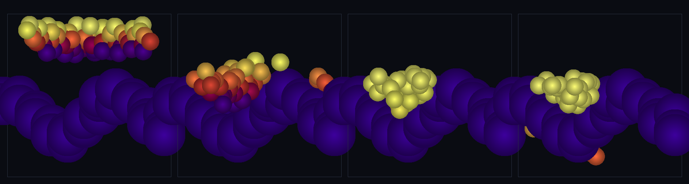

# step_0059 — TW1 펼쳐진 지형 (높이장 봉우리·계곡 위에 대량 구체 정착·계곡 모임)

> [design/environment.md](../../design/environment.md) §3 TW1 — 0056~0058 로 "딛는 지형의 *물리*"(정착·마찰·구름 저항=안식각)는 섰지만, 보여줄 *지형 그 자체*는 author 한 구 2~3개뿐이었다(사용자 의심: "확실히 지형이 만들어지냐"). 이 step 은 그것을 **펼쳐진 연속 지형**(여러 봉우리·계곡)으로 키워 "이게 지형이다"를 보인다. **장면 step**(새 엔진 법칙 0 = 중력·접촉·마찰·구름 저항 조립). (긴 설명은 viewer `note` 0059 가 집.)

## 논의 (조립/장면 step·새 엔진 법칙 0)

- **세계를 어떻게 변형?** 골격 = 큰 바닥 구(중력원·구체를 가둠) 위에 **높이장**(사인 합)으로 얹은 **봉우리 앵커 카펫**(여러 봉우리·계곡의 연속 표면·seed). 그 위에 대량 구체가 떨어져 표면에 정착하고, 봉우리서 굴러내려 **계곡에 모인다** = 지형 위 거동이 구체 법칙(중력·접촉0037·마찰0057·구름저항0058)으로 창발.
- **무엇으로 검증?** ① 기복 표면 위 정착(관통 안 함) ② 계곡 모임(창발·낮은 데로) ③ 지형 정적(앵커 카펫 불변) ④ 결정론. *조립이라 부품 보존은 부품 verify 가 보증.*
- **무엇이 보존/변하나?** 부품 법칙 그대로(중력·접촉·마찰·구름 저항). 방사 중력(바닥 구)이 구체를 가둬 무한 낙하/누출 없음(균일 중력 시도는 경계 없어 누출 → 방사로 전환). 새로 보이는 것: *연속 지형 위 정착·계곡 모임*.

## 구현 — 새 엔진 법칙 0 (장면: viewer/verify 가 조립·engine 변경 없음)

```
골격: 바닥 구(R·중력원·anchored) + 격자 봉우리 앵커(z = R + heightField(x,y)·anchored)
advance: applyEntityGravity(0028) → Contact(0037) → Friction(0057) → RollingResistance(0058) → step → pin 앵커
```
높이장 = 결정론적 사인 합(완만 → 인접 앵커 단차 작아 연속 표면). 봉우리 앵커 = 저질량(고체 장애물·중력 영향 없음)·바닥 구 = 거대 질량(중력원). engine 변경 0 → 회귀 구조적 0.

## 검증

**(a) 수치 — `node HTJ/steps/step_0059/verify.js` → PASS (4/4)**

```
PASS  기복 표면 위 정착 — 자유 구체가 높이장 표면 위에 멈춤(관통 안 함) = 표면 위 true(R<r<R+16) · 평균 속도 0.187(<0.3)
PASS  계곡 모임(창발) — 구체가 봉우리서 굴러내려 계곡(낮은 데)에 모인다 = 정착 구체 평균 지형높이 -2.01(<0=계곡 선호·봉우리는 비움)
PASS  지형 정적 — 바닥·봉우리 앵커 불변(구체가 때려도·외부 경계) = 앵커 122개 최대 변위 0(=0)
PASS  결정론 — 같은 지형·낙하 → 같은 정착 지문 = 0x822494b6
```
- 전 step verify **59/59 회귀 0**(engine 변경 없음=구조적) · `node tools/check-viewer.js` PASS(0059 등록).

**(b) 눈 — `steps/step_0059/capture.png`** (engine 직접 PNG·x-z 단면·색=높이)



4 패널: 보라 물결 = **연속 산맥·계곡 표면**, 그 위로 구체가 떨어져(노랑) → 기복 표면에 닿아 → 봉우리서 굴러내려 → **계곡에 모인다**(평균 지형높이 -1.99). author 구 2~3개가 아니라 *펼쳐진 땅*.

## 다음

**TW1 "지형이 보인다" 충족** — author 구 몇 개가 아니라 **펼쳐진 연속 지형(산맥·계곡)** 위에 구체가 정착·계곡에 모이는 장면. "법칙은 author(높이장 골격)·구조는 창발(정착·계곡 모임)". **다음(environment.md §3)**: TW2 바다(분지를 SPH 떼로 채워 수면 — 계곡에 *물*이 고임)·TW3 강(흐름)·TW4 광활함(지형 LOD·끝없이 펼침). **정직한 한계**: 봉우리 골격은 손수 높이장(절차 생성/무한 광활 아님)·방사 중력 국소 평지 근사·작은 패치 규모(km·끝없는 펼침은 TW4 LOD)·지형 정적(깎임·침식 없음).
