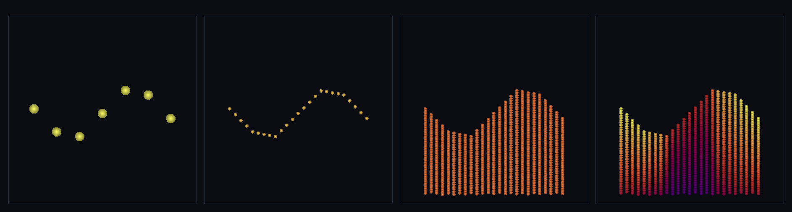

# step_0065 — T1 지형 표면 발현 (높이장 앵커 카펫 → 연속 음영 표면·점→면)

> [design/merge-dna.md](../../design/merge-dna.md) §5 T1 — 동역학·환경 물리(TW1~3)·병합 DNA(M1~M3)는 다 섰는데도 "지형이 안 자연스럽다". 진단: ① **배선** 지형이 형태 DNA 경로 밖(앵커는 coalesce 제외) ② **표현** viewer 가 앵커를 *민둥 구 점 무리*로 그림. 이 step 은 ②(표현)를 **점→면**으로 올린다 — 렌더 트랙(engine 물리 불변). (긴 설명은 viewer `note` 0065 가 집.)

## 논의 (렌더 트랙·engine 물리 불변)

- **세계를 어떻게 변형?** 변형 없음 — engine/물리 불변. 지형 앵커 카펫(0059 형 높이장 봉우리·정적 앵커)을 *읽어*, viewer 가 **연속 음영 표면**으로 발현한다(민둥 구 점 무리 → 이어진 땅). `reconstructShape`(M3)가 점 무리였던 한계를 *표면*으로 올린다(§5 원칙 3).
- **무엇으로 검증?** ① 점→면(앵커 점 ≪ 표면 정점·인접 점프 줄어 *이어짐*) ② 법선(단위·기울기 따라 기움·평지→+z) ③ 채움(빈 칸 없음·높이장 따라감) ④ 순수/engine 불변 ⑤ 결정론. 눈: 같은 지형이 *공 무더기*에서 *연속 음영 표면*으로.
- **무엇이 보존/변하나?** 물리량 전부 불변(형태 환원=표현일 뿐). 새 모듈 `htj-terrain.js` → 기존 engine 함수 0개 변경 = 구조적 회귀 0. 새로 보이는 것: *연속 음영 표면(땅)*.

## 구현 — 새 engine 법칙 0 (형태 환원 + viewer 발현)

```
engine/htj-terrain.js  terrainSurface(anchors, {up}) — 읽기 전용·순수(detectClumps/reconstructShape 부류):
  ① 그리드 검출: 앵커 (x,y) 격자선 → 성긴 높이장 H0[ix][iy]
  ② 조밀화: bilinear 업샘플 ×up → 조밀 연속 높이장(점→면)
  ③ 법선: 중앙차분 기울기 → n=normalize(−∂z/∂x,−∂z/∂y,1)  (viewer 가 음영 n·L 입힘)
viewer/htj-render.js   drawSurface(...) — quad 채움 + 법선 음영(픽셀·음영색은 여기·세계↔확인용 단방향)
```
engine 은 표면의 *형태(높이·법선)*만 들고 픽셀·음영은 viewer 가 입힌다 → engine·물리 불변(렌더 트랙·회귀 구조적 0).

## 검증

**(a) 수치 — `node HTJ/steps/step_0065/verify.js` → PASS (5/5)**

```
PASS  점→면(조밀화·연속) — 앵커 49 → 표면 정점 625(×12.8) · 인접 점프 성김 4.71 → 면 1.18(이어짐)
PASS  법선(단위·기울기 따라 기움) — 단위오차 2.2e-16 · 최소 n.z 0.668(<1=기운 면) · 내리막 방향 true · 평지→(0,0,1) true
PASS  채움(빈 칸 없음·높이장 따라감) — 정점 625개 전부 유한 true · 격자점 높이=앵커 오차 4.4e-16
PASS  순수 — 입력 앵커 불변(물리량 안 바뀜·표현 환원만)
PASS  결정론 — 같은 앵커 → 같은 표면 지문 0x632e848a
```
- 전 step verify **65/65 회귀 0**(engine 변경 없음=구조적) · `node tools/check-viewer.js` PASS(0065 등록).

**(b) 눈 — `steps/step_0065/capture.png`** (engine 직접 PNG·x-z 단면 4 패널)



① 앵커 점(민둥 구·old·성긴 큰 디스크) → ② 표면 정점(조밀) → ③ 표면 채움(면) → ④ 법선 음영(기운 면이 밝기 차 = 자연스러운 땅). 같은 지형 데이터가 *공 무더기*에서 *이어진 땅*으로. 음영 대비 0.41.

## 다음

**T1(표현=점→면) 충족** — 지형이 *연속 음영 표면*으로 발현(merge-dna §5 원칙 3). **남은 격차 = ①(배선)**: 지형 청크를 `registerShape` 로 사전 등록·hash·dedup(K≪N) = **T2**(M2 를 지형에)·거리 LOD = **T3**(M4+TW4 합류). **정직한 한계**: 표면은 손수 높이장 골격(절차 생성/무한 광활 아님·TW4)·정적(침식 없음)·단일 패치·색은 heatColor(높이)+법선 음영(흙/풀 재질은 후속).
