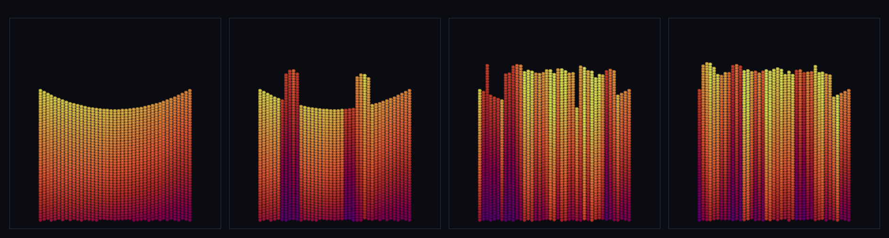

# step_0066 — 지형이 자란다 (정착 구체=퇴적물이 지형 표면이 되어 계곡이 차오름)

> [design/environment.md](../../design/environment.md) §2/§4 "그 위의 거동(딛기·고임·흐름·**깎임/쌓임**)은 구체 법칙의 창발" + [merge-dna.md](../../design/merge-dna.md) §5 T1(표면 발현) 확장 — T1(0065)은 지형을 *연속 음영 표면*으로 발현했으나 지형은 **정적**(author 카펫·"침식 없음")이었다. 이 step 은 그 표면을 **동적**으로: 자유 구체가 계곡으로 굴러 정착하면(0059 물리) 그 퇴적물이 표면 위에 얹혀 표면을 들어올린다 = 지형이 자란다. (긴 설명은 viewer `note` 0066 가 집.)

## 논의 (렌더 트랙·engine 물리 불변)

- **세계를 어떻게 변형?** 물리 변형 0 — 정착은 기존 entity 법칙(중력 0028·접촉 0037·마찰 0057·구름 저항 0058·0059 조립). `terrainSurface` 에 **퇴적 splat**(가법 옵션 `deposits`)만 더한다: 정착 자유 구체의 구면 상단 z=cz+√(r²−d²) 와 지형 높이의 **max** = "물질이 위에 쌓임". 표면은 그 결과를 *읽기만*.
- **무엇으로 검증?** ① 퇴적 융기(계곡이 차오름·발자국 밖 불변·어디서도 안 꺼짐) ② 항등(deposits 없음→T1 0065 표면 byte 동일·회귀0) ③ 채움/연속 ④ 순수 ⑤ 결정론. 눈: 자유 구체가 계곡에 정착·쌓이며 표면이 차오른다.
- **무엇이 보존/변하나?** 물리량 전부 불변(표면은 읽기만·terrainSurface 가법). 새로 보이는 것: *정착 퇴적물로 지형 모양이 변한다*(author 고정 아님).

## 구현 — terrainSurface 가법 확장(deposits splat)

```
terrainSurface(anchors, {up, deposits}) — heights 업샘플 후(T1) 퇴적 splat:
  for 정점 (I,J) at (wx,wy):
    for d in deposits: d2=(wx−d.cx)²+(wy−d.cy)²; if d2<r²: top=d.cz+√(r²−d2); h=max(h,top)
  (deposits 없으면 블록 통째로 건너뜀 → T1 0065 표면과 byte 동일·회귀0)
viewer: 정착=느린·지형 위로 내려앉은 자유 구체 → deposits · 낙하 중 = drawEntities 오버레이
```
정착=기존 물리·표면=읽기 splat(세계↔확인용 단방향)·engine 물리 불변(가법·구조적 회귀0).

## 검증

**(a) 수치 — `node HTJ/steps/step_0066/verify.js` → PASS (5/5)**

```
PASS  퇴적 융기(계곡이 차오름) — 계곡 표면 +2.80(자란다) · 발자국 밖 Δ0.0e+0(국소) · 어디서도 안 꺼짐 true
PASS  항등(퇴적 없음→T1 표면 byte 동일) — 빈 deposits=무지정=동일 · depositCount 0/12
PASS  채움/연속 — 정점 625 전부 유한 true · 인접 점프 max 2.43(이어짐) · 법선 단위오차 2.2e-16
PASS  순수 — 앵커·퇴적 입력 불변(읽기만·물리량 안 바뀜)
PASS  결정론 — 같은 앵커·퇴적 → 같은 표면 지문 0x143e9732
```
- 전 step verify **66/66 회귀 0**(terrainSurface 가법·deposits 무지정=0065 byte 동일) · `node tools/check-viewer.js` PASS(0066 등록).

**(b) 눈 — `steps/step_0066/capture.png`** (engine 직접 PNG·x-z 단면·표면=법선 음영 band·4 프레임)



정착 퇴적물 수 **0 → 37 → 136 → 140**. 맨 사발(계곡 골) → 자유 구체가 계곡으로 굴러 정착 → 표면 band 가 *계곡에서 차오른다* = 지형이 자란다.

## 다음

**자연스러운 지형 = 동적 지형의 첫 벽돌** — 모양이 author 고정이 아니라 정착·퇴적으로 *변한다*("법칙은 author·구조는 창발"). **정직한 한계**: 표면이 구 상단 max 라 **울퉁(개별 봉우리)** — 매끄러운 퇴적(가우시안 splat·이완)·**침식(깎임·역방향·물↔지형 왕복)**은 후속·퇴적물은 표면 반영만(물리 footprint 공유=M4)·정착 판정 절대속도+고도 게이트(노브)·단일 패치(광활=TW4). **다음**: 매끄러운 퇴적·침식 또는 T2 지형 DNA 배선(K≪N).
