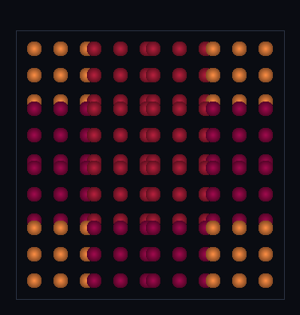

# step_0067 — T2(A) 지형 DNA 배선 (청크가 shapeHash 만·세계 사전이 K종 타일 공유)

> [design/merge-dna.md §5 T2](../../design/merge-dna.md) — 0067(되돌린 매끄러운 퇴적)에서 배운 **정답 경로**. 지형을 engine 지형 전용 함수(`terrainSurface`·폐기)가 아니라 *제너릭 DNA 경로*로 태운다. **조립 step**(engine·viewer 변경 0 → 구조적 회귀 0). 긴 설명은 viewer `note`(STEPS '0067')가 집.

## 논의 (조립 step·engine·viewer 불변)

- **세계를 어떻게 변형?** 변형 0(조립). 지형 = 무한질량(정적 앵커) 구체 *청크* 배열. 각 청크 앵커 배치를 **`registerShape`**(기존 제너릭 engine 함수·htj-shapedna)로 정규화→`shapeHash` + 세계 `shapeDict` 에 dedup. 청크는 hash + 변환만. 발현은 viewer 의 *제너릭* DNA 경로(0063·`reconstructShape`). **engine 에 "지형" 코드 0**(절대 원칙).
- **무엇으로 검증?** ① DNA 배선·dedup K≪N(16 청크→사전 K=3) ② 정규화(같은 타일=같은 hash·다른 타일=다른 hash) ③ shapeHash 순수 메타(물리 불변) ④ 형태 복원(reconstructShape→9점 타일·민둥 구 아님·DNA 없음→null) ⑤ 결정론. 눈: K=3 타일이 16 청크에 dedup(같은 타일=같은 색).
- **무엇이 보존/변하나?** 물리량 전부 불변(hash 는 순수 메타). 새 발현: *지형이 DNA 경로를 탄다*(K종 타일을 N 청크가 공유=확장성).

## 구현 — 기존 제너릭 함수·경로 조립 (engine·viewer 변경 0)

```
지형 청크 c:  hash = registerShape(shapeDict, c.앵커배치)   // 제너릭·dedup
              c = {위치, 스케일, shapeHash}                 // 구성원 세부 버림
발현(viewer): render:'entities' + world.__shapeDict 있으면 reconstructShape(c, dict) → 점 무리 (0063 경로)
같은 타일 → 같은 canonical → 같은 hash → 사전 1항목 (K=3 ≪ N=16)
```
- 신규: 시나리오 모듈 `viewer/scenes/step_0067.js` + verify 뿐. **engine·viewer 코드 0 변경** — `htj-shapedna`(0062)·제너릭 렌더 경로(0063)를 지형에 *조립*만.
- 세계↔확인용 단방향: shapeHash·사전은 순수 메타(물리 불변)·reconstructShape 는 어디에 그릴지만.

## 검증

**(a) 수치 — `node HTJ/steps/step_0067/verify.js` → PASS (5/5)** — 새 발현만 직접, 항등·결정론은 `htj-verify-lib` 공용 가드.

```
PASS  DNA 배선·dedup — 청크 N=16 → 사전 K=3(타일 종류 3) ≪ N (확장성)
PASS  정규화 — 같은 타일=같은 hash(peak 5b1b1d=5b1b1d) · 다른 타일=다른 hash(peak≠valley≠flat)
PASS  항등(노브=0→회귀 0) — shapeHash=순수 메타(registerShape 입력 불변) = 0xf2ebfe5e
PASS  형태 복원 — 청크→9점 타일(민둥 구 아님) · DNA 없음→null 폴백 true
PASS  결정론 — 같은 지형 → 같은 hash·사전 = 지문 0xa4a8f95d
```
- 전 step verify **67/67 회귀 0**(engine·viewer 변경 0=구조적) · `node tools/check-viewer.js` PASS(0067=scenes/ 모듈 등록).

**(b) 눈 — `steps/step_0067/capture.png`** (범용 러너 `node tools/htj-render-capture.js 0067`·시나리오 1벌·top-down·제너릭 reconstructShape 발현)



4×4 타일 지형: 모서리=평지(주황)·중앙=봉우리(빨강)·가장자리=계곡(자홍). **같은 타일=같은 색(DNA 서명)** = K=3 종이 16 청크에 dedup. per-step capture.js 없이 제너릭 DNA 경로로 생성.

## 다음

**지형도 다른 모든 것과 같은 원소+같은 DNA 경로를 탄다**(engine 타입 전용 코드 0) — 0067 되돌림이 못박은 원칙의 첫 실증. **정직한 한계**: 발현이 아직 *점 무리*(공 무더기) — **(B)표현 = 점→면 표면 승급은 다음 단위 T2b**(*제너릭* 표면 발현·매끄러움도 렌더 도메인). 회전 미정규화(M2 한계)·타일 손수 골격(절차 생성 후속). **다음 = T2b 제너릭 표면 발현**(reconstructShape 점 무리 → 연속 음영 표면·지형 전용 코드 없이).
</content>
