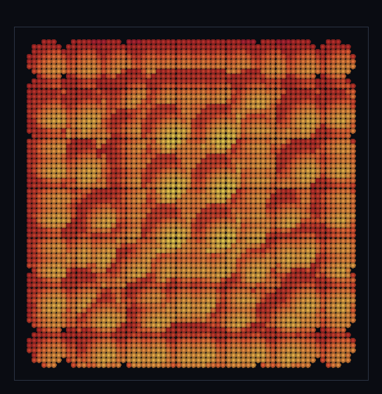

# step_0068 — T2b 제너릭 표면 발현 (DNA 점 무리 → 연속 음영 땅·점→면)

> [design/merge-dna.md §5 T2(B)](../../design/merge-dna.md) — 0067(A 배선)의 *점 무리*(공 무더기)를 **제너릭** 표면으로 승급. 0065 terrainSurface(지형 특별취급·폐기)를 *타입 무관* pointCloudSurface 로 대체 = "자연스러움은 DNA가 만든다"의 마무리. **렌더 트랙**(engine·htj-render.js 변경 0 → 구조적 회귀 0). 긴 설명은 viewer `note`(STEPS '0068')가 집.

## 논의 (렌더 트랙·engine·htj-render.js 불변)

- **세계를 어떻게 변형?** 변형 0. 0067 의 DNA 점 무리(reconstructShape)를 **제너릭** `pointCloudSurface`(viewer/htj-surface.js·신규)로 연속 높이장+법선으로 환원 → 기존 **제너릭** `drawSurface`(render:'terrain')로 그린다. 표면 유틸은 **타입을 모른다**(입력=점 무리)·자연스러움은 손수 필터(0067 되돌린 smooth) 아니라 *겹치는 구체 splat* 창발(sphere-world §3).
- **무엇으로 검증?** ① 점→면(성긴 점 무리→연속 채움 표면·인접 점프 작음) ② 법선 단위·기복 반영 ③ **타입 무관**(지형 아닌 블롭도 유효 표면 = 지형 특별취급 아님·원칙의 핵심) ④ 순수(입력 불변) ⑤ 결정론. 눈: 공 무더기→연속 음영 땅.
- **무엇이 보존/변하나?** engine·물리 전부 불변(렌더 트랙·구조적 회귀 0)·결정론. 신규 = 제너릭 표면 유틸(viewer)·기존 drawSurface 재사용.

## 구현 — 제너릭 표면 유틸 + 기존 drawSurface 조립 (engine·htj-render.js 변경 0)

`viewer/htj-surface.js :: pointCloudSurface(points, {res})` (순수·타입 무관):

```
점 무리 {cx,cy,cz,r} → top-down 래스터(res²): 각 점을 구면 cap splat(z_top=cz+√(r²−d²)·max)
  → 겹치면 연속 면(자연스러움 창발) → 정점 법선(중앙차분). 반환은 terrainSurface 호환({nx,ny,heights,normals,…})
장면: 지형 DNA 청크(0067) → reconstructShape 점 무리 → pointCloudSurface → w.__surface → render:'terrain'(기존 drawSurface)
```
- 신규: `viewer/htj-surface.js`(제너릭 유틸) + `viewer/scenes/step_0068.js` + verify. **engine·htj-render.js 코드 0 변경** — 타입 무관 유틸 + 기존 제너릭 drawSurface(0065) 조립.
- 세계↔확인용 단방향: pointCloudSurface 는 어디에/무슨 표면을 그릴지만(순수·렌더 의존 0·Node 에서 verify).

## 검증

**(a) 수치 — `node HTJ/steps/step_0068/verify.js` → PASS (5/5)** — 새 발현만 직접, 순수·결정론은 `htj-verify-lib` 공용 가드.

```
PASS  점→면 — 점 25개 → 표면 점유 3264셀(연속·×130) · 인접 점프 max 0.551(이어짐<0.7)
PASS  법선 — 단위오차 2.2e-16 · 최소 n.z 0.250(옆면 기욺=기복 반영)
PASS  타입 무관 — 지형 아닌 블롭도 유효 표면(점유 1325·전부 유한 true·법선 단위 true) = 지형 특별취급 아님
PASS  항등(노브=0→회귀 0) — pointCloudSurface 입력 점 무리 불변 = 0xfff5f734
PASS  결정론 — 같은 점 무리 → 같은 표면 = 지문 0xca98ffc0
```
- 전 step verify **68/68 회귀 0**(engine·htj-render.js 변경 0=구조적) · `node tools/check-viewer.js` PASS(0068=scenes/ 모듈 등록).

**(b) 눈 — `steps/step_0068/capture.png`** (범용 러너 `node tools/htj-render-capture.js 0068`·top-down 음영 표면)



0067 의 *개별 공 무더기*가 **연속 음영 땅**으로(4×4 타일 기복이 음영으로 드러남). 표면은 겹치는 sub-구체 splat 에서 창발 — 지형 전용 코드·손수 필터 없이.

## 다음

**"자연스러운 땅"의 마무리 — 지형 전용 코드 한 줄 없이 점→면.** terrainSurface(0065·지형 특별취급)가 *타입 무관* pointCloudSurface 로 제대로 대체됐다(0067 되돌림이 못박은 원칙의 완성: 모양·자연스러움은 DNA+제너릭 렌더). **정직한 한계**: top-down 높이장(오버행/동굴 없음·z=f(x,y))·splat rim 약한 거칠기(겹침 늘리면 매끄러움↑·렌더 노브)·회전 미정규화(M2)·타일 손수 골격·거리 LOD 는 T3. **다음 = T3 거리 LOD**(멀면 coarse·가까이 fine·TW4 합류) 또는 침식(물↔지형 왕복).
</content>
