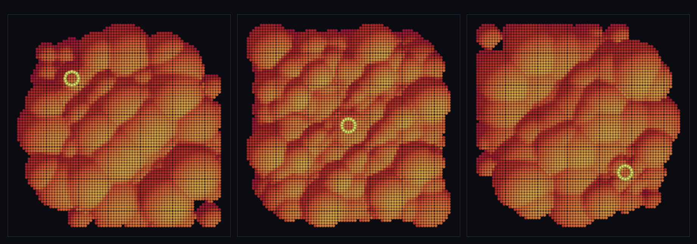

# step_0069 — T3 거리 LOD (발현 해상도가 관찰자 거리에 묶임·비용∝관찰 영역)

> [design/merge-dna.md §5 T3](../../design/merge-dna.md) — 0068(T2b)이 *모든* 청크를 같은 해상도로 표면 발현하던 것을 **관찰자 거리**에 묶는다. SW4 적응 LOD(0039·물리)의 **렌더 판**. **렌더 트랙**(engine·htj-render.js 변경 0 → 구조적 회귀 0). 긴 설명은 viewer `note`(STEPS '0069')가 집.

## 논의 (렌더 트랙·engine·htj-render.js 불변)

- **세계를 어떻게 변형?** 변형 0. 새 **제너릭** 유틸 `lodCloud(entities, dict, observer, opts)`(viewer/htj-lod.js)가 DNA 발현(reconstructShape 0063)을 관찰자 거리별 해상도로 입힌다: 가까운 청크 = fine(전체 점)·멀수록 coarse(stride=2^L decimate·반경 √stride 확대)·가장 먼 청크 = *민둥 구 1개*("hash 한 개 coarse"). 그 점 무리를 기존 제너릭 `pointCloudSurface`(0068)→`drawSurface`(0065)로 그린다.
- **무엇으로 검증?** ① 거리 LOD(가까이 fine·멀수록 점 수 단조↓·가장 먼=민둥 구 1) ② **비용∝관찰 영역**(먼 세계를 키워도 fine 예산 불변·먼 청크 청크당 O(1)·총점≪전부 fine) ③ 표면 보존(near=fine 청크 점 reconstructShape 정확 일치·LOD 점 무리→유효 연속 표면) ④ 항등(band≤0→전부 fine=0068 발현 byte 동일) ⑤ 결정론. 눈: 관찰자 둘레만 선명·먼 곳 흐릿·관찰자가 움직이면 fine 영역이 따라옴.
- **무엇이 보존/변하나?** engine·물리·htj-render.js 전부 불변(렌더 트랙·구조적 회귀 0)·결정론. 관찰자(camera·거리)는 *확인용* 개념 → viewer 도메인(세계↔확인용 단방향·engine 타입코드 0).

## 구현 — 제너릭 LOD 유틸 + 기존 표면 경로 조립 (engine·htj-render.js 변경 0)

`viewer/htj-lod.js :: lodCloud(entities, dict, observer, opts)` (순수·타입 무관):

```
청크마다: dist = |entity.center − observer|,  L = clamp(floor(dist/band), 0, maxL)
  L==0      → reconstructShape 전체 점(fine)
  0<L<maxL  → stride=2^L decimate(반경 ×√stride 로 덮음)
  L==maxL   → 민둥 구 1개(개체 중심·반경 = "hash 한 개 coarse")
band≤0 → 전부 L0(fine) = 0068 발현과 항등
```
- 신규: `viewer/htj-lod.js`(제너릭 유틸) + `viewer/scenes/step_0069.js` + verify. **engine·htj-render.js 코드 0 변경** — 타입 무관 유틸 + 기존 pointCloudSurface(0068)·drawSurface(0065) 조립.
- 세계↔확인용 단방향: lodCloud 는 *어디에/얼마나 촘촘히* 그릴지만(순수·렌더 의존 0·Node 에서 verify·reconstructShape 를 읽기만).

## 검증

**(a) 수치 — `node HTJ/steps/step_0069/verify.js` → PASS (5/5)** — 새 거동만 직접, 순수·결정론·항등은 `htj-verify-lib` 공용 가드.

```
PASS  거리 LOD — 청크별 점 수 9→5→3→2→1→1(가까이 fine=9·단조↓·가장 먼=민둥 구 1) · 레벨 012344
PASS  비용∝관찰 — fine 예산 K=6:9 = K=20:9(먼 세계 키워도 불변) · 먼 청크 청크당 O(1) true · 총점 35≪전부fine 180(×0.19)
PASS  표면 보존 — near=fine 청크 점 9개 reconstructShape 정확 일치 true · LOD 점 무리→연속 표면(점유 2217·법선 단위 true·유한 true)
PASS  항등(노브=0→회귀 0) — band≤0 → 전부 fine = reconstructShape 발현(0068) = 0xdf91ee14
PASS  결정론 — 같은 세계·관찰자 → 같은 LOD 발현 = 지문 0x8a25a150
```
- 전 step verify **69/69 회귀 0**(engine·htj-render.js 변경 0=구조적) · `node tools/check-viewer.js` PASS(0069=scenes/ 모듈 등록).

**(b) 눈 — `steps/step_0069/capture.png`** (범용 러너 `node tools/htj-render-capture.js 0069`·top-down 음영 표면 + 관찰자 마커)



관찰자(밝은 고리)가 한 모서리→중앙→반대 모서리로 스윕한다(3 프레임). 그 둘레는 *선명한 땅*(fine·작은 둔덕), 먼 곳은 *흐릿한 큰 둔덕*(coarse) → **fine 영역이 관찰자를 따라온다**. 6×6=36 청크의 *비싼* 발현이 관찰 영역에만 할당된다.

## 다음

**"광활함"의 첫 벽돌 — 발현 비용이 세계 크기가 아니라 관찰 영역에 묶인다(렌더 판).** SW4 적응 LOD(0039·물리)와 같은 정신을 DNA 표면 발현에 입혔다. **정직한 한계**: 거리 LOD 는 *발현*(렌더)만 — 물리 footprint LOD(가까이서 hash→형태 *물리* 되쪼갬)는 M4·hysteresis 없음(레벨 경계 깜빡임 가능·band 노브)·top-down 높이장(M2 회전 미정규화). **다음 = M4 물리 footprint**(렌더 LOD↔물리 LOD 합류) 또는 **TW4 광활**(무한 펼침·스케일 핵심 미해결)·침식(물↔지형 왕복).
