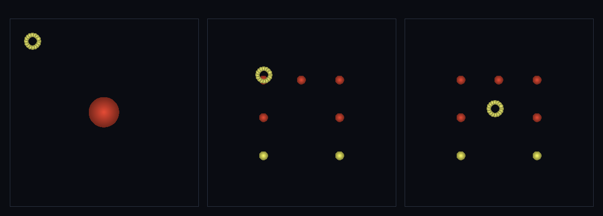

# step_0070 — M4 DNA 물리 footprint (가까이 가면 합친 덩어리가 원래 형태 물리 조각으로·보존 정확)

> [design/merge-dna.md §4 M4](../../design/merge-dna.md) — `reconstructShape`(M3·렌더 점·0063)의 **물리 개체** 판. adaptLOD(0039) refine 이 합친 개체를 *평면 고리*로 근사 복원하던 한계를, shapeHash 가 가리키는 **원래 DNA 형태** 위치로 되쪼개되 4 보존량 정확 보존 = **렌더 LOD(0069)↔물리 LOD 합류**. 긴 설명은 viewer `note`(STEPS '0070')가 집.

## 논의

- **세계를 어떻게 변형?** 새 engine 법칙 `refineByDNA(entity, dict, opts)`(htj-shapedna.js·VER 2→3): 합친 개체(coarse 민둥 구)를 그 `shapeHash` 가 가리키는 세계 사전의 *원래 구성원 배치* 위치로 N개 물리 조각으로 되쪼갠다. 렌더(reconstructShape)와 *같은 사전·hash·배율* → **물리 조각이 렌더가 그리는 바로 그 형태를 차지**(거리 LOD 0069 의 물리 판).
- **무엇으로 검증?** ① DNA 형태 충실(물리 조각이 reconstructShape 형태와 무게중심 정렬 시 정확 일치·평면 고리는 z 기복 소실) ② 보존 — 질량·운동량·각운동량(원점·궤도+스핀)·총E 정확 ③ 항등(hash 없음/사전에 없음 → null → fragmentEntity 평면 고리 폴백=0039 불변) ④ 결정론. 눈: 큰 구 1개 → DNA 형태 7조각.
- **무엇이 보존/변하나?** 구성원이 모두 부모 CoM 속도를 받고 offset 합을 0 으로 맞춰 → 4 보존량 정확(폭발 없는 dispersalFrac=0 판). 모양은 *유지*되되 물리는 *무손실*. refineByDNA 는 신규 함수·호출처 없음 → 구조적 회귀 0. 타입코드 0(형태는 DNA·sphere-world §1).

## 구현 — refineByDNA (htj-shapedna.js·VER 2→3)

```
offset_i = q_i·(quantum·R·spread) − mean(offset)   // 평균 빼기 → Σoffset=0(궤도 L 정확 보존)
구성원_i = { 위치 = entity.center + offset_i,  속도 = v_cm(전부 동일·폭발 0),
            질량 = M/n,  internalE = internalE/n,  스핀 = L_intrinsic/n,  energy = KEcm_i + intE_i }
보존: ΣP=M·v_cm=부모 · Σ(L_i+r_i×p_i)=부모 intrinsic+center×P=부모(Σoffset=0 이 궤도항을 닫음) · ΣE=부모
hash 없음/사전에 없음/n<2 → null(호출자: fragmentEntity 평면 고리 폴백=0039)
```
- 신규: `refineByDNA`(engine) + `viewer/scenes/step_0070.js` + verify. **engine 기존 함수 0 변경**(가법·신규 export)=구조적 회귀 0·engine 타입코드 0.

## 검증

**(a) 수치 — `node HTJ/steps/step_0070/verify.js` → PASS (7/7)** — 새 거동·형태 충실은 직접, 보존·결정론·항등은 `htj-verify-lib` 공용 가드.

```
PASS  DNA 형태 충실 — 물리 조각 6개가 렌더 형태와 정확 일치(무게중심 정렬 max 차 0.0e+0) · DNA z기복 7.75 vs 평면 고리 z 0.0e+0(고리는 모양 소실)
PASS  보존 — 질량 = 40 → 40 (rel 0.00e+0 < 1e-9)
PASS  보존 — 운동량 |P| = 14 → 14 (rel 0.00e+0 < 1e-9)
PASS  보존 — 각운동량 |L|(원점·궤도+스핀) = 482.68208999298906 → 482.68208999298906 (rel 0.00e+0 < 1e-9)
PASS  보존 — 총E = 52.45 → 52.45 (rel 0.00e+0 < 1e-9)
PASS  항등(노브=0→회귀 0) — DNA 없음 → null(0039 평면 고리 폴백·회귀 0) = 0x7a135a58
PASS  결정론 — 같은 개체·사전 → 같은 물리 되쪼갬 = 지문 0x8ed27f41
```
- 전 step verify **70/70 회귀 0**(refineByDNA 신규·호출처 없음=구조적) · `node tools/check-viewer.js` PASS(0070=scenes/ 모듈 등록).

**(b) 눈 — `steps/step_0070/capture.png`** (범용 러너 `node tools/htj-render-capture.js 0070`·top-down 물리 개체 + 관찰자 마커)



관찰자(밝은 고리)가 모서리→접근→덩어리 곁으로(3 프레임). 합친 덩어리가 **큰 구 1개 → L 자 형태 7조각**으로 되쪼개진다(z 기복=밝기). 렌더가 그리던 그 형태를 물리가 차지.

## 다음

**렌더 LOD(0069)↔물리 LOD 합류 — DNA 가 렌더뿐 아니라 *물리* 되쪼갬도 몬다.** adaptLOD(0039) refine 의 *평면 고리* 한계를 정확 보존으로 풀었다. **정직한 한계**: 되쪼갠 조각은 이 장면에선 정적(되쪼갠 뒤 자유 운동/재정착은 후속)·회전 미정규화(M2)·재coarsen 은 viewer 토글(엔진 adaptLOD 의 DNA hook 배선은 후속)·조각 반경 등가 구 근사. **다음 = adaptLOD 에 refineByDNA hook 배선**(LOD 루프가 DNA 물리 복원 사용) 또는 **TW4 광활**(무한 펼침·스케일 핵심 미해결)·침식(물↔지형 왕복).
