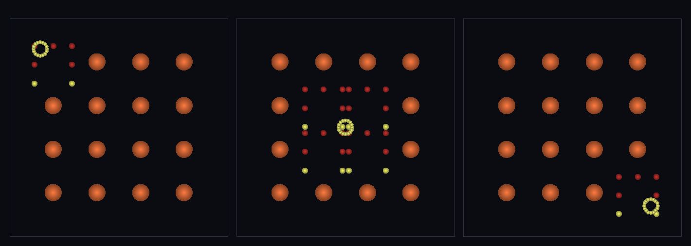

# step_0071 — adaptLOD↔refineByDNA 배선 (LOD 루프가 near 를 DNA 형태 물리 조각으로·물리 비용∝관찰)

> [design/merge-dna.md §4 M4](../../design/merge-dna.md) — 0070 의 `refineByDNA` 를 실제 LOD 파이프라인(`adaptLOD`·0039)에 배선한다. **조립/통합 step**(부품=adaptLOD 0039 + refineByDNA 0070·새로운 것=그 상호작용). 0069(렌더 LOD)의 **물리 판**. 긴 설명은 viewer `note`(STEPS '0071')가 집.

## 논의 (조립/통합·가벼운 의례)

- **세계를 어떻게 변형?** `adaptLOD` refine 가지에 `opts.refineDNA(entity)` 훅 추가(VER 10→11·0062 tagMerge 훅 선례·가법). 훅이 있고 개체가 DNA(shapeHash)를 들면 near refine 이 `refineByDNA`(원래 형태·보존 정확)로, 없으면 fragmentEntity *평면 고리*(0039). → 정준 세계=coarse DNA 개체 목록, adaptLOD 가 관찰자 의존 전개를 낸다: 가까운 덩어리는 DNA 형태 N조각·먼 것은 coarse 민둥 구 1개. **물리 조각 수(비용)가 관찰 영역에 묶인다**.
- **무엇으로 검증?**(통합만·부품 보존은 부품 verify 가 보증) ① 새 상호작용(adaptLOD near refine 이 DNA 형태 조각·평면 고리 아님) ② 합쳐서도 보존(coarsen far + DNA refine near 전체가 질량·P·L(원점)·총E 정확) ③ 항등(훅 없음 → fragmentEntity 평면 고리=0039 byte 동일) ④ 결정론.
- **무엇이 보존/변하나?** 훅 미지정 → adaptLOD 거동 0039 와 byte 동일(회귀 0). engine 타입코드 0(형태는 DNA).

## 구현 — adaptLOD refine 훅 (htj-entity.js·VER 10→11)

```
② refine — near 의 coarse 구체(구성원>1):
   frags = opts.refineDNA ? opts.refineDNA(e) : null    // (M4·0070) DNA 형태 물리 복원 훅(옵션)
   if (!frags) frags = fragmentEntity(e, {n:members, dispersalFrac:0, spread})   // 폴백=평면 고리(0039·회귀0)
호출자(viewer): opts.refineDNA = (e) => refineByDNA(e, dict, ropt)
```
- 수정: `adaptLOD`(가법·옵션 훅·미지정=0039) + 신규 `viewer/scenes/step_0071.js` + verify. cross-module 결합 없음(DI 훅).

## 검증

**(a) 수치 — `node HTJ/steps/step_0071/verify.js` → PASS (7/7)** — 통합·새 상호작용만 직접, 보존·결정론·항등은 `htj-verify-lib` 공용 가드.

```
PASS  새 상호작용 — adaptLOD near refine 이 DNA 형태 6조각(렌더 형태와 정렬 max 차 0.0e+0·z기복 3.00) vs 훅 끄면 평면 고리 z 0.0e+0
PASS  보존 — 질량(통합) = 60 → 60 (rel 0.00e+0 < 1e-9)
PASS  보존 — 운동량 |P|(통합) = 14 → 14 (rel 0.00e+0 < 1e-9)
PASS  보존 — 각운동량 |L|(원점·통합) = 732.8110261179207 → 732.8110261179206 (rel 1.55e-16 < 1e-9)
PASS  보존 — 총E(통합) = 49.63333333333333 → 49.63333333333334 (rel 1.43e-16 < 1e-9)
PASS  항등(노브=0→회귀 0) — 훅 없음 → adaptLOD refine = fragmentEntity 평면 고리(0039) = 0x35bcbd83
PASS  결정론 — 같은 세계·관찰자·훅 → 같은 LOD 결과 = 지문 0x903f5a26
```
- 전 step verify **71/71 회귀 0**(adaptLOD 훅 미지정=0039 byte 동일·0039 verify 포함 통과) · `node tools/check-viewer.js` PASS(0071=scenes/ 모듈 등록).

**(b) 눈 — `steps/step_0071/capture.png`** (범용 러너 `node tools/htj-render-capture.js 0071`·top-down 물리 개체 + 관찰자 마커)



관찰자(밝은 고리)가 4×4 덩어리 밭을 가로질러 스윕한다(3 프레임). 그 둘레만 **DNA 형태 7조각**으로 펼쳐지고 먼 곳은 **큰 구 1개**로 남는다 → 물리 디테일이 관찰자를 따라온다.

## 다음

**0069(렌더 LOD)·0070(물리 footprint)·0071(LOD 루프 배선)으로 렌더↔물리 LOD 합류가 실제 파이프라인까지 닫혔다.** **정직한 한계**: 매 프레임 master 에서 새로 전개(refine→coarsen 누적 시 mergeGroup 이 shapeHash 를 잃는 문제 회피·재coarsen DNA 보존은 후속)·되쪼갠 조각 정적·회전 미정규화(M2)·near/far 2단(연속 LOD 아님). **다음 = 재coarsen DNA 태깅**(M2 tagMerge 를 adaptLOD coarsen 에) 또는 **TW4 광활**(무한 펼침)·침식(물↔지형 왕복).
