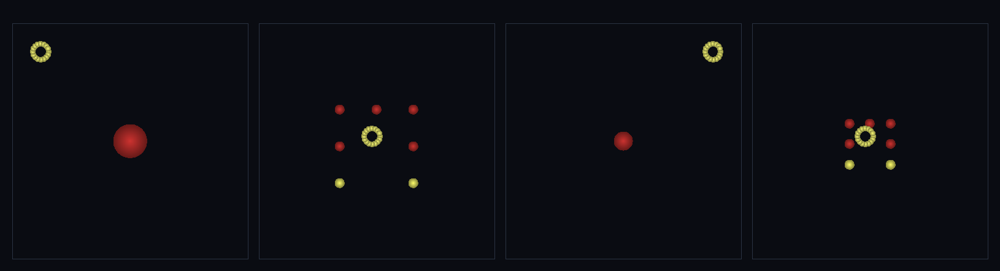

# step_0072 — adaptLOD coarsen DNA 태깅 (재coarsen 해도 형태 보존·왕복 LOD 루프 완성)

> [design/merge-dna.md §4 M2/M4](../../design/merge-dna.md) — 0071 이 회피한 *재coarsen 의 DNA 소실*을 메운다. `adaptLOD` coarsen 이 `opts.tagDNA` 훅으로 합친 블롭에 `shapeHash` 부착 → coarsen→refine→재coarsen→refine 왕복에서 원래 형태 보존. **0071 의 짝**(refine=형태 복원·coarsen=형태 기억). 긴 설명은 viewer `note`(STEPS '0072')가 집.

## 논의 (조립/통합·가벼운 의례)

- **세계를 어떻게 변형?** `adaptLOD` coarsen 가지에 `opts.tagDNA(members)` 훅 추가(VER 11→12·0062 tagMerge·0071 refineDNA 와 같은 DI 패턴). 합치며 구성원 배치를 형태 DNA 로 정규화·등록해 블롭에 `shapeHash` 부착 → 누적 상태로 굴려도 DNA 가 LOD cycle 을 살아남는다(다음 refine 이 평면 고리로 안 떨어짐).
- **무엇으로 검증?**(통합만) ① 새 거동(coarsen DNA 태깅 + 왕복 형태 보존: refine→rehash 가 태그와 동일·z 기복 보존) ② dedup 안정(K 불변) ③ 합쳐서도 보존(질량·P·L(원점)·총E) ④ 항등(태깅 제거 시 물리 byte 동일) ⑤ 결정론.
- **무엇이 보존/변하나?** 태깅은 *메타데이터* — 물리량 불변. 훅 미지정 → 0039 byte 동일(회귀 0)·engine 타입코드 0.

## 구현 — adaptLOD coarsen 태깅 훅 (htj-entity.js·VER 11→12)

```
① coarsen — 블록당 2+ 합침(mergeGroup):
   merged.lodMembers = Σ구성원 수
   if (opts.tagDNA) merged.shapeHash = opts.tagDNA(g.map(i => entities[i]))   // (M2) 형태 DNA 태깅(옵션)
호출자(viewer): opts.tagDNA = (members) => registerShape(dict, members)
짝: opts.refineDNA(0071) = (e) => refineByDNA(e, dict, ropt)   // coarsen 기억 ↔ refine 복원
```
- 수정: `adaptLOD` coarsen(가법·옵션 훅·미지정=0039) + 신규 `viewer/scenes/step_0072.js` + verify. DI 훅(cross-module 결합 없음).

## 검증

**(a) 수치 — `node HTJ/steps/step_0072/verify.js` → PASS (8/8)** — 통합·새 거동만 직접, 보존·결정론·항등은 `htj-verify-lib` 공용 가드.

```
PASS  coarsen DNA 태깅+왕복 — 블롭 shapeHash ee8934ea(훅 없으면 undefined) · refine→6조각·rehash ee8934ea==태그 true·z기복 2.89(평면 아님)
PASS  dedup 안정 — coarsen→refine→재coarsen 후 사전 K=1(같은 형태=1항목·확장성)
PASS  보존 — 질량(통합) = 30 → 30 (rel 0.00e+0 < 1e-9)
PASS  보존 — 운동량 |P|(통합) = 6 → 6 (rel 0.00e+0 < 1e-9)
PASS  보존 — 각운동량 |L|(원점·통합) = 2028.561312852042 → 2028.561312852042 (rel 0.00e+0 < 1e-9)
PASS  보존 — 총E(통합) = 24.6 → 24.6 (rel 0.00e+0 < 1e-9)
PASS  항등(노브=0→회귀 0) — 태깅 제거 시 물리 byte 동일(shapeHash 만 메타) = 0x90d393b1
PASS  결정론 — 같은 세계·훅 → 같은 coarsen+태깅 = 지문 0x18e14ae
```
- 전 step verify **72/72 회귀 0**(adaptLOD 훅 미지정=0039 byte 동일·0039 verify 포함 통과) · `node tools/check-viewer.js` PASS(0072=scenes/ 모듈 등록).

**(b) 눈 — `steps/step_0072/capture.png`** (범용 러너 `node tools/htj-render-capture.js 0072`·top-down 누적 LOD 왕복)



관찰자(밝은 고리)가 멀리(coarse 민둥 구 1개)→가까이(L 자 7조각)→멀리(재coarse·태깅·1개)→가까이(**같은** L 자 7조각). DNA 가 왕복을 살아남는다 — 4 프레임째 형태가 2 프레임째와 동일.

## 다음

**왕복 LOD 루프 완성 — coarsen 은 형태 기억(tagDNA)·refine 은 형태 복원(refineByDNA)·DNA 가 LOD cycle 을 살아남는다.** 병합·형태 DNA 트랙(M1~M4) + 거리 LOD(T3·0069~0072)가 한 닫힌 루프로 섰다. **정직한 한계**: 되쪼갠 조각 정적(자유 운동/재정착 후속)·회전 미정규화(M2)·near/far 2단(연속 LOD 아님)·coarsen 은 블록당 2+ 일 때만. **다음 = TW4 광활**(무한 펼침·스케일 핵심 미해결) 또는 침식(물↔지형 왕복)·SW5 격자 은퇴.
