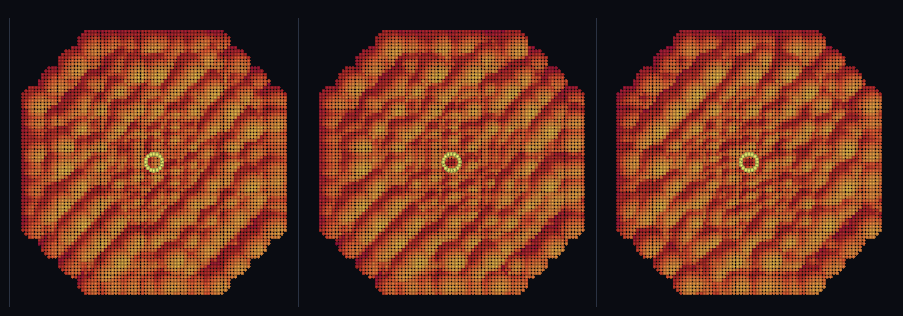

# step_0073 — TW4 광활 (무한 절차적 세계·관찰자 둘레 유한 창·비용≠세계 크기)

> [design/environment.md TW4](../../design/environment.md) — 0069~0072 LOD 가 발현/물리 *비용*을 관찰 영역에 묶었으나 세계는 여전히 *유한한 손수 청크 목록*(작은 패치)이었다. 이 step 은 마지막 스케일 레버를 푼다: **세계 = 무한 절차적 장**(grid (i,j)→DNA 순수 함수)·viewer 는 관찰자 둘레 유한 창만 materialize. **확인용 트랙**(engine 변경 0 → 구조적 회귀 0). 긴 설명은 viewer `note`(STEPS '0073')가 집.

## 논의 (확인용 트랙·engine 불변)

- **세계를 어떻게 변형?** 새 제너릭 유틸 `streamChunks(observer, opts)`(viewer/htj-stream.js): 세계를 무한 절차적 장(`shapeAt(i,j)→DNA shapeHash`·순수 함수)으로 보고, 관찰자 둘레 반경 안 grid 셀만 청크로 생성(유한 작업집합). 스트리밍(TW4)을 거리 LOD(0069)·제너릭 표면(0068)·형태 DNA(T2)와 *함께* 굴려 무한 지형을 관찰 영역 비용으로 발현.
- **무엇으로 검증?** ① 작업집합 유한·관찰자 위치/세계 크기 무관(∝반경²) ② 장 경로 무관(겹치는 창 공유 셀 동일·재방문 동일) ③ dedup K≪N(무한 청크가 K 형태 공유) ④ 채움/경계(반경 안 빠짐없이·밖 없음) ⑤ 결정론. 눈: huge 좌표 3 지점·매번 같은 크기 유한 지형 창.
- **무엇이 보존/변하나?** engine·물리 전부 불변(확인용 트랙·구조적 회귀 0). 관찰자(camera)는 *확인용* 개념 → viewer 도메인(세계↔확인용 단방향·engine 타입코드 0).

## 구현 — streamChunks (viewer/htj-stream.js·신규·VER 1)

```
streamChunks(observer, {spacing, radius, shapeAt}):
  관찰자 둘레 [ox±radius] grid 박스 순회 → 반경 안 셀만:
    cx=i·spacing, cy=j·spacing,  hash=shapeAt(i,j)   // 절차적 장: (i,j)→DNA(순수·경로 무관)
    emit { cx,cy,gx:i,gy:j, shapeHash:hash, radius:spacing/2, anchored:true }
hashIndex(i,j,K)=fnv1a("i,j")%K  // 무한 위치 → K 형태 팔레트(dedup K≪N)
```
- 신규: `viewer/htj-stream.js`(제너릭 유틸) + `viewer/scenes/step_0073.js` + verify. **engine 변경 0** — 스트리밍 위에 lodCloud(0069)·pointCloudSurface(0068) 조립.

## 검증

**(a) 수치 — `node HTJ/steps/step_0073/verify.js` → PASS (5/5)** — 새 거동만 직접, 결정론은 `htj-verify-lib` 공용 가드.

```
PASS  작업집합 유한·위치 무관 — 창 197개 = 먼 세계 197 = 197(관찰자 위치/세계 크기 무관·≈π·반경² 201)
PASS  장 경로 무관 — 공유 셀 140개 DNA 일치(불일치 0) · 멀리 갔다 재방문 동일 true
PASS  dedup K≪N — 청크 197개가 형태 4종 공유(K=4≪N·사전 4항목)
PASS  채움/경계 — 반경 안 셀 빠짐없이 true·반경 밖 없음 true(끝없이 이어지되 창은 잘림)
PASS  결정론 — 같은 관찰자 → 같은 창 = 지문 0xb0580880
```
- 전 step verify **73/73 회귀 0**(engine 변경 0=구조적) · `node tools/check-viewer.js` PASS(0073=scenes/ 모듈 등록).

**(b) 눈 — `steps/step_0073/capture.png`** (범용 러너 `node tools/htj-render-capture.js 0073`·top-down 지형 창 + 관찰자 마커)



관찰자(밝은 고리)가 무한 세계의 *아주 멀리 떨어진* 세 지점 (0,0)→(15444,11280)→(huge)으로 점프한다(3 프레임). 매번 같은 크기의 유한 지형 창·같은 K 팔레트 — 끝없이 펼쳐지되 비용 일정.

## 다음

**"광활함" 닫음 — 세계는 무한 절차적 장, 비용은 관찰 영역에.** LOD 3종(발현 0069·물리 0070~0072)이 비용을 관찰 영역에 묶었고, 이 step 이 세계 *extent* 를 무한으로 풀어 그 위에 얹었다. **정직한 한계**: 장이 손수 K 팔레트+해시 사상(진짜 노이즈/바이옴 지형은 장 함수 교체로 확장)·청크 경계 이음매(LOD 가 부드럽히나 근사)·정적(결정론적·시간 변화/침식 없음)·2D 평면 grid. **다음 = 절차적 장 고도화**(노이즈·바이옴) 또는 **침식**(물↔지형 왕복)·SW5 격자 은퇴.
