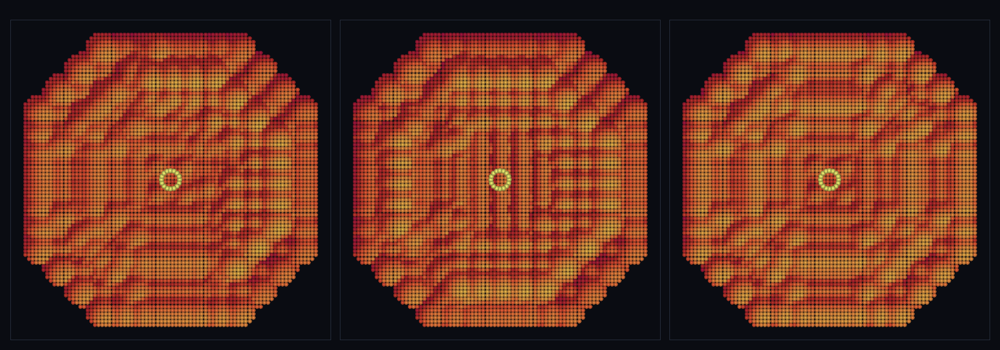

# step_0074 — 절차적 장 고도화(노이즈): 백색 잡음 → 공간 상관 지형·바이옴

> [design/environment.md TW4](../../design/environment.md) 후속 — 0073 이 세계를 *무한 절차적 장*으로 풀었으나, 각 grid 셀의 형태를 `hashIndex`(**백색 잡음**)으로 골라 봉우리·계곡이 흩어진 모자이크였다(0073 의 정직한 한계). 이 step 은 그 *장 함수만* 공간 상관 노이즈로 교체한다. **확인용 트랙**(streamChunks 도 불변 — `shapeAt` 만 다른 함수를 받음·engine 변경 0). 긴 설명은 viewer `note`(STEPS '0074')가 집.

## 논의 (확인용 트랙·engine 불변)

- **세계를 어떻게 변형?** 무한 절차적 장의 형태 선택을 백색 잡음 → **공간 상관 노이즈**로. 신규 제너릭 유틸 `valueNoise2D`/`fbm`/`fieldNoise`(viewer/htj-stream.js·VER 1→2·가법). `fieldNoise(palette,{scale,octaves})`=fBm(여러 옥타브 값 노이즈 합) 높이를 높이순 팔레트(분지<평지<능선<봉우리)에 사상 → 인접 셀이 닮아 같은 높이대가 *뭉치고*(코히어런트 지형), 저주파 옥타브가 *바이옴*(큰 동질 지역)을 만든다. 0073 스트리밍(TW4)·거리 LOD(0069)·표면(0068)·DNA(T2)는 그대로 굴린다.
- **무엇으로 검증?** ① 공간 상관 창발(fBm 인접 차 ≪ 먼 차 ≪ 백색 잡음 인접 차) ② 바이옴(같은 형태 평균 런 ≫ 백색) ③ 범위 유한(fBm∈[0,1)·idx∈[0,K)) ④ 순수·경로 무관(재방문 동일·호출 순서 무관) ⑤ 결정론. 눈: 0073(흩어진 모자이크) vs 0074(이어진 능선·계곡).
- **무엇이 보존/변하나?** engine·streamChunks 전부 불변(확인용 트랙·구조적 회귀 0). 장 함수는 viewer 도메인의 *제너릭 노이즈*(타입 모름·형태는 DNA·발현은 제너릭 표면·engine 타입코드 0).

## 구현 — fieldNoise (viewer/htj-stream.js·VER 2·가법)

```
valueNoise2D(x,y): 정수 격자 난수값(latticeVal=fnv1a/2³²) + smootherstep bilinear 보간 → 공간 상관 장 [0,1)
fbm(x,y,{octaves,lacunarity,gain,frequency}): Σ amp·valueNoise2D(freq) / Σamp → 큰 윤곽+작은 디테일 [0,1)
fieldNoise(palette,{scale,…fbm})(i,j) = palette[clamp(floor(fbm(i·scale,j·scale)·K), 0, K-1)]
```
- 신규: 위 3 함수 + `viewer/scenes/step_0074.js` + verify. **engine·streamChunks·hashIndex 변경 0** — 0073 장면은 그대로 `hashIndex`(백색 잡음) 사용(회귀 0). 0074 만 `fieldNoise`.

## 검증

**(a) 수치 — `node HTJ/steps/step_0074/verify.js` → PASS (5/5)** — 새 거동만 직접, 결정론은 `htj-verify-lib` 공용 가드.

```
PASS  공간 상관 창발 — 인접 차 0.0317 ≪ 먼 차 0.2027(상관) · ≪ 백색 잡음 인접 차 0.3396(매끄러움)
PASS  바이옴 런길이 — 노이즈 평균 런 8.79셀 ≫ 백색 잡음 1.04셀(같은 형태가 연속=큰 동질 지역)
PASS  범위 유한 — fBm ∈ [0.245, 0.899] ⊂ [0,1) · idx 전부 [0,K) (팔레트 밖 0)
PASS  순수·경로 무관 — 재방문 동일 true · 호출 순서 무관 true(장은 (i,j) 순수 함수)
PASS  결정론 — 같은 장 → 같은 샘플 = 지문 0x3280ea19
```
- 전 step verify **74/74 회귀 0**(engine·streamChunks 변경 0=구조적) · `node tools/check-viewer.js` PASS(0074=scenes/ 모듈 등록).

**(b) 눈 — `steps/step_0074/capture.png`** (범용 러너 `node tools/htj-render-capture.js 0074`·top-down 지형 창 + 관찰자 마커)



0073(백색 잡음)은 흩어진 고주파 모자이크였으나, 0074 는 *이어진 능선·계곡*(매끄러운 음영 띠)으로 발현된다 — 관찰자가 무한 노이즈 세계의 서로 다른 세 지점으로 점프해도 매번 코히어런트한 지형 창.

## 다음

**0073 의 "손수 K 팔레트+해시 사상" 한계를 노이즈로 푼다 — 무한 세계가 *자연스러운* 지형·바이옴을 갖는다.** 장 함수만 교체했고(streamChunks·LOD·표면·DNA 불변) engine 은 손도 안 댔다(확인용 트랙). **정직한 한계**: fBm 평균이 가운데로 쏠려 극단(분지·봉우리) 타일이 드묾(대비 스트레치/도메인 왜곡 후속)·2D 높이장(오버행 없음)·단일 노이즈 사상 바이옴(온도·습도 다축은 후속)·정적(시간 변화/침식 없음). **다음 = 침식**(물↔지형 왕복·지형 정적 해소) 또는 **SW5 격자 은퇴**.
