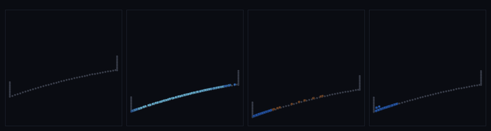

# step_0075 — 침식: 흐르는 물이 침식가능 바닥을 깎아 내려간다(물↔지형 왕복)

> [design/environment.md §2/§4](../../design/environment.md) — 0060(법선 경계)·0064(접선 마찰)은 물을 지형에 *얹고 흘렀게* 했으나 지형은 **정적**이었다(물→지형 *일방*·거의 모든 지형 step 이 적은 공통 한계). 이 step 의 새 엔진 법칙 `sphSedimentErosion` 이 그 일방을 *왕복*으로 닫는다. 긴 설명은 viewer `note`(STEPS '0075')가 집.

## 논의 (새 엔진 법칙·SW5/TW)

- **세계를 어떻게 변형?** 흐르는 물(SPH)이 바닥(앵커)을 *깎아 싣고*(침식) 느려지면 *내려놓는다*(퇴적) = 흐름이 땅을 빚는다. 입자가 스칼라 `sediment` 운반·운반 용량 `C=capacity·|v_t|`(stream power)보다 적게 실었으면 바닥 `A.bed` 를 깎아 싣고, 넘치면 내려놓는다. 깎인 만큼 `A.radius` 가 줄어 *물이 따라 내려간다*(2-way 결합). 0064(접선 마찰)·0060(법선)과 같은 SPH↔앵커 *generic* 법칙 family(타입 모름).
- **무엇으로 검증?** ① 침식+퇴적 방향성(빠른 빈 입자 깎음·느린 가득 입자 내려놓음) ② 실제 SPH 강이 바닥을 깎음(창발 결합) ③ Σbed+Σsediment 보존 ④ erodeRate=0→0064 회귀 ⑤ 결정론. 눈: 맑은 물→갈색(퇴적물 싣고)→댐 웅덩이 퇴적.
- **무엇이 보존/변하나?** Σbed+Σsediment 정확 보존(땅↔흐름 쌍 이동). 퇴적물은 *수동 스칼라* → 운동량·내부E 안 건드림 → 0064 동역학 불변. 바뀌는 건 바닥 두께(`A.bed`→`A.radius`).

## 구현 — sphSedimentErosion (engine/htj-sph.js·VER 15→16·가법)

```
C = capacity·|v_t|                                       // 운반 용량(stream power)
load < C → 침식: dm=min(erodeRate·(C−load)·dt, bed−minBed)  bed↓·load↑
load > C → 퇴적: dm=min(erodeRate·(load−C)·dt, load)         bed↑·load↓
A.radius = A.bed                                          // 기하 반영(물이 깎인 바닥 따라감)
```
- 신규 함수(접촉 판정=0060/0064 와 동일·접선 슬립 v_t 재사용)·기존 호출처 0 → 구조적 회귀 0. erodeRate=0/앵커 없음/dt=0 → early-return. anchors 는 *읽고 bed/radius 만 갱신*(위치 불변). engine 타입코드 0.

## 검증

**(a) 수치 — `node HTJ/steps/step_0075/verify.js` → PASS (5/5)** — 새 거동만 직접, 보존·항등·결정론은 `htj-verify-lib` 공용 가드.

```
PASS  침식+퇴적 — 빠른 빈 입자: bed 10.5→10.260↓·load 0→0.240↑(깎아 싣음) · 느린 가득 입자: bed 10.5→10.692↑·load 5→4.808↓(내려놓음)
PASS  실제 강 침식 창발 — 흐르는 물이 램프 바닥을 97.10 깎음(bed 600→502.9·radius 따라감→물이 내려감) · 부유 퇴적물 140.61 · Σbed+Σsed 보존 true
PASS  보존 — Σ bed + Σ sediment = 26 → 26.000000000000007 (rel 2.73e-16 < 1e-9)
PASS  항등(노브=0→회귀 0) — erodeRate=0 → bed·sediment 불변 = 0x96d66b6b
PASS  결정론 — 같은 흐름 → 같은 침식 = 지문 0x364725be
```
- 전 step verify **75/75 회귀 0**(engine 가법·0064 erodeRate=0 회귀) · `node tools/check-viewer.js` PASS(0075=scenes/ 모듈 등록).

**(b) 눈 — `steps/step_0075/capture.png`** (범용 러너 `node tools/htj-render-capture.js 0075`·x-z 단면)



맑은 파란 물이 상류서 흘러내리며(프레임 1) 바닥을 깎아 **갈색**으로 탁해지고(프레임 2·퇴적물 싣고 운반), 하류 댐 웅덩이에 고인 느린 물은 퇴적물을 내려놓는다(프레임 3). 회색 바닥선은 흐름 아래로 조금씩 내려간다(침식).

## 다음

**"지형 정적·물→지형 일방"을 왕복으로 닫음 — 흐름이 땅을 빚는다(침식·퇴적).** 0060/0064 가 물을 지형 위에 흘렸다면, 이 법칙은 그 물이 *지형을 바꾼다*. **정직한 한계**: 바닥이 단일 큰 램프라 *균일하게* 내려간다(공간적 협곡/삼각주는 분절 바닥 필요·분절 SPH 바닥은 겹친 앵커 경계력이 폭발해 불안정 — verify 는 규정 흐름으로 빠른 곳 깎임·느린 곳 쌓임을 보이고 안정 분절 결합은 후속)·퇴적물 수동 스칼라(운반이 운동량엔 무영향)·정적 minBed 기반암. **다음 = 안정 분절 침식**(공간 협곡)·**SW5 격자 은퇴** 또는 절차적 장 다축 바이옴.
