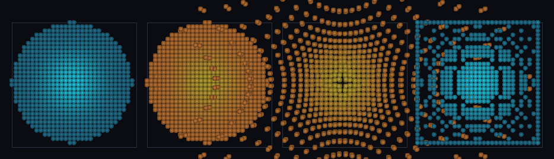

# step_0076 — SW5 격자 은퇴 역이주: 격자→SPH→격자 왕복(가역 은퇴)

> [design/sphere-world.md §6 SW5](../../design/sphere-world.md) — 0051 `fluidToParticles`(격자→SPH 복사)·0055 `migrateRegionToSPH`(이동·격자 비움)은 격자 은퇴를 *일방*으로만 했다. SPH 가 필요 없어진 영역을 격자로 되접을 길이 없었다(STATE 의 명시된 SW5 잔여 = "SPH→격자 역이주"). 이 step 의 새 엔진 법칙 `particlesToFluid` 가 그 역을 더해 왕복을 닫는다. 긴 설명은 viewer `note`(STEPS '0076')가 집.

## 논의 (새 엔진 법칙·SW5)

- **세계를 어떻게 변형?** `particlesToFluid(particles, world)` — SPH 입자를 제가 점유한 격자 셀(반올림 좌표)에 되쌓아(질량 ρ·운동량 mom·내부E therm 누적) 격자로 *녹인다* = 0026 promote/0031 demote 의 *유체 전체* 판의 역방향. 격자→SPH→격자 왕복이 항등.
- **무엇으로 검증?** ① 격자→SPH→격자 왕복 항등(셀별 정확 복원) ② migrate-out(0055)→되돌림 이동 왕복 ③ 한 셀에 여럿→상대 KE→열(총E 보존) ④ 경계 클램프 질량 보존 ⑤ 결정론. 눈: 청록 격자→주황 SPH→퍼짐→청록 격자.
- **무엇이 보존/변하나?** Σ질량·운동량·총E(=KE+내부E) 정확 보존(누적·상대 KE→열). 입자 없음→격자 불변. world 제자리 변형(격자에 누적).

## 구현 — particlesToFluid (engine/htj-sph.js·VER 16→17·가법)

```
셀 i = round(p.cx,cy,cz) (격자 밖은 경계 클램프·손실 0)
ρ[i]+=m · mom[i]+=p · therm[i]+=internalE
한 셀에 여럿/기존 유체와 합쳐지면: relKE = (기존 bulk KE + Σ입자 KE) − 합친 bulk KE ≥ 0 → therm 에 적립(총E 보존)
```
- 신규 함수·기존 호출처 0 → 구조적 회귀 0. 입자 없음 → early-return. 한 셀당 입자 하나면 relKE=0(왕복 항등).

## 검증

**(a) 수치 — `node HTJ/steps/step_0076/verify.js` → PASS (5/5)** — 새 거동만 직접, 결정론은 `htj-verify-lib` 공용 가드.

```
PASS  격자→SPH→격자 왕복 항등 — 입자 1728개 되쌓음(셀 1728) · 모든 장 셀별 최대차 0.00e+0(원래 격자 복원)
PASS  이동 왕복 — 비운 격자 질량 0.00e+0→되쌓음 · 입자 1728 · 원래 격자 최대차 0.00e+0
PASS  누적+상대KE→열 — 셀 질량 2·운동량 0.000(상쇄)·상대 KE 4→열 4.000 · 총E 4→4.000 보존
PASS  경계 클램프 보존 — 격자 밖 입자 질량 Σ 4(손실 0·되쌓은 셀 2 전부 범위 안)
PASS  결정론 — 같은 입자 → 같은 격자 = 지문 0x9876b64f
```
- 전 step verify **76/76 회귀 0**(신규 함수·구조적) · `node tools/check-viewer.js` PASS(0076=scenes/ 모듈 등록).

**(b) 눈 — `steps/step_0076/capture.png`** (범용 러너 `node tools/htj-render-capture.js 0076`·중앙 z-슬라이스)



청록 격자 블롭(프레임 1) → 이주해 주황 SPH 입자(프레임 2·같은 모양) → 자유 운동으로 퍼짐(프레임 3) → `particlesToFluid` 로 다시 청록 격자 셀에 녹아듦(프레임 4). 색 전환(청록=격자·주황=SPH)이 표현 변환을 보인다.

## 다음

**격자 은퇴가 *가역*이 됐다 — 격자 유체 ↔ SPH 입자를 양방향으로 오간다.** 0051/0055(격자→SPH 일방)에 역방향이 붙어 0026 promote·0031 demote 의 유체 판이 양방향으로 닫혔다. **정직한 한계**: 되쌓기는 최근접 셀 반올림(CIC 보간 아님·셀 이하 위치 양자화)·viewer 는 중앙 z-슬라이스만(3D 전체는 입자 과중). **다음 = 자동 양방향 이주 트리거**(영역별 격자↔SPH 동적 선택·비용 적응)·통합 중력 SPH 판·안정 분절 침식(0075 후속).
