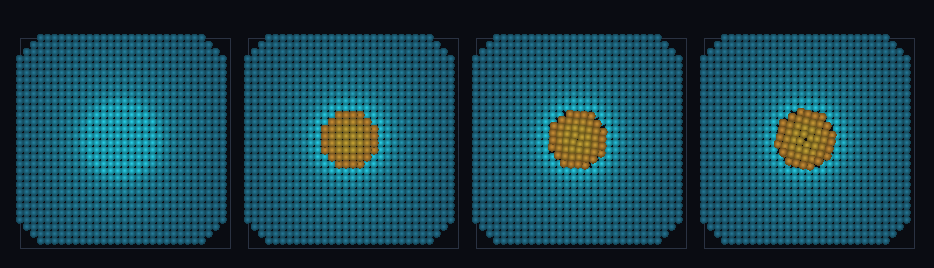

# step_0077 — SW5 자동 양방향 이주: 밀도별 격자↔SPH 적응 선택(SW5 페이오프)

> [design/sphere-world.md §6 SW5](../../design/sphere-world.md) — 0055(격자→SPH 이동)·0076(SPH→격자 역이주)이 양방향 *메커니즘*을 줬다. 이 step 은 둘을 *정책*으로 묶어 표현을 자동 선택한다 = **SW4 적응 LOD(0039)의 격자↔SPH 판**. 긴 설명은 viewer `note`(STEPS '0077')가 집.

## 논의 (조립/통합 step·새 정책)

- **세계를 어떻게 변형?** `autoMigrate(world, particles, opts)` — 밀집/붕괴 영역(ρ≥rhoOn)은 SPH 로(0055 이동)·확산 영역(입자셀질량≤rhoOff)은 격자로(0076 누적) 자동 선택. *비용이 디테일을 따라간다*. 이력 ρ_on>ρ_off 로 깜빡임 방지.
- **무엇으로 검증?** ① 적응 선택(밀집 코어→SPH·확산 입자→격자) ② 이력 무깜빡임(중간 밀도 반복 호출 안정) ③ 전역(격자+입자) 질량·운동량·총E 보존 ④ 노브 없음→불변 ⑤ 결정론. 눈: 청록 격자 헤일로 + 주황 SPH 코어 공존.
- **무엇이 보존/변하나?** 전역 보존(0055 이동+0076 누적 둘 다 보존). 바뀌는 건 *어느 표현이냐*(격자↔SPH)뿐 — 물질량은 불변.

## 구현 — autoMigrate (engine/htj-sph.js·VER 17→18·0055+0076 정책)

```
1) 격자→SPH: region = (ρ[cell] ≥ rhoOn) → migrateRegionToSPH(0055·이동·격자 비움)
2) SPH→격자: 셀 입자질량 ≤ rhoOff 인 확산 입자 → particlesToFluid(0076·누적). 밀집(>rhoOff)은 SPH 유지
이력: rhoOn > rhoOff → 임계 근처 표현 안 깜빡임. rhoOn/rhoOff 없음 → 불변(회귀 0)
```
- 기존 이주 법칙 둘을 *정책*으로 조립(새 물리 0)·신규 함수→구조적 회귀 0.

## 검증

**(a) 수치 — `node HTJ/steps/step_0077/verify.js` → PASS (6/6)** — 새 거동만 직접, 보존·항등·결정론은 `htj-verify-lib` 공용 가드.

```
PASS  적응 선택 — 밀집 코어 27셀→SPH(코어 격자 비움 true) · 확산 입자 4개→격자(남은 입자 전부 밀집 true)
PASS  이력 무깜빡임 — 중간 밀도(2) 클러스터 5회 반복: 입자 2→2·이주 0(toGrid+toSPH 0)·격자 빈 채(깜빡임 없음)
PASS  보존 — 전역 질량(격자+입자) = 135.9 → 135.9 (rel 0.00e+0 < 1e-9)
PASS  전역 운동량·총E 보존 — px 54.500→54.500 · E 41.550→41.550
PASS  항등(노브=0→회귀 0) — 노브 없음 → 격자·입자 불변 = 0xe1ee6a47
PASS  결정론 — 같은 입력 → 같은 적응 이주 = 지문 0xa4a569a
```
- 전 step verify **77/77 회귀 0**(신규 함수·구조적) · `node tools/check-viewer.js` PASS(0077=scenes/ 모듈 등록).

**(b) 눈 — `steps/step_0077/capture.png`** (범용 러너 `node tools/htj-render-capture.js 0077`·중앙 z-슬라이스)



청록 격자 블롭(프레임 1) → 밀집 코어만 주황 SPH 로 이주·확산 헤일로는 격자 유지(프레임 2·**밀도별 표현 공존**) → SPH 코어가 자유로이 소용돌이친다(프레임 3·4·Lagrangian 이 물질 따라감)·격자 헤일로는 고정 셀 배경.

## 다음

**격자 은퇴가 *적응*이 됐다 — 한 세계에 두 표현이 밀도에 따라 공존(SW5 페이오프).** 0051→0055→0076→0077 로 SW5 적응 이주 루프가 닫혔다(메커니즘 양방향 + 자동 정책). 디테일이 필요한 곳엔 SPH·조용한 배경엔 격자. **정직한 한계**: 밀도 프록시는 셀 질량(SPH 커널 밀도 아님)·단일 임계 쌍 정책(다축·구배 후속)·**이주 입자↔격자 통합 중력 미결합**(0033 의 SPH 판 후속·0055 부터의 잔여)·viewer 중앙 z-슬라이스만. **다음 = 통합 중력 SPH 판**(이주 입자↔격자 중력 결합)·구배/속도 기준 정책·안정 분절 침식(0075 후속).
