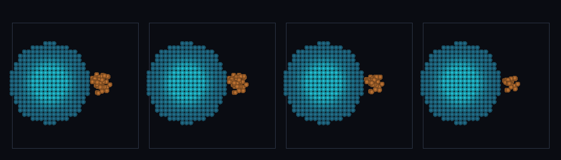

# step_0078 — 입자-격자 통합 중력(Particle-Mesh): 격자 유체와 SPH 입자가 하나의 Φ 공유

> [design/sphere-world.md §6 SW5](../../design/sphere-world.md) — 0055~0077 이 격자↔SPH 이주 메커니즘·적응 정책을 줬지만, *이주한 SPH 입자가 격자 중력과 미결합*이었다(SW5 마지막 잔여·0077 한계로 명시). 이 step 은 그 공백을 메운다 = **0007 중력의 입자-메시(PM) 판**. 긴 설명은 viewer `note`(STEPS '0078')가 집.

## 논의 (법칙 step·새 엔진 법칙)

- **세계를 어떻게 변형?** `applyParticleMeshGravity(world, particles, dt, opts)` — 입자 질량을 격자에 적치(NGP)해 결합 밀도 ρ⁺=ρ_grid+scatter(parts) 를 만들고, *단 하나의* Poisson Φ 를 풀어 a=−∇Φ 로 격자 운동량과 입자 속도를 함께 가속. 격자와 SPH 입자가 *같은 퍼텐셜*을 본다(진짜 통합 중력).
- **무엇으로 검증?** ① 상호 인력(격자 덩어리↔입자 무리가 서로 끌림·반대 부호) ② 순 운동량 정확 보존(격자+입자 평균 가속 차감) ③ 항등(입자 없음→`applyGravity` byte 동일) ④ 항등(G=0→불변) ⑤ 결정론. 눈: 청록 격자 덩어리(좌)+주황 SPH 입자(우)가 가운데로 모임.
- **무엇이 보존/변하나?** 순 운동량 보존(ā 차감). 바뀌는 건 격자·입자가 *중력으로 결합*된다는 것 — 이주 입자가 더는 중력적으로 단절되지 않음.

## 구현 — applyParticleMeshGravity (engine/htj-gravity.js·VER 1→2)

```
1) ρ⁺ = ρ_grid + Σ NGP(particle mass)        // 입자 질량을 nearest 셀에 적치
2) solvePotential(ρ⁺) → 단일 Φ               // 격자·입자가 같은 퍼텐셜
3) a = −∇Φ ;  ā = Σ_{grid+part} m·a / Σm     // 질량가중 평균(격자+입자 모두)
4) grid:  g[i] += dt·G·ρ[i]·(a[i]−ā)
   part:  p.p  += dt·G·m·(a[cell(p)]−ā)        // 순 운동량 정확 0 (뉴턴 3법칙·NGP 대칭)
입자 없음 → ρ⁺=ρ_grid → applyGravity 와 byte 동일(회귀 0) · G=0 → 항등
```
- 입자는 generic 구체(cx,cy,cz,mass,px,py,pz)만 — 타입 무지(절대 원칙: engine 에 타입 분기 없음).

## 검증

**(a) 수치 — `node HTJ/steps/step_0078/verify.js` → PASS (5/5)** — 새 거동만 직접, 보존·항등·결정론은 `htj-verify-lib` 공용 가드.

```
PASS  상호 인력 — 격자 px 6.16e+0(+x·입자 쪽) · 입자 px -6.16e+0(−x·격자 쪽) · 합 2.32e-13≈0
PASS  순 운동량 보존 — 정지 시작 → (격자+입자) Σp = (-2.98e-13, -3.91e-13, -4.90e-13) ≈ 0
PASS  항등(노브=0→회귀 0) — 입자 없음 → applyGravity 와 byte 동일 = 0xbba046cf
PASS  항등(노브=0→회귀 0) — G=0 → 격자·입자 불변 = 0xcfa87da3
PASS  결정론 — 같은 입력 → 같은 입자-메시 중력 = 지문 0x5275cff4
```
- 전 step verify **78/78 회귀 0**(applyParticleMeshGravity 신규·applyGravity 불변) · `node tools/check-viewer.js` PASS(0078=scenes/ 모듈 등록).

**(b) 눈 — `steps/step_0078/capture.png`** (범용 러너 `node tools/htj-render-capture.js 0078`·중앙 z-슬라이스)



청록 격자 덩어리(좌)는 고정 배경·주황 SPH 입자 무리(우)가 프레임을 거듭하며 *왼쪽 격자 쪽으로 끌려 모인다* — 같은 Φ 를 공유한 상호 인력(verify ① 가설과 일치).

## 다음

**이주 입자↔격자 통합 중력이 결합됐다 — 격자↔SPH 가 표현(0077)만이 아니라 *중력으로도 한 세계*.** SW5 의 마지막 결합 벽돌이 놓였다(0051→0055→0076→0077→**0078**). **정직한 한계**: NGP 적치(CIC 보간 아님·셀 해상도 격자력)·격자는 배경(viewer 에서 이류 생략·입자만 자유 운동)·입자 자체 SPH 압력/점성은 직교(이 step 은 중력만). **다음 = 구배/속도 기준 적응 이주 정책·안정 분절 침식(0075 후속)·CIC 보간**.
