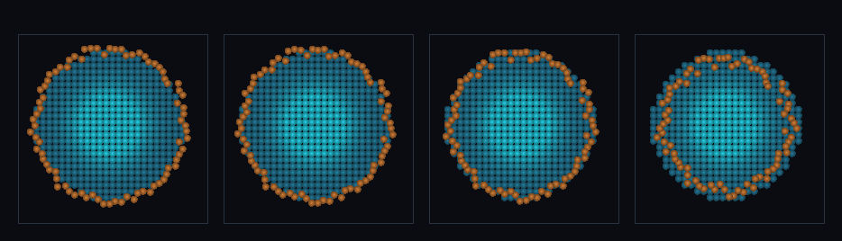

# step_0079 — 입자-메시 중력 CIC 보간: NGP(blocky) → trilinear(sub-cell 매끈)

> [design/sphere-world.md §6 SW5](../../design/sphere-world.md) — 0078 이 격자+SPH 입자를 하나의 Φ 로 묶었으나 NGP 적치(셀 해상도·blocky)가 한계였다(0078 정직한 한계). 이 step 이 CIC(cloud-in-cell) 보간으로 sub-cell 정밀도를 더한다. 긴 설명은 viewer `note`(STEPS '0079')가 집.

## 논의 (법칙 step·새 거동=적치/수집 스텐실)

- **세계를 어떻게 변형?** `applyParticleMeshGravity(..., {cic:true})` — 셀 사이 입자를 둘러싼 8 셀에 부피 가중 적치(trilinear)하고 힘은 *같은* 8 가중으로 수집 → 부드러운 sub-cell 격자력. NGP(한 셀 몰빵)의 셀 경계 점프 제거.
- **무엇으로 검증?** ① CIC 적치(x=4.5 입자→두 셀 반반) ② sub-cell 연속(0.1 이동당 힘 점프 CIC ≪ NGP) ③ 순 운동량 보존(적치/수집 대칭→scheme 무관) ④ 항등(cic 안 줌·정수 좌표→NGP=0078 동일) ⑤ 결정론. 눈: 격자 우물로 떨어지는 입자 고리가 매끄럽게 휘돌며 모임.
- **무엇이 보존/변하나?** 순 운동량 보존(대칭 가중). 바뀌는 건 격자력 *해상도*(셀→sub-cell) — 물리량 보존은 불변.

## 구현 — applyParticleMeshGravity opts.cic (engine/htj-gravity.js·VER 2→3)

```
stencil(p): cic? 8 셀 trilinear [(cell, wx·wy·wz)…]  :  NGP 단일 셀 [(cell, 1)]
적치:  src[cell] += m·w   (스텐실)        // ρ⁺ 결합 밀도
수집:  a@p = Σ w·a[cell]  (같은 스텐실)    // 대칭 → 자기력 상쇄
ā = Σ_{grid+part} m·a / Σm → 차감 → 순 운동량 0 (scheme 무관)
cic 안 줌 → NGP = 0078 byte 동일(회귀 0)
```
- 적치/수집이 *같은 가중*(대칭)이라 순 운동량 보존이 NGP·CIC 모두 정확.

## 검증

**(a) 수치 — `node HTJ/steps/step_0079/verify.js` → PASS (5/5)** — 새 거동만 직접, 보존·항등·결정론은 `htj-verify-lib` 공용 가드.

```
PASS  CIC 적치 — x=4.5 입자(m=8) → 셀 4·5 에 반반(4.000, 4.000)·NGP 면 한 셀에 8
PASS  sub-cell 연속 — 0.1 이동당 힘 점프 최대: CIC 2.14e+0 ≪ NGP 2.14e+1(셀 경계 갈아탐)
PASS  순 운동량 보존(CIC) — 정지 시작 → Σp = (-1.56e-13, -1.55e-13, -2.40e-12) ≈ 0
PASS  항등(노브=0→회귀 0) — 정수 좌표 입자 → CIC=NGP(0078 동일) = 0x1213184e
PASS  결정론 — 같은 입력 → 같은 CIC 중력 = 지문 0xd7cbc3c8
```
- 전 step verify **79/79 회귀 0**(cic 기본 off→0078 byte 동일·NGP 경로 불변) · `node tools/check-viewer.js` PASS(0079=scenes/ 모듈 등록).

**(b) 눈 — `steps/step_0079/capture.png`** (범용 러너 `node tools/htj-render-capture.js 0079`·중앙 z-슬라이스)



가장자리 고리에서 접선 속도로 출발한 주황 SPH 입자 무리가 중앙 청록 격자 우물로 *매끄럽게* 끌려 휘돌며 안으로 모인다(프레임 1→4 고리 수축) — CIC sub-cell 격자력의 연속성(verify ② 가설과 일치).

## 다음

**PM 통합 중력(0078)이 sub-cell 정밀도로 올라섰다 — 이주 입자가 격자와 *매끄럽게* 한 중력장을 이룬다.** **정직한 한계**: TSC(2차) 더 매끈하나 미도입·격자는 배경(이류 생략·입자만 자유 운동)·입자 SPH 압력/점성은 직교(중력만). **다음 = autoMigrate+PM 중력 조립**(자기중력 붕괴→밀집 코어 SPH 이주가 중력적으로 결합)·구배 기준 적응 이주·안정 분절 침식.
