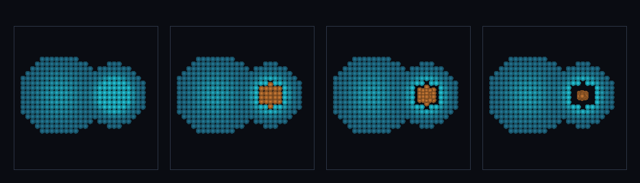

# step_0080 — (조립) 적응 이주 + 입자-메시 통합 중력: 표현은 적응·중력은 하나

> [design/sphere-world.md §6 SW5](../../design/sphere-world.md) — 0077 이 표현을 적응 선택(격자↔SPH)하고 0078/0079 가 격자+입자를 하나의 Φ 로 묶었다. 이 step 은 둘을 *한 무대*에서 함께 굴려 SW5 페이오프(표현은 적응·중력은 하나)를 보인다. 엔진 변경 0(조립). 긴 설명은 viewer `note`(STEPS '0080')가 집.

## 논의 (조립/통합 step·엔진 변경 0)

- **세계를 어떻게 변형?** 매 step `autoMigrate(0077)` → `applyParticleMeshGravity(cic·0078/0079)` 순으로 굴린다. 밀집 격자 영역이 SPH 로 이주한 뒤에도 옅은 격자 구름과 *같은 중력장*으로 묶여 합류.
- **무엇으로 검증?**(조립=새 상호작용+합쳐서 보존만) ① 조립 창발(밀집→SPH 이주·격자 공존·PM 중력으로 격자↔입자 상호 인력) ② 전역 보존(조립 6 루프 후 격자+입자 총 질량·운동량) ③ 결정론. 부품 보존은 0077/0078/0079 verify 가 이미 보증(중복 안 함). 눈: 격자 구름(청록)+이주 SPH 코어(주황) 합류.
- **무엇이 보존/변하나?** 전역 보존(이주·PM 중력 둘 다 보존). 바뀌는 건 *두 메커니즘이 한 루프로 닫힘* — 입자가 autoMigrate 결과로 생겨 그대로 중력 결합.

## 구현 — 조립(새 코드 0)

```
advance: autoMigrate(grid, parts, {rhoOn, rhoOff})       // 밀집→SPH·확산→격자(0077)
         applyParticleMeshGravity(grid, parts, dt, {cic}) // 격자+입자 단일 Φ(0078)·CIC(0079)
         parts.cx += px/m·dt                              // 입자 자유 운동(Lagrangian)
```
- 기존 법칙 둘의 조립 → 신규 함수 0 → 구조적 회귀 0.

## 검증

**(a) 수치 — `node HTJ/steps/step_0080/verify.js` → PASS (4/4)** — 조립=새 상호작용+전역 보존만, 결정론은 공용 가드.

```
PASS  조립 창발 — 우 밀집→SPH(80개)·좌 격자 공존 true · PM 중력 결합: 격자 px 1.93e+3(+x) · 입자 px -1.93e+3(−x) · 합≈0
PASS  보존 — 전역 질량(격자+입자·조립 6 루프) = 4125.957093211658 → 4125.957093211654 (rel 8.82e-16 < 1e-9)
PASS  전역 운동량 보존 — 정지 시작 → Σp = (-2.27e-13, -7.50e-13, 2.79e-12) ≈ 0
PASS  결정론 — 같은 입력 → 같은 조립(이주+PM 중력) = 지문 0xdbb9f25d
```
- 전 step verify **80/80 회귀 0**(엔진 변경 0·조립) · `node tools/check-viewer.js` PASS(0080=scenes/ 모듈 등록).

**(b) 눈 — `steps/step_0080/capture.png`** (범용 러너 `node tools/htj-render-capture.js 0080`·중앙 z-슬라이스)



옅은 격자 구름(좌·청록)+밀집 덩어리(우) → 밀집만 SPH(주황)로 이주(프레임 2) → SPH 코어가 같은 중력장에 끌려 좌로 휘며 수축·합류(프레임 3·4) — 표현 적응 + 통합 중력 결합(verify ① 가설과 일치).

## 다음

**SW5 적응 이주 루프(0051→0055→0076→0077)와 통합 중력(0078/0079)이 한 무대에서 만났다 — 격자 은퇴가 표현뿐 아니라 *중력적으로도 한 세계*.** **정직한 한계**: 격자는 배경(이류 생략·입자만 자유 운동)·단일 임계 쌍 정책·viewer 중앙 z-슬라이스만. **다음 = 구배/속도 기준 적응 이주·격자 이류 합류·안정 분절 침식**.
