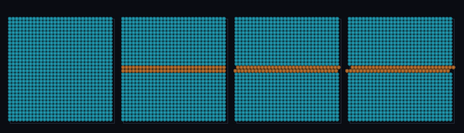

# step_0081 — 구배(전단) 기준 적응 이주: |∇v| 큰 전단층도 SPH(디테일=속도 변화)

> [design/sphere-world.md §6 SW5](../../design/sphere-world.md) — 0077 의 `autoMigrate` 는 밀도(셀 질량) 하나로 격자↔SPH 를 골랐다(0077 한계: 단일 임계 쌍). 이 step 은 정책을 한 축 넓힌다 — *속도 전단*도 디테일이다. 긴 설명은 viewer `note`(STEPS '0081')가 집.

## 논의 (법칙 step·새 거동=전단 기준 + 측정자)

- **세계를 어떻게 변형?** `gridShearField(world)` = 셀별 |∇v|=√Σ(∂v_i/∂x_j)² 측정자 + `autoMigrate({shearOn})` — |∇v|≥shearOn 인 셀(전단·소용돌이)도 SPH 로(밀도 OR 전단). 고정 셀 격자가 수치 확산으로 뭉개는 전단면을 Lagrangian SPH 가 좇는다.
- **무엇으로 검증?** ① 전단 기준(같은 밀도라도 전단 큰 영역→SPH·균일 내부→격자) ② 밀도+전단 OR 결합 ③ 전역 보존(이주=이동) ④ 항등(shearOn 없음→0077 밀도 기준만) ⑤ 결정론. 눈: 반대 흐름 만나는 전단층만 SPH.
- **무엇이 보존/변하나?** 전역 보존(이주=이동). 바뀌는 건 *디테일 판정 축*(밀도→밀도+구배).

## 구현 — gridShearField + autoMigrate shearOn (engine/htj-sph.js·VER 18→19)

```
gridShearField:  v=mom/ρ ; out[i]=√(Σ_{comp} Σ_{axis} (∂v_comp/∂axis)²)  (중심차분·경계 클램프·ρ≤0→0)
autoMigrate:  region(grid→SPH) = (ρ≥rhoOn) OR (|∇v|≥shearOn)            // 밀도 OR 전단
shearOn 안 줌 → ρ≥rhoOn 만(0077 byte 동일·회귀 0)
```
- 전단은 *읽기 전용* 측정자(world 불변)·이주는 기존 migrateRegionToSPH(이동·보존).

## 검증

**(a) 수치 — `node HTJ/steps/step_0081/verify.js` → PASS (6/6)** — 새 거동만 직접, 보존·항등·결정론은 `htj-verify-lib` 공용 가드.

```
PASS  전단 기준 이주 — 전단 내부 셀(x=2)→SPH(비움 true) · 균일 내부 셀(x=9)→격자 유지 true · toSPH 1008
PASS  밀도+전단 OR — 밀집 셀(x=2)과 전단 영역(x≥6) 둘 다 SPH(5개·x=[2,6,7,8,9])
PASS  보존 — 전역 질량(격자+입자) = 1728 → 1728 (rel 0.00e+0 < 1e-9)
PASS  전역 운동량 보존 — px 5832.000 → 5832.000
PASS  항등(노브=0→회귀 0) — shearOn 없음 → 밀도 기준만(전단 무시·격자 유지) = Δ 0.00e+0
PASS  결정론 — 같은 입력 → 같은 전단 적응 이주 = 지문 0xf215a14
```
- 전 step verify **81/81 회귀 0**(shearOn 기본 off→0077 동일·gridShearField 신규) · `node tools/check-viewer.js` PASS(0081=scenes/ 모듈 등록).

**(b) 눈 — `steps/step_0081/capture.png`** (범용 러너 `node tools/htj-render-capture.js 0081`·중앙 z-슬라이스)



박스 전체 균일 격자(프레임 1·청록) → 위/아래 반대 흐름이 만나는 *전단층*(중앙 띠)만 SPH(주황)로 이주(프레임 2)·균일 흐름 영역은 격자 유지 → SPH 전단층 입자가 반대 흐름으로 미끄러진다(프레임 3·4·Lagrangian·verify ① 가설과 일치).

## 다음

**표현 적응 정책이 단일 임계(밀도)에서 *다축*(밀도+구배)으로 — 0077 의 한계를 한 축 넓혔다.** **정직한 한계**: |∇v| 만(와도·발산 분해 안 함)·단일 shearOn 임계·전단은 이력(hysteresis) 미적용·viewer 중앙 z-슬라이스만. **다음 = 와도/발산 분해·전단 이력·격자 이류 합류·안정 분절 침식**.
