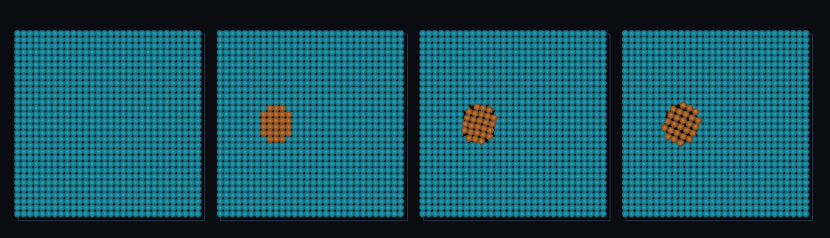

# step_0082 — 와도(vorticity) 기준 적응 이주: 회전 소용돌이만 SPH(회전≠발산 분리)

> [design/sphere-world.md §6 SW5](../../design/sphere-world.md) — 0081 이 |∇v|(전단)으로 디테일을 짚었으나, |∇v| 는 *회전*(eddy)과 *발산*(압축/팽창)을 못 가른다(0081 한계). 이 step 은 와도 ω=∇×v 로 *회전만* 분리해 짚는다. 긴 설명은 viewer `note`(STEPS '0082')가 집.

## 논의 (법칙 step·새 거동=와도 기준 + 측정자)

- **세계를 어떻게 변형?** `gridVorticityField(world)` = 셀별 |∇×v| 측정자 + `autoMigrate({vortOn})` — |∇×v|≥vortOn 인 회전 영역(소용돌이)도 SPH 로. 회전 eddy 는 고정 셀 격자가 가장 못 좇고 Lagrangian SPH 가 특히 잘 좇는다.
- **무엇으로 검증?** ① 회전→SPH ② **핵심 구분**: 순수 발산(방사 팽창)은 |∇v| 크지만 |ω|=0 → vortOn 으론 안 이주(전단 기준과 다른 축) ③ 전역 보존 ④ 항등(vortOn 없음→0077) ⑤ 결정론. 눈: 좌 회전 소용돌이만 SPH·우 발산은 격자.
- **무엇이 보존/변하나?** 전역 보존(이주=이동). 바뀌는 건 *디테일 판정 축 추가*(밀도→전단→회전).

## 구현 — gridVorticityField + autoMigrate vortOn (engine/htj-sph.js·VER 19→20)

```
gridVorticityField:  ω=∇×v ; out[i]=|ω|=√(ω_x²+ω_y²+ω_z²)  (중심차분·경계 클램프·ρ≤0→0)
autoMigrate:  region(grid→SPH) = (ρ≥rhoOn) OR (|∇v|≥shearOn) OR (|∇×v|≥vortOn)   // 밀도·전단·회전 다축
순수 발산: |∇v|=√2 크지만 |ω|=0 → vortOn 무시·shearOn 이주(축 분리)
vortOn 안 줌 → 0077/0081 동일(회귀 0)
```
- 와도는 *읽기 전용* 측정자(world 불변)·이주는 기존 migrateRegionToSPH(이동·보존).

## 검증

**(a) 수치 — `node HTJ/steps/step_0082/verify.js` → PASS (6/6)** — 새 거동만 직접, 보존·항등·결정론은 `htj-verify-lib` 공용 가드.

```
PASS  회전→SPH — 솔리드-바디 회전(|ω|=2≥vortOn) 전부 SPH(toSPH 1000·격자 비움 0.0e+0)
PASS  발산은 와도 0 — 방사 팽창(div=2·curl=0): vortOn→이주 0(0) · 대조 shearOn→이주 1000(>0). 회전≠발산 분리
PASS  보존 — 전역 질량(격자+입자) = 1000 → 1000 (rel 0.00e+0 < 1e-9)
PASS  전역 운동량 보존 — Σ(px+py) -0.000 → -0.000
PASS  항등(노브=0→회귀 0) — vortOn 없음 → 밀도 기준만(회전 무시·격자 유지) = Δ 0.00e+0
PASS  결정론 — 같은 입력 → 같은 와도 적응 이주 = 지문 0x4b1b4a34
```
- 전 step verify **82/82 회귀 0**(vortOn 기본 off→0077/0081 동일·gridVorticityField 신규) · `node tools/check-viewer.js` PASS(0082=scenes/ 모듈 등록).

**(b) 눈 — `steps/step_0082/capture.png`** (범용 러너 `node tools/htj-render-capture.js 0082`·중앙 z-슬라이스)



박스 전체 균일 격자(프레임 1·청록) → 좌측 회전 소용돌이(|ω|≈1.66)만 SPH(주황)로 이주·우측 방사 팽창(발산·|ω|≈0.24<vortOn)은 격자 유지(프레임 2) → SPH 소용돌이 입자가 휘돈다(프레임 3·4·Lagrangian·verify ②의 회전≠발산 분리가 화면에 그대로).

## 다음

**표현 적응 정책이 밀도(0077)→전단(0081)→회전(0082)으로 *물리적으로 의미 있는 축*을 쌓았다 — 비용이 진짜 디테일(회전 구조)을 따라간다.** **정직한 한계**: |ω| 크기만(축 방향 무시)·단일 vortOn 임계·이력 없음·viewer 중앙 z-슬라이스만. **다음 = 와도 이력·발산(충격면) 축·격자 이류 합류·안정 분절 침식**.
