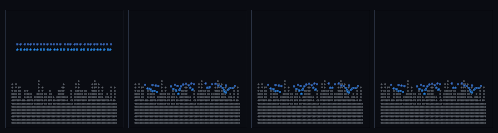

# step_0083 — (조립) 법칙만으로 지형과 바다: 노이즈 지형 위로 물이 분지에 고여 수면을 찾는다

> 조립 step(engine 변경 0·선례 0035·0043·0080) — 새 법칙 없이 *이미 가진 두 법칙을 한 무대에서 함께* 굴려 창발을 본다. 긴 설명은 viewer `note`(STEPS '0083')가 집.

## 논의 (조립 step·새 법칙 0·합쳐서 생긴 창발)

- **세계를 어떻게 변형?** 노이즈 높이장(value-noise fBm·0074 `fieldNoise` 가족)으로 지형을 깔고, 그 위에 물(SPH 입자)을 *균일 살포* → 중력 + 경계 접촉(0060 `sphBoundaryForce`) + SPH 압력/점성(0041/0046)으로 물이 *스스로* 낮은 분지로 흘러 고이고 평평한 수면을 찾는다. 봉우리는 수면 위로 솟아 땅(섬). **어디가 땅·바다인지 author 안 함 — 법칙이 가른다.**
- **무엇으로 검증?** ① 물 찬 컬럼 지형 < 마른 컬럼(낮은 곳으로) ② 수면 산포 ≪ 지형 산포(제 높이 찾기=바다) ③ 땅·바다 공존(봉우리=섬) ④ 물 질량 보존 ⑤ 결정론. 눈: 균일 살포 물이 분지로 모여 평평한 바다·봉우리는 땅.
- **무엇이 보존/변하나?** 물 질량 보존(살포=초기·이동만). engine 불변(부품 보존은 0041/0046/0060 verify 가 보증) → 새로 생긴 건 *지형·바다의 동시 창발*.

## 구현 — 기존 법칙 조립 (engine 변경 0·viewer/scenes/step_0083.js)

```
지형(법칙):  terrainTop(x) = AMP·fBm(x·SCALE)        // 봉우리·계곡 창발(author 없음)·작은 앵커 구로 bumpy 바닥
바다(법칙):  물 균일 살포 → 매 step:
              sphPressureForce + sphViscosity         // SPH 유체(0041/0046)
              pz -= m·G·dt                            // 중력
              sphBoundaryForce(water, anchors)         // 지형 경계 법선 반발(0060)
              stepEntities                             // 자유 운동(0027)
            → 물이 낮은 분지로 흘러 고이고 평평한 수면을 찾는다(바다)·봉우리는 수면 위 = 땅
```
- engine 은 "지형/바다" 타입을 모름 — 노이즈=generic 장, 경계=generic 정적 앵커, 물=한 원소. viewer 는 읽기만.

## 검증

**(a) 수치 — `node HTJ/steps/step_0083/verify.js` → PASS (6/6)** — 조립이라 *합쳐서 생긴 창발 + 보존*만, 결정론은 `htj-verify-lib` 공용 가드.

```
PASS  바다는 분지에 — 물 찬 컬럼 지형 8.86 < 마른 컬럼 11.23(중력이 물을 낮은 곳으로)
PASS  수면 평평(제 높이 찾기) — 수면 산포 0.57 < 0.4×지형 산포 1.16(지형 2.90)
PASS  땅·바다 공존 — 바다 컬럼 10·땅(마른) 컬럼 15·수면(≈14.2) 위로 솟은 봉우리 1개
PASS  보존 — 물 질량(살포 → 정착) = 58 → 58 (rel 0.00e+0 < 1e-9)
PASS  유한성 — 모든 입자 좌표 유한(발산 없음·최저 z 10.7)
PASS  결정론 — 같은 법칙 → 같은 지형·바다 = 지문 0xd70fa96c
```
- 전 step verify **83/83 회귀 0**(engine 변경 0 — 부품 법칙 불변) · `node tools/check-viewer.js` PASS(0083=scenes/ 모듈 등록).

**(b) 눈 — `steps/step_0083/capture.png`** (범용 러너 `node tools/htj-render-capture.js 0083`·x-z 단면)



균일하게 뿌린 물(프레임 1·파랑·지형 위 띠) → 떨어져 낮은 분지로 흘러 모이고(프레임 2) → 평평한 수면을 찾아(프레임 3) → 봉우리(회색)가 솟은 땅 사이에 바다가 고인다(프레임 4·verify ①②③의 분지 고임·평평 수면·땅바다 공존이 화면에 그대로).

## 다음

**4 트랙 골격(SW·TW·M·U) 위에서 "법칙만으로 지형과 바다"가 한 화면에 모였다 — 노이즈가 땅을 낳고 중력·접촉이 바다를 가른다(author 0).** **정직한 한계**: 2D x-z 단면(진짜 3D 분지·해안선은 후속)·지형 정적 앵커(0075 침식 결합 시 물↔땅 왕복)·물 살포량은 입력(수위는 보존이라 결정적)·단일 노이즈 장. **다음 = 침식 결합(흐름이 해안 깎음)·3D 해안선·연속 바다(TW2)**.
