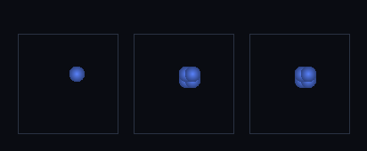

# step_0084 — PM 중력 TSC(2차) 보간: CIC(C⁰·kink) → TSC(C¹·매끈)

> [design/sphere-world.md §6 SW5](../../design/sphere-world.md) — 입자-메시 중력의 적치/수집 보간 사다리(NGP 0078 → CIC 0079 → **TSC**). 긴 설명은 viewer `note`(STEPS '0084')가 집.

## 논의 (법칙 step·새 거동=2차 보간)

- **세계를 어떻게 변형?** `applyParticleMeshGravity` 에 `opts.tsc` 추가 — 입자 질량을 가장 가까운 셀 ±1(축마다 3 셀·총 27 셀)에 *2차* 가중 `w(d)=½(½∓d)², ¾−d²`(Σ=1)으로 적치/수집. CIC(1차 삼각·C⁰ kink) → TSC(2차·C¹·기울기까지 연속).
- **무엇으로 검증?** ① 정수 좌표도 27 셀로 퍼짐(중심 m·0.75³·합 보존) ② 미세 이동당 적치 가중 2차 차분(기울기 점프) TSC ≪ CIC ③ 순 운동량 보존(적치/수집 대칭) ④ tsc off→CIC=0079 동일 ⑤ 결정론. 눈: 적치 밀도장 NGP(blocky)→CIC→TSC(매끈).
- **무엇이 보존/변하나?** 순 운동량·총 질량 보존(대칭 가중). 바뀌는 건 *보간 차수*(격자력 매끄러움↑·kink 제거).

## 구현 — stencil TSC 분기 (engine/htj-gravity.js·VER 3→4)

```
TSC stencil(p):  i=round(p), d=p−i ∈[−½,½]
                 w(d) = [ ½(½−d)², ¾−d², ½(½+d)² ]   (축마다·Σ=1)
                 27 셀 = wx[c]·wy[b]·wz[a]   // C¹(CIC 의 C⁰ kink 제거)
적치/수집 *같은* 가중(대칭) → 순 운동량 정확 보존
tsc 안 줌 → 기존 CIC/NGP 스텐실(회귀 0)
```
- TSC 는 적치/수집 가중만 바꾼다(Poisson·∇Φ·평균차감 불변).

## 검증

**(a) 수치 — `node HTJ/steps/step_0084/verify.js` → PASS (5/5)** — 새 거동만 직접, 보존·항등·결정론은 `htj-verify-lib` 공용 가드.

```
PASS  TSC 적치(2차) — 정수 x=5 입자(m=8): 중심 3.375(=8·0.75³)·면이웃 0.563>0·27셀 합 8.000=8·NGP/CIC 면 한 셀 몰빵
PASS  C¹ 매끈 — 미세 이동당 적치 가중 2차 차분 최대: TSC 2.25e-2 ≪ CIC 8.00e-1(삼각 kink 제거)
PASS  순 운동량 보존(TSC) — 정지 시작 → Σp = (2.98e-13, 3.22e-13, 2.52e-12) ≈ 0
PASS  항등(노브=0→회귀 0) — tsc off → CIC(0079 동일) = 0x667ab882
PASS  결정론 — 같은 입력 → 같은 TSC 중력 = 지문 0xd894cf80
```
- 전 step verify **84/84 회귀 0**(tsc 기본 off→0079/0078 동일·VER 4) · `node tools/check-viewer.js` PASS(0084=scenes/ 모듈 등록).

**(b) 눈 — `steps/step_0084/capture.png`** (범용 러너 `node tools/htj-render-capture.js 0084`·z 중앙 슬라이스)



같은 셀-사이 입자(8.5,8.5)의 적치 밀도장: NGP(한 밝은 셀·blocky·프레임 1) → CIC(2×2 블록·프레임 2) → TSC(매끈한 3×3 구름·프레임 3) — verify ②의 "kink 제거·매끈"이 화면에 그대로.

## 다음

**PM 중력 보간이 NGP→CIC→TSC(2차)로 한 칸 더 올라 격자력이 매끄러워졌다(SW5 통합중력 정밀도↑).** **정직한 한계**: 2차까지(3차 PCS=64 셀·비용↑·미도입)·힘은 여전히 중심차분 ∇Φ(격자 해상도)·경계 wrap·viewer 는 z 슬라이스. **다음(SW5) = 격자 장면 SPH 점진 대체·입자 SPH+PM 중력 통합 루프**.
