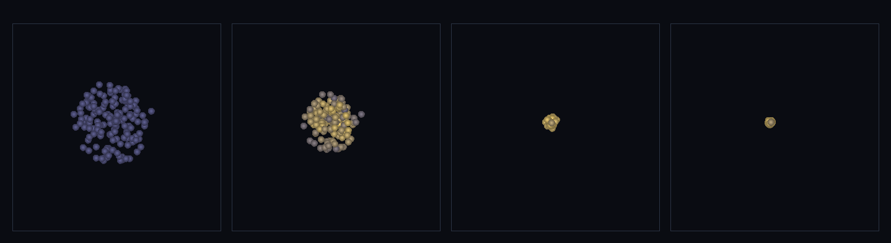

# step_0085 — (조립) 격자 장면을 SPH 로: 자기중력 붕괴가 격자 질량 0 으로 입자만으로

> [design/sphere-world.md §6 SW5](../../design/sphere-world.md) — 격자 은퇴: 0007 이 격자 ρ Poisson 으로 하던 자기중력 붕괴를 격자를 비운 채 입자(SPH)만으로. 조립 step(engine 변경 0·선례 0035·0043·0080·0083). 긴 설명은 viewer `note`(STEPS '0085')가 집.

## 논의 (조립 step·새 법칙 0·합쳐서 생긴 창발)

- **세계를 어떻게 변형?** 입자 블롭에 `sphPressureForce`(0041)+`sphViscosity`(0046)+`applyParticleMeshGravity`(0078·0084 TSC)+`stepEntities`(0027)를 함께 굴린다 → 격자 질량 0인데도 입자가 *스스로 끌려* 모이고, 낙하 KE 가 점성으로 열(internalE)이 돼 코어가 달궈진다(별 형성).
- **무엇으로 검증?** ① 자기중력 붕괴(RMS↓·격자 없이) ② 격자 질량 0(PM 중력이 입자만으로 옛 격자 자기중력 대신) ③ 붕괴 가열(internalE>0·압력 OFF→0) ④ 질량·운동량 보존 ⑤ 결정론. 눈: 찬 블롭→모여듦→뜨거운 코어.
- **무엇이 보존/변하나?** 입자 질량·순 운동량 보존. engine 불변(부품 보존은 0041/0046/0078 verify 가 보증) → 새로 생긴 건 *격자 없이 입자만의 자기중력 붕괴+가열*.

## 구현 — 기존 법칙 조립 (engine 변경 0·viewer/scenes/step_0085.js)

```
매 step (격자 ρ = 0·입자만):
  sphPressureForce + sphViscosity        // SPH 압력/점성(0041/0046)
  applyParticleMeshGravity(grid, P, {tsc})// 입자 질량 적치→단일 Φ→입자 가속(0078/0084)
  stepEntities                            // 자유 운동(0027)
→ 격자 질량 0(Σ|격자 장|=0)·입자 블롭 자기중력 붕괴·낙하 KE→점성→internalE(가열·별)
```
- 격자는 PM 중력의 *연산 격자*로만 쓰이고 질량을 담지 않는다 — 옛 격자 유체(0007)의 *은퇴*.

## 검증

**(a) 수치 — `node HTJ/steps/step_0085/verify.js` → PASS (6/6)** — 조립이라 *합쳐서 생긴 창발 + 보존*만, 결정론은 `htj-verify-lib` 공용 가드.

```
PASS  자기중력 붕괴(입자만) — RMS 반경 3.03 → 최소 0.12(< 0.5×r0·격자 없이 모인다)
PASS  격자 질량 0 — Σ|격자 장| = 0.0e+0(PM 중력이 입자만으로·격자 은퇴 정당화)
PASS  붕괴 가열 — Σ internalE: 압력ON 4085.7 > 0 · OFF 0.0(낙하 KE→열·비가역)
PASS  보존 — 입자 질량(붕괴 220 step) = 150 → 150 (rel 0.00e+0 < 1e-9)
PASS  순 운동량 보존 — 정지 시작 → Σp = (1.39e-14, 5.55e-15, 3.69e-15) ≈ 0
PASS  결정론 — 같은 법칙 → 같은 붕괴 = 지문 0xfd74b8b4
```
- 전 step verify **85/85 회귀 0**(engine 변경 0 — 부품 법칙 불변) · `node tools/check-viewer.js` PASS(0085=scenes/ 모듈 등록).

**(b) 눈 — `steps/step_0085/capture.png`** (범용 러너 `node tools/htj-render-capture.js 0085`·x-z 투영·밝기=열)



흩어진 찬 블롭(프레임 1·파랑) → 자기중력으로 모여들며 코어가 달궈지고(프레임 2·금색) → 붕괴해 뜨거운 밀집 코어(프레임 3·4·흰/노랑) — 격자 한 칸 없이 별이 빚어진다(verify ①③의 붕괴+가열이 화면에 그대로).

## 다음

**SW5 격자 은퇴가 시연됐다 — 0007 의 격자 자기중력을 입자(SPH)만으로 재현(격자 질량 0·붕괴+가열).** **정직한 한계**: 유한 코어 비리얼 평형은 미세조정 필요(여기선 붕괴+가열까지·압력 코어 안정화 후속)·주기 경계 PM(고립계 근사)·viewer x-z 투영. **다음(SW5 마무리) = 격자+SPH 가 한 세계에 공존하며 autoMigrate 로 적응 이주하는 통합 루프**.
