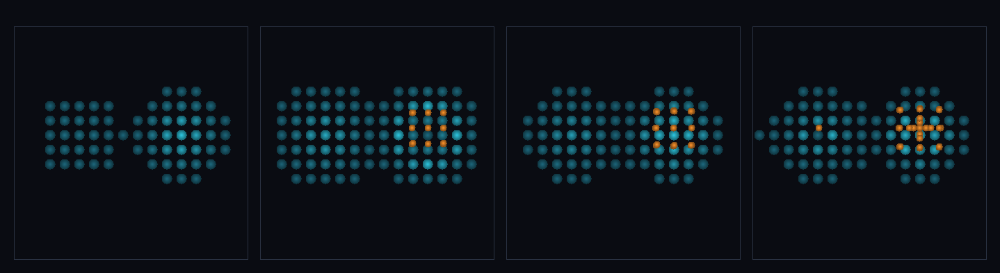

# step_0086 — (조립) SW5 통합 루프: 격자+SPH 가 한 세계에 공존하며 단일 Φ 로 함께 굴러간다

> [design/sphere-world.md §6 SW5](../../design/sphere-world.md) — SW5 마지막 그림: 한 세계, 두 표현(격자+SPH), 하나의 물리. 조립 step(engine 변경 0·선례 0080·0083·0085). 긴 설명은 viewer `note`(STEPS '0086')가 집.

## 논의 (조립 step·새 법칙 0·합쳐서 생긴 창발)

- **세계를 어떻게 변형?** 0080(autoMigrate+PM 중력) 위에 *완전한 루프*를 얹는다 — 매 step `autoMigrate`(밀집 격자→SPH·확산 SPH→격자) + `sphPressureForce`/`sphViscosity`(이주 입자가 유체로 거동) + `applyParticleMeshGravity`{tsc}(격자+입자 단일 Φ) + `advect`(격자 배경도 함께 흐름) + `stepEntities`. **0080 대비 새로움 = ② SPH 내부물리 ③ 격자 이류 합류.**
- **무엇으로 검증?** ① 공존+단일 Φ 상호인력 ② SPH 내부물리(internalE>0) ③ 격자 이류(advect 가 격자 옮김) ④ 통합 루프 전역 보존 ⑤ 결정론. 눈: 격자(청록)+SPH(주황) 한 세계에서 함께 진화.
- **무엇이 보존/변하나?** 전역 질량·순 운동량 보존. engine 불변(부품 보존은 각 step verify) → 새로 생긴 건 *완전한 적응 루프(SPH 물리+격자 이류)가 단일 Φ 로 함께 굴러가며 보존*.

## 구현 — 기존 법칙 조립 (engine 변경 0·viewer/scenes/step_0086.js)

```
매 step (격자+입자 한 세계):
  autoMigrate(grid, P, {rhoOn})           // 밀집 격자→SPH·확산 SPH→격자(0077)
  sphPressureForce + sphViscosity         // 이주 입자 유체 거동(0041/0046) ← 0080 엔 없던
  applyParticleMeshGravity(grid, P, {tsc})// 격자+입자 단일 Φ(0078/0084)
  advect(grid)                            // 격자 배경도 Φ 로 흐름(0006) ← 0080 엔 없던
  stepEntities(P)                         // 입자 자유 운동(0027)
→ 한 세계·두 표현·하나의 물리·전역 보존
```

## 검증

**(a) 수치 — `node HTJ/steps/step_0086/verify.js` → PASS (6/6)** — 조립이라 *합쳐서 생긴 상호작용 + 전체 루프 전역 보존*만, 결정론은 `htj-verify-lib` 공용 가드.

```
PASS  공존+단일 Φ — 격자(761)+SPH(27) 공존 true·상호인력 격자 px 3.72e+0(+x)·입자 px -3.72e+0(−x)·합≈0
PASS  SPH 내부물리 — 이주 입자 유체 거동: Σ internalE = 6004.1 > 0(압력/점성이 낙하 KE→열·0080 엔 없던 축)
PASS  격자 이류 합류 — advect 가 격자 배경을 옮긴다: Σ|ρ_after − ρ_before| = 4.04e+1 > 0(격자도 Φ 로 흐름)
PASS  보존 — 전역 질량(격자+입자·통합 루프 30회) = 1250.7974338762601 → 1250.7974338762572 (rel 2.36e-15 < 1e-9)
PASS  전역 운동량 보존 — 정지 시작 → Σp = (3.98e-13, 6.78e-14, -2.32e-13) ≈ 0
PASS  결정론 — 같은 입력 → 같은 통합 루프 = 지문 0x5b56439e
```
- 전 step verify **86/86 회귀 0**(engine 변경 0 — 부품 법칙 불변) · `node tools/check-viewer.js` PASS(0086=scenes/ 모듈 등록).

**(b) 눈 — `steps/step_0086/capture.png`** (범용 러너 `node tools/htj-render-capture.js 0086`·z 중앙 슬라이스·청록=격자·주황=SPH)



두 격자 덩어리(프레임 1·청록) → 우측 밀집 덩어리가 SPH(주황)로 이주해 유체로 뭉치고(프레임 2) → 좌측 옅은 격자는 advect 로 흐르며 둘이 같은 Φ 로 서로 끌려(프레임 3·4) 한 세계에서 함께 진화한다(verify ①②③이 화면에 그대로).

## 다음

**SW5 골격이 닫혔다 — 격자↔SPH 적응 이주·통합중력(TSC)·격자 은퇴·통합 루프가 한 세계에서 보존하며 함께 굴러간다(한 세계·두 표현·하나의 물리).** **정직한 한계**: 격자 advect 1차 수치확산·주기 경계 PM(고립계 근사)·유한 코어 비리얼 평형 미세조정 후속·viewer z 슬라이스. **다음 = 발산(충격면) 축·이주 이력·안정 분절 침식 등 후속 정밀화**.
