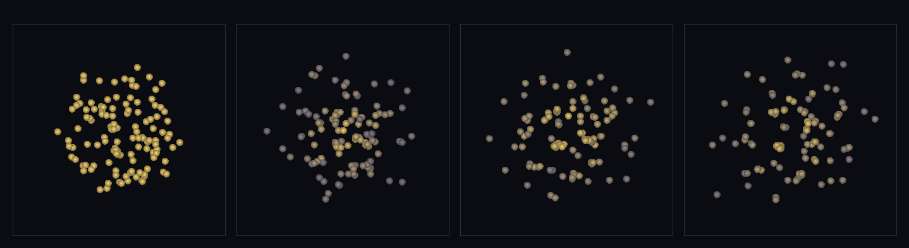

# step_0087 — (조립) 비리얼 평형 별 코어: 되먹임 압력이 자기중력 붕괴를 *유한 코어*에서 멈춘다

> [design/sphere-world.md §6 SW5](../../design/sphere-world.md)·STATE §3 NEXT #2(유한 코어 비리얼 평형·0085 후속). 조립 step(engine 변경 0). 긴 설명은 viewer `note`(STEPS '0087')가 집.

## 논의 (조립 step·새 법칙 0·합쳐서 생긴 창발)

- **세계를 어떻게 변형?** 0085 는 자기중력 붕괴를 입자만으로 보였으나 *압력이 약해 점으로* 무너졌다(RMS 3.03→0.12). 여기에 되먹임 압력(0045 `sphThermalPressureForce` P=(γ−1)ρu)+점성 감쇠(0046)를 얹어 — 붕괴가 가스를 데우고 데운 압력이 *떠받쳐* **유한 반경에서 멈춘다**. 비리얼 근처(U₀≈½|W₀|)서 시작 → 점성이 잔여 운동 깎아 **비리얼 평형**(2(K+U)+W≈0)에 정착. **0085 대비 새로움 = 압력이 붕괴를 멈춘다(지속하는 코어)**.
- **무엇으로 검증?** ① 유한 코어(ON 유계 정착 vs OFF 점 붕괴) ② 비리얼 정리 Q=2(K+U)/|W|→1 ③ 압력 지지(K_bulk≪U) ④ 운동량 보존 ⑤ 결정론. 눈: 흩어진 블롭이 모여 데워지며 유한 코어로 정착.
- **무엇이 보존/변하나?** 운동량 정확 보존(중력·압력·점성 모두 쌍힘). 중력=쌍힘(0028)·PE=같은 법칙(0028 `pairPotentialEnergy`)이라 비리얼 수지가 정확히 닫힌다. engine 불변 → 새로 생긴 건 *압력이 붕괴를 유한 코어에서 멈춰 비리얼 평형에 정착*.

## 구현 — 기존 법칙 조립 (engine 변경 0·viewer/scenes/step_0087.js)

```
매 step (가스 블롭·비리얼 근처 시작 U₀≈½|W₀|):
  applyEntityGravity(P, {G, soft})           // 쌍힘 자기중력(0028)·안으로
  sphThermalPressureForce(P, {gamma:5/3, h}) // 되먹임 압력(0045)·압축 데움→P↑→밖으로
  sphViscosity(P, {alpha, beta, h})          // 점성(0046)·infall 운동→열(진동 깎음)
  stepEntities(P)                            // 자유 운동(0027)
→ 중력↓ + 압력↑ 균형 = 유한 코어·비리얼 평형(2(K+U)+W≈0)
```

## 검증

**(a) 수치 — `node HTJ/steps/step_0087/verify.js` → PASS (5/5)** — 조립이라 *합쳐서 생긴 창발(유한 코어·비리얼·압력 지지)+운동량 보존*만, 결정론은 `htj-verify-lib` 공용 가드.

```
PASS  유한 코어 — 압력 ON ⟨rms⟩=4.025(유계·정착) vs OFF rms=0.053(점 붕괴)·비 75×(압력이 붕괴 멈춤)
PASS  비리얼 평형 — ⟨Q⟩=2(K+U)/|W|=1.074 ≈ 1 (init 1.039→정착·2(K+U)+W≈0·별 코어)
PASS  압력 지지 — ⟨K_bulk⟩/⟨U⟩=0.0206 ≪ 1(점성이 infall 깎음·코어는 *압력*이 떠받침·⟨K⟩=17.8 ⟨U⟩=866.4)
PASS  운동량 보존 — 정지 시작 → Σp=(-6.44e-14, -1.14e-14, -1.12e-13) ≈ 0
PASS  결정론 — 같은 입력 → 같은 비리얼 평형 = 지문 0x9ea20a26
```
- 전 step verify **87/87 회귀 0**(engine 변경 0 — 부품 법칙 불변) · `node tools/check-viewer.js` PASS(0087=scenes/ 모듈 등록).

**(b) 눈 — `steps/step_0087/capture.png`** (범용 러너 `node tools/htj-render-capture.js 0087`·x-z 투영·밝기=열 internalE)



균일한 따뜻한 블롭(프레임 1) → 자기중력으로 모이며 중심이 데워지고(노랑 코어·회색 외곽) → **유한 반경의 지속하는 코어로 정착**(프레임 2~4·점으로 안 무너지고 흩어지지도 않음). verify ①②③(유한 코어·비리얼·압력 지지)이 화면에 그대로.

## 다음

**"스스로 형성돼 *지속*하는 개체"의 첫 시연 — 중력↓+압력↑ 균형이 별 코어를 빚는다**(STATE §4 "선 캐릭터=중력↓+접촉 반발↑ 균형"의 유체 판). **정직한 한계**: ⓐ 비리얼을 정확히 닫으려 0085 의 PM(주기 게이지 모호) 대신 직접 N체 중력(0028)+짝맞는 PE — 격자 은퇴(PM) 트랙과 직교한 압력-비리얼 트랙 ⓑ softened 중력이라 Q≈1.07(7% 편차) ⓒ 냉각 없는 단열·점성만의 평형 ⓓ 총E~2% 수치 표류 ⓔ x-z 투영. **다음 = 유한 코어 + 복사 냉각(0052) 균형으로 정상상태 별·발산(충격면) 축·연속 바다 3D**.
