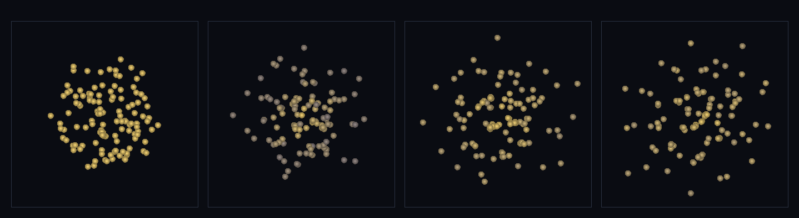

# step_0088 — (조립) 정상상태 별: 가열(점화)↔냉각(복사) 균형으로 *지속하며 빛나는* 별

> [design/sphere-world.md §6 SW5](../../design/sphere-world.md)·STATE §3 NEXT #1(정상상태 별·0087 후속). 조립 step(engine 변경 0). 긴 설명은 viewer `note`(STEPS '0088')가 집.

## 논의 (조립 step·새 법칙 0·합쳐서 생긴 창발)

- **세계를 어떻게 변형?** 0087 의 유한 코어는 비리얼 평형이지만 *단열*(열 출입 0)이었다. 진짜 별은 *빛난다* — 점화(0053 `sphIgnition` 연료→열)로 데우고 복사(0052 `sphRadiativeCooling` 열→빛)로 잃는다. 둘을 0087 코어에 얹으면 **에너지 정상상태**가 창발: 가열률≈냉각률 균형 → 내부E plateau·광도 정상·연료 단조 소진. **0087 대비 새로움 = 에너지 throughput(먹고 빛나고 늙는다)**.
- **무엇으로 검증?** ① 정상상태(U plateau) ② 가열≈냉각 ③ 빛나는 유한 수명 ④ 전체 에너지 장부 닫힘 ⑤ 운동량 보존 ⑥ 결정론. 눈: 코어가 점화해 환히 빛나며 균형 속에 밝기 유지.
- **무엇이 보존/변하나?** 운동량 정확 보존(점화/냉각은 운동량 불변·힘은 쌍힘). **전체 에너지 장부** K+U+W+fuel+radiated = const(연료 저장고·떠난 빛까지 포함). engine 불변 → 새로 생긴 건 *가열↔냉각 균형이 빚는 정상상태 별*.

## 구현 — 기존 법칙 조립 (engine 변경 0·viewer/scenes/step_0088.js)

```
매 step (0087 코어 + 가열 + 냉각):
  applyEntityGravity + sphThermalPressureForce + sphViscosity   // 0087 비리얼 코어
  sphIgnition(rate, uCrit)        // 점화: 연료→내부E (u≥uCrit)·가열
  sphRadiativeCooling(coolRate)   // 복사: 내부E→radiated·냉각
  stepEntities
→ 가열률 ≈ 냉각률 → 내부E plateau·광도 정상·연료 소진(유한 수명)
```

## 검증

**(a) 수치 — `node HTJ/steps/step_0088/verify.js` → PASS (6/6)** — 조립이라 *정상상태·광도·균형·전체 장부 닫힘*만, 보존/결정론은 `htj-verify-lib` 공용 가드.

```
PASS  정상상태 — 내부E plateau ⟨U⟩≈937(spread 5.8% < 15%)·throughput L≈407/t 인데도 U 거의 불변(가열↔냉각 균형)
PASS  가열≈냉각 — 연소 420/t ≈ 복사 광도 L 407/t (불균형 3.0% < 15%·정상상태)
PASS  빛나는 유한 수명 — 광도 L=407>0 지속·연료 단조 소진 2400→384(유한 수명·연료→열→빛)
PASS  보존 — 전체 에너지 장부 K+U+W+fuel+radiated = 1623.8146720867067 → 1638.5324907153476 (rel 9.06e-3 < 0.02)
PASS  운동량 보존 — 정지 시작 → Σp=(-9.80e-14, -1.15e-13, -1.18e-13) ≈ 0
PASS  결정론 — 같은 입력 → 같은 정상상태 = 지문 0x95914c2f
```
- 전 step verify **88/88 회귀 0**(engine 변경 0) · `node tools/check-viewer.js` PASS(0088=scenes/ 모듈 등록).

**(b) 눈 — `steps/step_0088/capture.png`** (범용 러너·x-z 투영·밝기=열)



비리얼 코어가 점화해 환히 빛나고 → 가열↔냉각 균형으로 밝기를 유지하며(정상상태) → 연료를 태우며 지속(verify ①②③이 화면에).

## 다음

**0087 "지속하는 개체"에 에너지 throughput(점화→정상연소→연료 고갈=별의 일생)이 더해졌다 — author 없이 균형에서.** **정직한 한계**: 점화/냉각률은 노브(자기조절은 uCrit 게이트 한 방향)·softened 중력(0087 계승)·총 장부 ~1% 수치 표류·x-z 투영. **다음 = 발산(충격면) 축(0089)·다축 바이옴·연속 바다 3D**.
