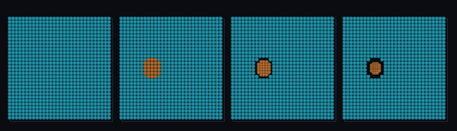

# step_0089 — (SW5 적응 이주+) 발산(압축·충격면) 기준 이주: 수렴 흐름만 SPH (회전≠압축 분리)

> [design/sphere-world.md §6 SW5](../../design/sphere-world.md)·STATE §3 NEXT(발산 축·0082 후속). 법칙 step(engine 가법 +1·`gridDivergenceField`+autoMigrate `divOn`). 긴 설명은 viewer `note`(STEPS '0089')가 집.

## 논의 (법칙 step·가장 단순한 한 축·divOn=0→회귀 0)

- **세계를 어떻게 변형?** 적응 이주 디테일 판정에 **발산(압축/충격면) 축**을 더한다. 0081 전단(|∇v|)은 모든 변형을, 0082 와도(|∇×v|)는 *회전만* 짚지만, 둘 다 *압축/충격면*(수렴 흐름)을 회전과 못 가른다. `gridDivergenceField`=max(0,−∇·v)가 *수렴(압축)만* 짚는다 — **0082 와도 축의 거울짝**. autoMigrate 다축(밀도·전단·회전·압축) 완성.
- **무엇으로 검증?** ① 수렴 압축→SPH ② 회전은 압축 0(divOn 못 잡음)·대조 vortOn 은 잡음(회전≠압축) ②b 방사 팽창도 압축 0(수렴만) ③ 전역 보존 ④ divOn off→회귀 0 ⑤ 결정론.
- **무엇이 보존/변하나?** 이주는 이동이라 (격자+입자) 총 질량·운동량 정확 보존. divOn 안 주면 0077/0081/0082 byte 동일(가법).

## 구현 — engine 가법 +1 (engine/htj-sph.js·VER 21)

```
gridDivergenceField(world): ∇·v = ∂vx/∂x+∂vy/∂y+∂vz/∂z,  out = max(0, −∇·v)  // 수렴(압축)만·중심차분·ρ≤0→0
autoMigrate(... {divOn}): region |= (divOn != null && divF[i] >= divOn)        // 4축: 밀도 OR 전단 OR 회전 OR 압축
```

## 검증

**(a) 수치 — `node HTJ/steps/step_0089/verify.js` → PASS (7/7)** — 새 거동(압축 검출·회전/팽창과 분리)이 알맹이, 보존·항등·결정론은 `htj-verify-lib` 공용 가드.

```
PASS  압축→SPH — 방사 수렴(max(0,−∇·v)=2≥divOn) 전부 SPH(toSPH 1000·격자 비움 0.0e+0)
PASS  회전은 압축 0 — 솔리드-바디 회전(curl=2·div=0): divOn→이주 0(0) · 대조 vortOn→이주 1000(>0). 회전≠압축 분리
PASS  팽창≠압축 — 방사 팽창(∇·v=+2>0): divOn→이주 0(0·max(0,−∇·v)=0·압축/충격면만 잡음)
PASS  보존 — 전역 질량(격자+입자) = 1000 → 1000 (rel 0.00e+0 < 1e-9)
PASS  전역 운동량 보존 — Σ(px+py) -0.000 → -0.000
PASS  항등(노브=0→회귀 0) — divOn 없음 → 밀도 기준만(압축 무시·격자 유지) = Δ 0.00e+0
PASS  결정론 — 같은 입력 → 같은 압축 적응 이주 = 지문 0x4b1b4a34
```
- 전 step verify **89/89 회귀 0**(divOn 안 주면 기존 거동 byte 동일) · `node tools/check-viewer.js` PASS(0089=scenes/ 모듈 등록).

**(b) 눈 — `steps/step_0089/capture.png`** (범용 러너·중앙 z-슬라이스·주황=SPH·청록=격자)



좌측 수렴 압축 코어만 주황 SPH 로 이주해 안으로 모이고(Lagrangian·충격면 추적) → 우측 회전 소용돌이(∇·v=0) 포함 나머지는 청록 격자 유지(verify ①②가 화면에).

## 다음

**적응 이주 디테일 판정이 4축(밀도·전단·회전·압축) 완성 — 비용이 진짜 디테일(밀집·전단·소용돌이·충격면)을 따라간다.** **정직한 한계**: 수렴 크기만(방향 무시)·단일 divOn 임계·다축 이력 없음·viewer z-슬라이스. **다음 = 연속 바다 3D(0090)·다축 바이옴·다축 이력**.
