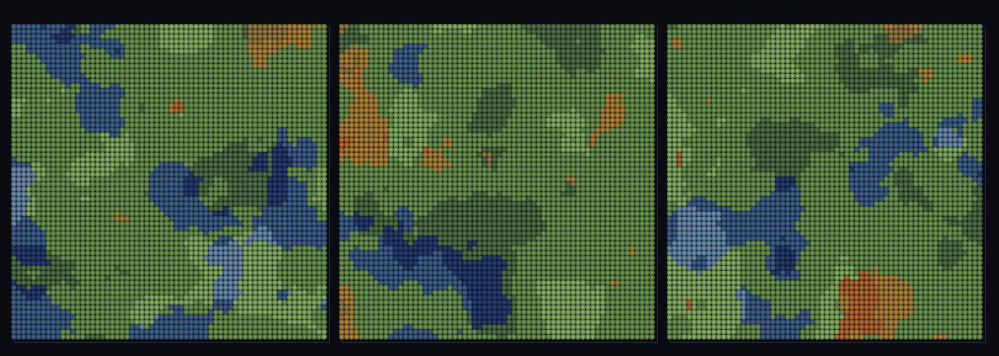

# step_0090 — (TW4+) 절차적 장 다축화: 독립 온도·습도 두 축의 교차로 바이옴이 창발

> [design/environment.md TW4](../../design/environment.md)·STATE §3 NEXT(절차적 장 다축화·0074 후속). 확인용 트랙(engine 변경 0·`viewer/htj-stream.js` 가법). 긴 설명은 viewer `note`(STEPS '0090')가 집.

## 논의 (확인용 트랙·새 거동=다축 독립·salt 없음→0074 동일)

- **세계를 어떻게 변형?** 0074 는 *단일* 노이즈축(높이)만 봤다. 실세계 바이옴은 ≥2 *독립* 축(온도·습도)의 교차다. `biomeField` 가 두 fBm 을 *다른 salt*(독립 lattice 채널)로 뽑아 — 각 축은 공간 상관(코히어런트)이되 서로 무상관 → (temp,humidity)→정수 칸의 *제너릭* 2D 양자화. **0074 대비 새로움 = 두 축 독립**.
- **무엇으로 검증?** ① 다축 독립(corr≈0) ② 각 축 공간 상관 ③ 제너릭 바이옴 분류(여러 칸) ④ salt 없음→0074 동일(회귀 0) ⑤ 순수·경로 무관.
- **무엇이 보존/변하나?** engine 불변(확인용 트랙). salt 안 주면 `latticeVal`/`fbm`/`fieldNoise` byte 동일(0074/0083 불변·가법).

## 구현 — viewer 가법 (viewer/htj-stream.js·VER 3)

```
latticeVal(i,j,salt): 좌표해시 ⊕ salt해시 후 강한 avalanche(salt 없으면 fnv1a(i,j) 그대로·하위호환)
                       // FNV 접두 salt 는 동일 suffix 를 같은 방식으로 섞어 affine 상관 잔존 → avalanche 로 근본 분리
biomeField(opts): temp=fbm(salt 'T'), humidity=fbm(salt 'H'), biome=q(temp,nT)*nH+q(humidity,nH)  // 제너릭 2D 양자화
```

## 검증

**(a) 수치 — `node HTJ/steps/step_0090/verify.js` → PASS (5/5)** — 새 거동(다축 독립·공간 상관·제너릭 분류)이 알맹이, 항등·결정론은 `htj-verify-lib` 공용 가드.

```
PASS  다축 독립 — corr(temp,humidity)=-0.0361 ≈ 0 (서로 무상관·진짜 2D 축·같은 노이즈면 corr≈1 일 것)
PASS  각 축 공간 상관 — 이웃차 T 0.027·H 0.027 ≪ 무작위쌍차 0.139(둘 다 코히어런트 fBm·백색 아님)
PASS  제너릭 바이옴 — 9칸 중 9칸 발현(온도×습도 교차·범위 [0,8]⊂[0,9)·제너릭 양자화)
PASS  항등(노브=0→회귀 0) — salt 없음 → 0074 fbm 동일(회귀 0) = 0x97873da8
PASS  결정론 — 같은 좌표 → 같은 바이옴(순수·경로 무관) = 지문 0x2a299d97
```
- 전 step verify **90/90 회귀 0**(salt 안 주면 0074/0083 byte 동일) · `node tools/check-viewer.js` PASS(0090=scenes/ 모듈 등록).

**(b) 눈 — `steps/step_0090/capture.png`** (범용 러너·바이옴 맵·청=한대·녹=온대·주=건조)



관찰자가 무한 세계 세 지역으로 점프 → 각 창이 이어진 바이옴 패치(코히어런트)이고 지역마다 다른 조성(온도×습도 교차·verify ①②③이 화면에).

## 다음

**환경의 절차적 장이 단일축→다축(온도·습도)으로 — 바이옴이 두 독립 축의 교차로 창발(author 없이).** **정직한 한계**: 두 축 균등 양자화(실세계 경계는 비선형)·fBm 평균 쏠림으로 가운데 칸 과대표현·정적·2D 맵(고도 결합 후속). **다음 = 연속 바다 3D(0091)·다축 이주 이력**.
