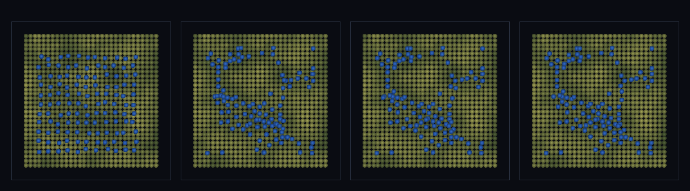

# step_0091 — (TW2) 연속 바다·해안선: 2D 맵 지형 위로 물이 한 수면을 찾고 해안선이 창발

> [design/environment.md TW2](../../design/environment.md)·STATE §3 NEXT(연속 바다·3D 해안선·0083 후속). 조립 step(engine 변경 0). 긴 설명은 viewer `note`(STEPS '0091')가 집.

## 논의 (조립 step·새 법칙 0·합쳐서 생긴 창발)

- **세계를 어떻게 변형?** 0083 은 1D 단면(x-z·한 분지)이었다. 이 step 은 **2D 맵 지형 h(x,y)** 위로 물을 떨궈 — 분지로 흘러 *한 수면(바다)*을 이루고, 바다∩땅 **해안선**·해수면 위로 솟은 **섬**이 창발. **0083 대비 새로움 = 2D 연속 바다 + 해안선**.
- **무엇으로 검증?** ① 연속 수면(전역 한 높이) ② 해안선 창발(경계서 지형이 솟음) ③ 땅·바다·섬 공존 ④ 물 보존 ⑤ 결정론.
- **무엇이 보존/변하나?** 물 질량 보존·발산 없음. engine 불변(부품은 0041/0046/0060/0083). 새로 생긴 건 *2D 맵에서 연속 바다·해안선*.

## 구현 — 기존 법칙 조립 (engine 변경 0·viewer/scenes/step_0091.js)

```
지형 = fBm 높이장 h(x,y) (author 없음·앵커 구 + 둘레 벽=그릇)
매 step: sphPressureForce + sphViscosity + 중력(pz -= mG·dt) + sphBoundaryForce(0060) + stepEntities
→ 균일 살포한 물이 분지로 흘러 한 수면·해안선·섬 (법칙만으로)
```

## 검증

**(a) 수치 — `node HTJ/steps/step_0091/verify.js` → PASS (6/6)** — 합쳐서 생긴 창발(연속 수면·해안선·공존)만, 보존·결정론은 `htj-verify-lib` 공용 가드.

```
PASS  연속 수면 — 2D 맵 수면 산포 0.79 < 0.4×지형 산포 1.11(물이 전역에서 한 높이 ≈12.8=바다)
PASS  해안선 창발 — 바다∩땅 경계 31셀·해안선에서 지형이 솟음(마른쪽 10.0 > 젖은쪽 8.6)·젖은쪽 지형 8.6 < 해수면 12.8(물에 잠긴 해저)
PASS  땅·바다·섬 공존 — 바다 31·땅 165·섬(해수면 위 봉우리) 34·바다지형 8.6<땅지형 12.0
PASS  보존 — 물 질량(살포 → 정착) = 121 → 121 (rel 0.00e+0 < 1e-9)
PASS  유한성 — 모든 입자 좌표 유한(발산 없음·최저 z 9.5)
PASS  결정론 — 같은 법칙 → 같은 연속 바다 = 지문 0xa8ea149c
```
- 전 step verify **91/91 회귀 0**(engine 변경 0) · `node tools/check-viewer.js` PASS(0091=scenes/ 모듈 등록).

**(b) 눈 — `steps/step_0091/capture.png`** (범용 러너·탑다운 x-y 맵·고도 음영+물 파랑)



살포된 물(파랑)이 낮은 분지로 흘러 모여 → 해안선이 또렷한 연속 바다가 되고 봉우리는 섬으로 남는다(verify ①②③이 화면에).

## 다음

**환경(TW2)이 1D 단면 → 2D 맵으로 — "딛고 다닐 해안·바다"에 한 발 더(연속 바다·해안선·섬이 법칙만으로).** **정직한 한계**: 유한 SPH 물이라 깊은 분지부터 채워 얕은 저지대는 마른 채(연속성↔물량)·2D 높이장(오버행 없음)·앵커 그릇 경계(열린 해안 아님)·탑다운 단일 뷰. **다음 = 다축 이주 이력·고도×바이옴 결합·열린 해안·안정 분절 침식**.
