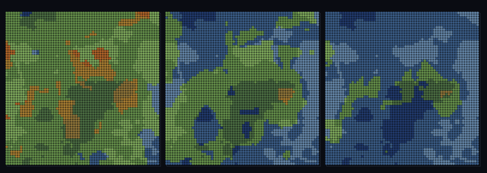

# step_0092 — (TW4+ 다축) 고도×바이옴 결합: 기온 감률로 고지대가 찬 바이옴(산악 툰드라)

> [design/environment.md TW4](../../design/environment.md)·STATE §3 NEXT(고도×바이옴 결합·0090 후속). 확인용 트랙(engine 변경 0·`htj-stream.js` biomeField). 긴 설명은 viewer `note`(STEPS '0092')가 집.

## 논의 (확인용 트랙·새 engine 법칙 0·고도 결합·lapse=0→회귀 0)

- **세계를 어떻게 변형?** 0090 은 (온도·습도) 2축이었다. 실세계는 같은 위도(=같은 base 온도)라도 *높은 곳이 더 춥다*(기온 감률). 세 번째 *무상관* fBm 축(고도·`elevSalt='E'`)을 뽑아 **effTemp = clamp(temp − lapse·elev)** 로 분류 → 고지대가 찬 바이옴 칸으로 이동(적도 봉우리 툰드라). **0090 대비 새로움 = 고도 결합축**.
- **무엇으로 검증?** ① 고도 축 독립(corr≈0) ② 기온 감률(고도↑→effTemp↓·찬 바이옴 비율↑) ③ 고도 공간 상관 ④ lapse=0→0090 byte 동일 ⑤ 결정론.
- **무엇이 보존/변하나?** engine 불변(viewer 순수 함수). lapse=0 → biome 0090 동일(가법). 새로 생긴 건 *고도가 유효 온도를 낮춰 산악 바이옴*.

## 구현 — viewer/htj-stream.js biomeField (engine 변경 0·VER 4)

```
elev = lapse!==0 ? fbm(scaled, {salt:'E'}) : 0          // 세 번째 무상관 축(salt 분리)
effTemp = lapse!==0 ? clamp01(temp − lapse·elev) : temp // 고지대일수록 유효 온도 ↓(기온 감률)
biome = q(effTemp, nT)*nH + q(humidity, nH)             // lapse=0 → effTemp=temp → 0090 동일
```

## 검증

**(a) 수치 — `node HTJ/steps/step_0092/verify.js` → PASS (5/5)** — 새 거동(고도가 유효 온도 낮춤)만, 결정론·항등은 `htj-verify-lib`/직접 비교.

```
PASS  고도 축 독립 — corr(elev,temp)=0.0639·corr(elev,hum)=0.0312 ≈ 0 (세 축 무상관·salt 분리)
PASS  기온 감률 — corr(elev,effTemp)=-0.379<0 · 유효온도 고도하위 0.276 > 상위 0.153(Δ0.123) · 찬바이옴(row0) 비율 상위 0.88>하위 0.69(산악 툰드라)
PASS  고도 공간 상관 — 이웃차 0.027 ≪ 무작위쌍차 0.143(코히어런트 산맥·백색 아님)
PASS  항등(노브=0→회귀 0) — lapse=0 → 0090 biome 동일(회귀 0) = 0x19aa4f0c
PASS  결정론 — 같은 좌표 → 같은 고도결합 바이옴(순수·경로 무관) = 지문 0xaddd502f
```
- 전 step verify **회귀 0**(lapse 안 주면 기존 거동 byte 동일) · `node tools/check-viewer.js` PASS(0092=scenes/ 모듈 등록).

**(b) 눈 — `steps/step_0092/capture.png`** (범용 러너·같은 맵·lapse sweep 0→0.5→1.0)



같은 지역에서 lapse 를 0(좌·0090 그대로)→0.5→1.0(우) 올리면 *고지대 패치가 청색(툰드라)* 으로 식어가고 저지대는 그대로 — verify ②가 화면에.

## 다음

**바이옴이 2축(온도·습도) → 3축(+고도) — "같은 위도라도 높으면 춥다"가 법칙 없이 노이즈 결합으로.** **정직한 한계**: 고도는 *별도 노이즈 축*(0083/0091 의 실제 지형 높이장 h(x,y) 와 아직 분리·결합은 후속)·균등 양자화·정적. **다음 = 위도 온도대(기후대)·바이옴×지형 형태 결합·열린 해안**.
