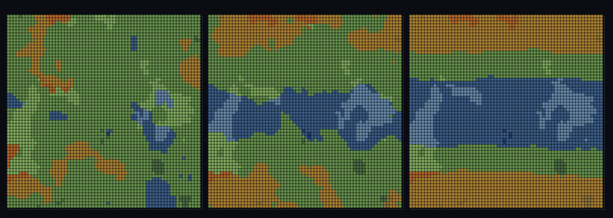

# step_0093 — (TW4+ 다축) 위도 온도대: 온도가 위도에 묶여 기후대 띠(열대·온대·한대)가 창발

> [design/environment.md TW4](../../design/environment.md)·STATE §3 NEXT(위도 온도대·0092 후속). 확인용 트랙(engine 변경 0·`htj-stream.js` biomeField). 긴 설명은 viewer `note`(STEPS '0093')가 집.

## 논의 (확인용 트랙·새 engine 법칙 0·위도 결합·latAmp=0→회귀 0)

- **세계를 어떻게 변형?** 0090~0092 의 온도는 *순수 잡음*(어디나 같은 분포)이었다. 실세계 온도의 1차 구조는 *위도* — 적도 덥고 극지 춥다. 결정론적 위도 인자 `warm(j)=½(1+cos(2π·j/P))`를 온도축에 blend(`tBand=(1−latAmp)·temp+latAmp·warm`) → 같은 경도줄에 **열대→온대→한대 띠** 창발. **0092 대비 새로움 = 위도 대역 구조**.
- **무엇으로 검증?** ① 위도 결합(corr(warm,effTemp) 강한 +) ② 기후대 띠(적도행≫극행) ③ 위도는 온도만(습도 무관) ④ latAmp=0→0092 byte 동일 ⑤ 결정론.
- **무엇이 보존/변하나?** engine 불변(viewer 순수 함수). latAmp=0 → biome 0092 동일(가법). 새로 생긴 건 *위도가 온도를 대역적으로 묶어 기후대 띠*.

## 구현 — viewer/htj-stream.js biomeField (engine 변경 0·VER 5)

```
warm = ½(1 + cos(2π·j/latPeriod))                  // 위도 인자(적도행=1·극행=0·결정론)
tBand = latAmp!==0 ? (1−latAmp)·temp + latAmp·warm : temp  // 잡음(국소)+위도(대역) blend·latAmp=0→0092 동일
effTemp = clamp(tBand − lapse·elev)                // 위도대 보정 후 고도 감률(0092)
```

## 검증

**(a) 수치 — `node HTJ/steps/step_0093/verify.js` → PASS (5/5)** — 새 거동(위도가 온도를 대역적으로 묶음)만, 결정론·항등은 `htj-verify-lib`/직접 비교.

```
PASS  위도 결합 — corr(warm,effTemp)=0.989 > 0.6 (온도가 위도에 묶임·순수 잡음이면 ≈0)
PASS  기후대 띠 — 적도행 effTemp 0.798 ≫ 극행 0.178(Δ0.621)·1840/1840셀(열대↔한대 띠)
PASS  위도=온도만 — corr(warm,humidity)=-0.0164 ≈ 0 (위도는 습도 안 건드림·결합 표적화)
PASS  항등(노브=0→회귀 0) — latAmp=0 → 0092 biome 동일(회귀 0) = 0x21871a4b
PASS  결정론 — 같은 좌표 → 같은 위도대 바이옴(순수·경로 무관) = 지문 0x52e9e34a
```
- 전 step verify **회귀 0**(latAmp 안 주면 기존 거동 byte 동일) · `node tools/check-viewer.js` PASS(0093=scenes/ 모듈 등록).

**(b) 눈 — `steps/step_0093/capture.png`** (범용 러너·같은 맵·latAmp sweep 0→0.4→0.8)



latAmp 0(좌·0090 잡음 얼룩)→0.4→0.8(우) 올리면 *가로 기후대 띠*(상하 적도=적·중앙 극=청)가 또렷해지고 그 위에 습도 잡음이 무늬를 얹는다 — verify ①②가 화면에.

## 다음

**온도가 위도에 묶여 기후대 띠가 창발 — "적도 덥고 극지 춥다"가 잡음+결정론 인자 blend 로.** **정직한 한계**: 위도 period 는 무한 세계라 *주기적 띠*(유한 행성 한 적도 아님)·균등 양자화·정적·고도(0092)와 직교 합산. **다음 = 바이옴×지형 형태 결합·열린 해안·안정 분절 침식**.
