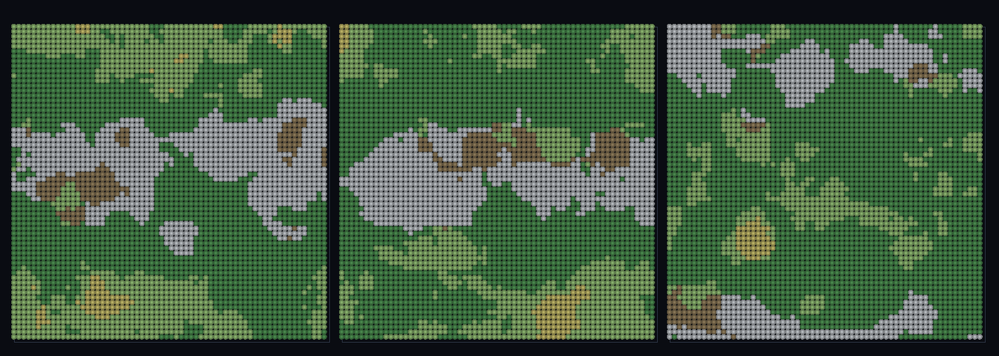

# step_0094 — (TW4+ 조립) 바이옴이 지형 형태(DNA)를 고른다: 기후마다 다른 랜드폼

> [design/environment.md TW4](../../design/environment.md)·STATE §3 NEXT(바이옴×지형 형태 결합·0073/0093 후속). 조립 step(engine 변경 0·구조적 회귀 0). 긴 설명은 viewer `note`(STEPS '0094')가 집.

## 논의 (조립 step·새 법칙 0·합쳐서 생긴 창발)

- **세계를 어떻게 변형?** 0074 는 무한 세계의 지형 형태를 *단일 높이 노이즈*로 골랐다(어디나 같은 종류). 이 step 은 그 선택을 **바이옴**에 맡긴다 — 각 셀의 (온도·습도·위도) 바이옴(0090~0093)이 그 지역의 *지형 DNA 랜드폼*(평탄·사구·평원·구릉·능선·0062 registerShape)을 고르고 `streamChunks`(0073)가 펼친다. **새로움 = 지형 형태가 기후에 묶임**.
- **무엇으로 검증?** ① 형태=바이옴 함수(모든 청크 형태가 바이옴 지정과 일치) ② 지형 다양성(여러 랜드폼) ③ 코히어런트(바이옴 뭉침→지형 성격 뭉침) ④ DNA dedup(K≪N) ⑤ 결정론.
- **무엇이 보존/변하나?** engine 불변. 부품 보존은 부품 verify 가 보증(중복 금지). 새로 생긴 건 *기후→지형 형태 결합·코히어런트 지형 province*.

## 구현 — viewer 조립 (engine 변경 0·biomeField + registerShape + streamChunks)

```
LAND = [평탄,사구,평원,구릉,능선].map(registerShape)        // 기하적 구별 랜드폼(세계 사전 dedup·K=5)
BIOME2FORM[biome] → 랜드폼 인덱스                            // 기후가 지형 형태를 고름(렌더 도메인 매핑)
shapeAt(i,j) = LAND[BIOME2FORM[biomeField(i,j).biome]]       // streamChunks 가 이 형태로 무한 세계 펼침
```

## 검증

**(a) 수치 — `node HTJ/steps/step_0094/verify.js` → PASS (5/5)** — 합쳐서 생긴 창발(형태=바이옴·코히어런트 province)만, 결정론은 공용 가드.

```
PASS  형태=바이옴 함수 — 1257/1257 청크의 DNA 랜드폼이 그 바이옴이 고른 형태와 일치(지형 형태가 바이옴 결정·단일 노이즈 아님)
PASS  지형 다양성 — 한 창에 랜드폼 4종 발현(기후마다 다른 지형·툰드라 평탄/사막 사구/삼림 구릉…)
PASS  코히어런트 — 이웃 청크 같은 랜드폼 0.90 ≫ 무작위쌍 0.62(바이옴 뭉침→지형 성격 뭉침)
PASS  DNA dedup — 형태 5종 ≪ 청크 1257개(shapeDict 공유·세계가 K개만 보유·M2 정신)
PASS  결정론 — 같은 관찰자 → 같은 바이옴 지형(순수·경로 무관) = 지문 0xd77b260e
```
- 전 step verify **회귀 0**(engine 변경 0) · `node tools/check-viewer.js` PASS(0094=scenes/ 모듈 등록).

**(b) 눈 — `steps/step_0094/capture.png`** (범용 러너·탑다운·랜드폼 relief 색조)



관찰자가 무한 세계의 서로 다른 지역으로 점프 → 각 창이 *이어진 지형-형태 province*(녹=구릉/회백=능선/노=사구/갈=평탄)이고 위도 띠(0093)를 따라 지형 성격이 바뀐다 — verify ①②③이 화면에.

## 다음

**무한 세계의 지형 형태가 단일 노이즈 → 기후 결합 — "툰드라는 평탄·사막은 사구·산지는 능선"이 바이옴 장에서.** **정직한 한계**: BIOME2FORM 은 손수 짠 *매핑 표*(바이옴↔형태 대응은 설계·랜드폼 자체는 창발 아님)·top-down 색 province(3D 표면 발현은 0074 surface 파이프라인 결합 후속)·정적. **다음 = 열린 해안·안정 분절 침식·다축 이주 이력**.
