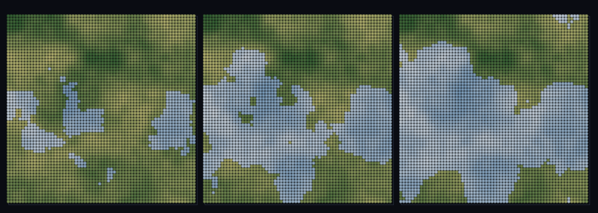

# step_0095 — (TW4+ 다축) 실제 지형 고도×바이옴 결합: 봉우리에 만년설(자기일관 산)

> [design/environment.md TW4](../../design/environment.md)·STATE §5(0092 한계: 고도가 실제 지형과 분리). 확인용 트랙(engine 변경 0·`htj-stream.js` biomeField `elevFn`). 긴 설명은 viewer `note`(STEPS '0095')가 집.

## 논의 (확인용 트랙·새 engine 법칙 0·실제 지형 결합·elevFn 없음/lapse=0→회귀 0)

- **세계를 어떻게 변형?** 0092 의 고도축은 *별도 독립 노이즈*였다(실제 지형과 무관·정직한 한계). 이 step 은 고도축에 **지형 높이장 그 자체**(0094 의 랜드폼을 고른 바로 그 장)를 `elevFn` 으로 먹인다 → effTemp=temp−lapse·**terrain** → 높은 땅이 곧 찬 바이옴 → 산봉우리가 차고 험준(만년설·툰드라). **0092 대비 새로움 = 고도축이 실제 지형(자기일관)**.
- **무엇으로 검증?** ① biome.elev = 제공 지형장(별도 노이즈 아님) ② 산이 차다(corr(지형,effTemp)<0·peaks 찬 바이옴) ③ 새 거동 engage(지형 vs 내부 노이즈 불일치) ④ lapse=0→0090 동일 ⑤ 결정론.
- **무엇이 보존/변하나?** engine 불변(viewer 순수 함수). elevFn 없음→0092·lapse=0→0090(가법). 새로 생긴 건 *지형과 기후가 한 장에서 자기일관(고지=찬 바이옴=능선)*.

## 구현 — viewer/htj-stream.js biomeField (engine 변경 0·VER 6)

```
elev = lapse!==0 ? (elevFn ? clamp01(elevFn(i,j)) : fbm(...,'E')) : 0   // 실제 지형 또는 내부 노이즈(0092)
effTemp = clamp(tBand − lapse·elev)                                     // 높은 땅이 곧 찬 바이옴(자기일관 산)
```

## 검증

**(a) 수치 — `node HTJ/steps/step_0095/verify.js` → PASS (5/5)** — 새 거동(실제 지형이 고도축)만, 결정론·항등은 `htj-verify-lib`/직접 비교.

```
PASS  실제 지형=고도축 — biome.elev 가 제공 지형 높이장과 일치(최대차 0.00e+0 < 1e-9·별도 노이즈 아님)
PASS  산이 차다 — corr(지형,effTemp)=-0.465<0 · 찬 바이옴(row0) 비율 지형상위 0.99 ≫ 하위 0.73(높은 땅=찬 바이옴·자기일관 산)
PASS  새 거동 engage — elevFn(지형) vs 내부 노이즈 biome 불일치 199/900(>10%·실제 지형 결합 작동)
PASS  항등(노브=0→회귀 0) — lapse=0 → 0090 동일(elevFn 무시·회귀 0) = 0xa745181f
PASS  결정론 — 같은 좌표 → 같은 지형결합 바이옴(순수·경로 무관) = 지문 0x4339046b
```
- 전 step verify **회귀 0**(elevFn 안 주면 0092·lapse=0 이면 0090 byte 동일) · `node tools/check-viewer.js` PASS(0095=scenes/ 모듈 등록).

**(b) 눈 — `steps/step_0095/capture.png`** (범용 러너·고정 지형·lapse sweep 0→0.2→0.4·녹 저지+만년설 캡)



고정 지형(녹=저지) 위에서 lapse 0→0.4 올리면 찬 바이옴(만년설)이 점점 *밝은 봉우리(고지)에 들러붙어 만년설 캡*을 씌운다 — verify ②가 화면에.

## 다음

**0092 의 "고도=별도 노이즈" 한계 해소 — 고도축이 실제 지형장이라 산이 차고 험준해진다(지형·기후 자기일관).** **정직한 한계**: 지형장은 viewer 가 만든 2D 높이장(SPH 바다 0091 의 동적 지형과는 아직 분리)·균등 양자화·정적. **다음 = 바이옴 3D 표면 발현·열린 해안·안정 분절 침식**.
