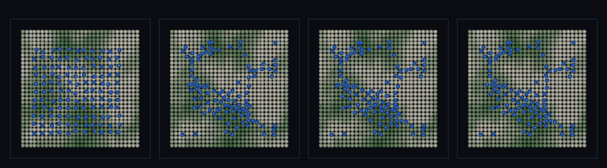

# step_0096 — (TW 조립) 바이옴 지형 위의 바다: 따뜻한 저지=바다·찬 고지=산(섬)

> [design/environment.md TW](../../design/environment.md)·STATE §3 NEXT(바이옴+바다 결합·0091/0095 후속). 조립 step(engine 변경 0·구조적 회귀 0). 긴 설명은 viewer `note`(STEPS '0096')가 집.

## 논의 (조립 step·새 법칙 0·두 트랙 cross-thread 창발)

- **세계를 어떻게 변형?** 환경(TW)의 두 축을 **한 무대**에서 굴린다: ① 2D 바다(0091·SPH 물이 분지에 한 수면) ② 바이옴(0092~0095·고도축=실제 지형장→높은 땅=찬 산). 같은 지형장이 *바다의 분지*이자 *바이옴의 고도축*이라 — **바다는 따뜻한 저지에, 산은 찬 고지에** 일관되게 자리잡는다. **새로움 = 기후+해수면 한 세계(cross-thread)**.
- **무엇으로 검증?** ① 바다=저지(물이 낮은 분지에) ② cross-thread(바다 effTemp > 섬 effTemp·섬=찬 바이옴) ③ 물 보존 ④ 결정론.
- **무엇이 보존/변하나?** engine 불변. 부품 보존(SPH 물리·바이옴 순수)은 부품 verify 가 보증. 새로 생긴 건 *따뜻한 바다↔찬 산의 자기일관*.

## 구현 — viewer 조립 (engine 변경 0·0091 SPH + biomeField elevFn=지형)

```
지형 h(x,y) = fBm 높이장(0091 과 동일)
바다: sphPressureForce+sphViscosity+중력+sphBoundaryForce+stepEntities (0091)  → 낮은 분지에 한 수면
바이옴: biomeField({lapse, elevFn:(x,y)=>h(x,y)/AMP}) (0095)                    → 높은 땅=찬 산
→ 바다는 따뜻한 저지에, 산은 찬 고지에(같은 h 가 분지이자 고도축)
```

## 검증

**(a) 수치 — `node HTJ/steps/step_0096/verify.js` → PASS (5/5)** — 합쳐서 생긴 cross-thread 창발만, 보존·결정론은 공용 가드.

```
PASS  바다=저지 — 바다 31·땅 165·바다지형 8.6 < 땅지형 12.0(물이 낮은 분지에 고임)
PASS  바다=따뜻·산=차다 — 바다 effTemp 0.22 > 섬 0.07(Δ0.15)·섬 34개 중 찬 바이옴 100%(고지=찬 산·자기일관)
PASS  보존 — 물 질량(살포 → 정착) = 121 → 121 (rel 0.00e+0 < 1e-9)
PASS  유한성 — 모든 입자 좌표 유한(발산 없음·해수면 ≈12.8)
PASS  결정론 — 같은 법칙 → 같은 바이옴 바다 = 지문 0xa8ea149c
```
- 전 step verify **회귀 0**(engine 변경 0) · `node tools/check-viewer.js` PASS(0096=scenes/ 모듈 등록).

**(b) 눈 — `steps/step_0096/capture.png`** (범용 러너·탑다운·따뜻 저지 녹→찬 고지 백·물 파랑)



살포된 물(파랑)이 낮은 분지로 흘러 고이며 → 따뜻한 저지(녹)는 바다가 되고 찬 고지(백·만년설)는 해수면 위로 솟아 산/섬으로 남는다 — verify ①②가 화면에.

## 다음

**환경(TW)의 두 축(바다·기후)이 마침내 한 화면에 — "딛고 다닐 해안 + 기후대 있는 대륙"에 한 발 더(따뜻한 바다·찬 산이 자기일관).** **정직한 한계**: 유한 SPH 물(깊은 분지부터)·앵커 그릇 경계(열린 해안 아님)·바이옴은 *읽기*(물이 바이옴을 바꾸진 않음·강수→침식 결합은 후속)·탑다운 단일 뷰. **다음 = 열린 해안·바이옴 3D 표면 발현·안정 분절 침식**.
