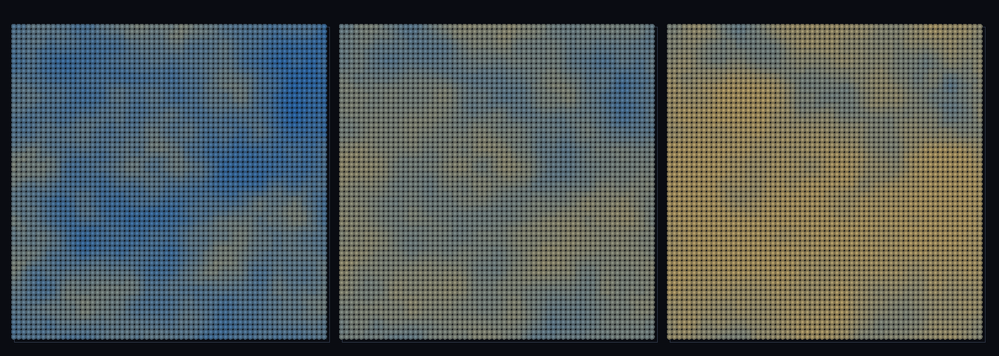

# step_0097 — (TW4+ 다축) 강수장: 비는 humidity·effTemp 의 derived 함수 (우림은 젖고 사막/툰드라는 마른다)

> [design/environment.md TW](../../design/environment.md)·STATE §3 NEXT(강수→침식 결합의 첫 벽돌). 확인용 트랙(engine 변경 0·htj-stream.js biomeField). 긴 설명은 viewer `note`(STEPS '0097')가 집.

## 논의 (확인용 트랙·biomeField 가법 derived 축)

- **세계를 어떻게 변형?** 비(강수)를 *새 축*이 아니라 *이미 가진 두 축*(습도·유효온도)의 derived 함수로 더한다 — `precip = clamp01(humidity^0.7·(precipFloor+(1−precipFloor)·effTemp))`. 습하고 따뜻=우림(비↑)·건조하거나 추움=사막/툰드라(비↓). 강(0098)이 이 강수가 흘러 모이는 곳에서 창발할 *물의 공급원*.
- **무엇으로 검증?** ① precip 이 습도·온도 둘 다와 양의 상관 ② 우림(습·온) ≫ 사막/툰드라(건·한) ③ precip∈[0,1] ④ biome byte 불변(가법·회귀 0) ⑤ 결정론.
- **무엇이 보존/변하나?** engine 불변. `biome`·`effTemp` 등 기존 키 불변(precip 은 반환 객체에 키 추가). 새로 생긴 건 *강수 = 두 기후축의 함수*.

## 구현 — viewer/htj-stream.js `biomeField` (가법·새 노이즈 0)

```js
const precip = cl01(Math.pow(humidity, 0.7) * (precipFloor + (1 - precipFloor) * effTemp));
return { temp, humidity, elev, warm, effTemp, precip, biome: q(effTemp, nT) * nH + q(humidity, nH) };
```

## 검증

**(a) 수치 — `node HTJ/steps/step_0097/verify.js` → PASS (5/5)**

```
PASS  강수=습도·온도의 함수 — corr(humidity,precip) 0.63(>0.4)·corr(effTemp,precip) 0.78(>0.4)·둘 다 비를 끈다
PASS  우림 vs 사막/툰드라 — 습·온 0.60 > 건·한 0.23(Δ0.37)·표본 27/5086
PASS  precip ∈ [0,1] 유한 — min 0.093·max 0.662
PASS  항등(노브=0→회귀 0) — precip 도입 후 biome 불변 = 0x413e11f
PASS  결정론 — 같은 법칙 → 같은 강수장 = 지문 0x526ec95e
```
- 전 step verify **회귀 0**(engine 변경 0·biome byte 불변) · `node tools/check-viewer.js` PASS(0097=scenes/ 모듈 등록).

**(b) 눈 — `steps/step_0097/capture.png`** (탑다운·precipFloor 1→0 sweep·다우=청록·건조=모래색)



precipFloor 를 1→0.5→0 으로 내리면 온도 게이트가 켜져 찬 고지·극지가 말라가며(청록→모래) 사막/툰드라가 드러난다 — verify ①②가 화면에.

## 다음

**기후의 *물 공급*(강수)이 장에 들어왔다 — 다음은 이 비가 지형을 따라 흘러 모이면 강이 창발(0098 flowField).** **정직한 한계**: 지형성 강수(비그늘 사막)·바람·계절 없음(정적 국소 함수). **다음 = 흐름 누적(flowField)으로 강·유역 창발 → 강이 바이옴을 적심(riparian)**.
