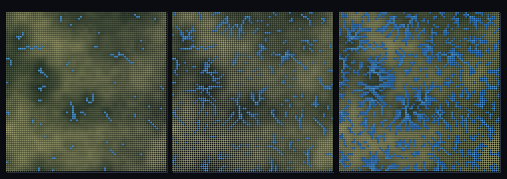

# step_0098 — (TW3+ 흐름) 흐름 누적(flowField): 강수가 지형 따라 모이면 강이 창발 (D8 드레인 네트워크)

> [design/environment.md TW3](../../design/environment.md)·STATE §3 NEXT(물순환 사다리·강수→흐름). 확인용 트랙(engine 변경 0·htj-stream.js flowAccumulation). 긴 설명은 viewer `note`(STEPS '0098')가 집.

## 논의 (확인용 트랙·제너릭 라우팅 측정·타입 0)

- **세계를 어떻게 변형?** 0097 강수는 *어디에 비가 오나*만 냈다. 비는 *중력 따라 낮은 곳으로 흐른다* — 각 셀의 비를 가장 가파른 내리막 이웃(8방향 D8)으로 흘려 누적하면, 지류가 모여 본류가 되는 **강이 창발**한다. 강 *타입*을 박지 않는다(일반 높이장에 라우팅 돌린 측정).
- **무엇으로 검증?** ① 채널화(maxAcc ≫ meanAcc·흐름이 본류로 집중) ② corr(elev,acc)<0(낮은 곳에 모임) ③ 단조(acc≥자기 비량) ④ 보존(sink+창밖=Σrain) ⑤ 결정론.
- **무엇이 보존/변하나?** engine 불변. 모든 빗방울은 sink 에 고이거나 창을 빠져나간다(sinkAccum+borderOut=Σrain). 새로 생긴 건 *강=강수의 흐름 누적*.

## 구현 — viewer/htj-stream.js `flowAccumulation` (제너릭 D8 라우팅·순수)

```js
// 각 셀 → 최급강하 이웃(D8, 경사 √2 정규화); 고→저 정렬 후 한 번 훑으며 acc[down] += acc[k].
// down: -1=sink(고임)·-2=창 밖(borderOut). 반환 { acc, down, rain, sinkAccum, borderOut, maxAcc, meanAcc }
```

## 검증

**(a) 수치 — `node HTJ/steps/step_0098/verify.js` → PASS (5/5)**

```
PASS  강 창발(채널화) — maxAcc 257 / meanAcc 5.55 = 46.3× (≫1·흐름이 본류로 집중)
PASS  누적=낮은 곳에 모임 — corr(elev, acc) -0.28 < 0(높은 곳 발원·낮은 곳 강)
PASS  단조 — min(acc) 1.000 ≥ 자기 비량 1(누적은 더하기만)
PASS  보존 — 물 라우팅(sink+창밖 = 총 강수) = 6400 → 6400 (rel 0.00e+0 < 1e-9)
PASS  결정론 — 같은 법칙 → 같은 흐름장 = 지문 0x9da2b56b
```
- 전 step verify **회귀 0**(engine 변경 0·biomeField 불변) · `node tools/check-viewer.js` PASS(0098=scenes/ 모듈 등록).

**(b) 눈 — `steps/step_0098/capture.png`** (탑다운·강 임계 40→12→4 sweep·지형 위 파란 물줄기)



강 임계를 내리면 굵은 본류 → 지류 → 실개천까지 나뭇가지 드레인 네트워크가 드러난다 — 능선에서 발원해 골짜기로 합류 — verify ①②가 화면에.

## 다음

**물이 지형을 따라 흘러 강이 창발했다(드레인 네트워크) — 다음은 이 강이 강가를 적셔 바이옴을 바꾸고(riparian·0099), 국소 최저점에 고인 물이 호수가 된다(0100).** **정직한 한계**: 유한 창 라우팅(전역 유역 아님)·pit 에 물 고임(채움은 0100)·균일 비(precip 가중은 0099). **다음 = 강이 바이옴을 적심(riparian) → 호수 채움(lakeFill)**.
