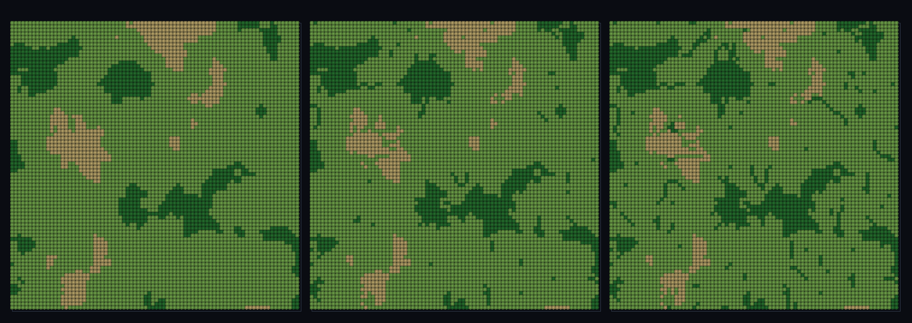

# step_0099 — (TW 조립) 강이 바이옴을 적신다(riparian): 사막을 가르는 초록 강 회랑

> [design/environment.md TW](../../design/environment.md)·STATE §3 NEXT(물순환 사다리·강→바이옴). 조립 step(engine 변경 0·새 법칙 0·구조적 회귀 0). 긴 설명은 viewer `note`(STEPS '0099')가 집.

## 논의 (조립 step·두 트랙 cross-thread 창발)

- **세계를 어떻게 변형?** 강(0098)은 물줄기일 뿐 아니라 *주변을 적신다* — 흐름 누적이 강가의 유효 습도를 올려 **강 회랑**(riparian·오아시스)이 주변보다 풍성한 바이옴이 된다. 두 트랙을 한 무대에서: ① 흐름 누적(0098) ② 바이옴(0090~0097). `effHum=clamp01(humidity+ripW·ramp(흐름))`·임계 이하=무보정(강둑만).
- **무엇으로 검증?** ① corr(흐름,습도증가)>0 ② 사막 속 강 회랑(건조지 강 셀이 비-강보다 습한 바이옴 칸으로) ③ effHum∈[0,1) ④ ripW=0→바이옴 불변(회귀 0) ⑤ 결정론.
- **무엇이 보존/변하나?** engine 불변. 부품(라우팅·바이옴)은 부품 verify 가 보증. 새로 생긴 건 *강가가 풍성해지는 riparian 창발*.

## 구현 — viewer 조립 (engine 변경 0·flowAccumulation 0098 + biomeField)

```js
const ramp = nla <= 0.4 ? 0 : (nla - 0.4) / (1 - 0.4);     // 흐름 임계 넘는 강 셀만 적심(강둑)
const effHum = Math.min(0.999999, humidity + ripW * ramp); // 강가 유효 습도 ↑ → 습한 바이옴 칸
```

## 검증

**(a) 수치 — `node HTJ/steps/step_0099/verify.js` → PASS (5/5)** — 합쳐서 생긴 cross-thread 창발만, 항등·결정론은 공용 가드.

```
PASS  강가 적심 — corr(흐름, 습도증가) 0.82 > 0.7(강일수록 유효 습도↑·임계 이하=무보정 ramp)
PASS  사막 속 강 회랑 — 건조지 강 셀 100% > 비-강 0% 가 습한 칸으로(Δ100%·표본 42/397)
PASS  effHum ∈ [0,1) 유한 — max 1.000
PASS  항등(노브=0→회귀 0) — ripW=0 → 바이옴 불변 = 0xb5f0efa6
PASS  결정론 — 같은 법칙 → 같은 riparian = 지문 0x5e24cee9
```
- 전 step verify **회귀 0**(engine 변경 0) · `node tools/check-viewer.js` PASS(0099=scenes/ 모듈 등록).

**(b) 눈 — `steps/step_0099/capture.png`** (탑다운·ripW 0→0.6 sweep·사막 모래/초원 연녹/우림 짙은 녹 3밴드)



ripW 를 올리면 사막(모래) 패치가 줄고 강을 따라 짙은 초록 회랑이 파고든다 — 마른 땅을 강이 적셔 바이옴 칸을 올린다 — verify ②가 화면에.

## 다음

**강이 단지 흐르는 게 아니라 *주변 바이옴을 바꾼다*(riparian) — 물순환이 기후·식생과 결합.** **정직한 한계**: 유효 습도만 바꿈(실제 식생/색은 호출자 해석)·정적·유한 창·강폭=흐름 임계 노브. **다음 = 호수 채움(pit→평평 수면·lakeFill) → 기후·강·호수·바다 통합 맵(0101)**.
