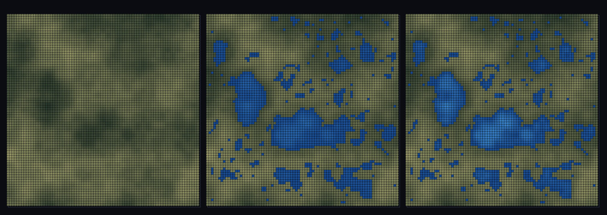

# step_0100 — (TW2+ 호수) 호수 채움(lakeFill): 분지가 차올라 평평한 호수 수면 (priority-flood)

> [design/environment.md TW2](../../design/environment.md)·STATE §3 NEXT(물순환 사다리·호수 채움). 확인용 트랙(engine 변경 0·htj-stream.js lakeFill). 긴 설명은 viewer `note`(STEPS '0100')가 집.

## 논의 (확인용 트랙·제너릭 채움 측정·타입 0)

- **세계를 어떻게 변형?** 0098 흐름은 분지(sink)에 물을 *고이게만* 했다. 실제 분지는 *유출구(spill)* 높이까지 차올라 **평평한 호수 수면**을 이룬다. priority-flood 로 각 셀의 수면(filled)을 구한다 → depth=filled−지형>0=호수·경사=0. 호수 *타입*을 박지 않는다(일반 높이장 채움 측정).
- **무엇으로 검증?** ① 분지→호수(셀·수심·수량) ② 평평한 수면(한 호수 내 filled 편차 0) ③ 단조(filled≥지형) ④ 순수 경사→호수 0(거짓 호수 없음) ⑤ 결정론.
- **무엇이 보존/변하나?** engine 불변. 물은 채우기만(땅 아래로 안 팜). 새로 생긴 건 *분지=평평 호수 수면+호반*.

## 구현 — viewer/htj-stream.js `lakeFill` (priority-flood·순수)

```js
// 경계(유출)에서 최소 힙으로 안으로 번짐: filled[이웃] = max(지형[이웃], 흘러온 수면).
// 분지는 유출구 높이로 평평하게 참 → depth = filled − 지형. 반환 { filled, depth, lakeCells, maxDepth, volume }
```

## 검증

**(a) 수치 — `node HTJ/steps/step_0100/verify.js` → PASS (5/5)**

```
PASS  분지→호수 — 호수 셀 1407개·최대 수심 0.249·총 수량(Σdepth) 78.90
PASS  평평한 수면 — 호수 109개·한 호수 내 수면 최대 편차 0.00e+0 < 1e-6(유출구 높이로 평평)
PASS  단조 — min(수심) 0.00e+0 ≥ 0(물은 채우기만·지형 아래로 안 팜)
PASS  항등(노브=0→회귀 0) — 순수 경사 → 호수 수량 0 = Δ 0.00e+0
PASS  결정론 — 같은 법칙 → 같은 호수장 = 지문 0x9c946c1c
```
- 전 step verify **회귀 0**(engine 변경 0) · `node tools/check-viewer.js` PASS(0100=scenes/ 모듈 등록).

**(b) 눈 — `steps/step_0100/capture.png`** (탑다운·채움 0→1 sweep·지형 relief 위 파란 호수)



채움 비율을 올리면 마른 분지에 파란 호수가 차올라 평평한 수면과 호반이 드러난다(깊을수록 밝은 파랑) — verify ①②가 화면에.

## 다음

**물순환 사다리의 마지막 지형 요소(호수)가 들어왔다 — 강수→흐름(강)→riparian→호수가 모두 제너릭 장 측정으로 갖춰짐.** **정직한 한계**: 유한 창(경계=유출구)·정적 기하 채움(SPH 동적 수면 0091 과 별개)·강수량 무관(분지 항상 가득·증발/유량 균형은 후속). **다음 = 기후·강·호수·바다 통합 맵(0101 조립)**.
