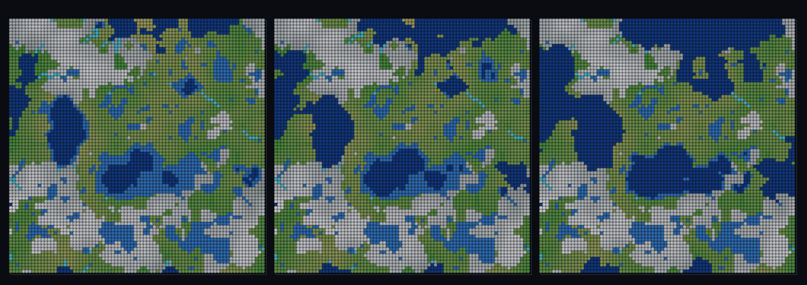

# step_0101 — (TW 조립) 기후·강·호수·바다 통합 맵: 한 지형장이 산·강·호수·바다를 자기일관하게

> [design/environment.md TW](../../design/environment.md)·STATE §3 NEXT(물순환 사다리 완성·통합 맵). 조립 step(engine 변경 0·새 법칙 0·구조적 회귀 0). 긴 설명은 viewer `note`(STEPS '0101')가 집.

## 논의 (조립 step·물순환+기후 통합 cross-thread)

- **세계를 어떻게 변형?** 물순환 사다리(강수 0097·흐름 0098·riparian 0099·호수 0100)+바이옴(0090~0096)을 **한 맵**에서 굴린다. 같은 지형 높이장 하나가 ⓐ 바이옴 고도축(높은 곳=찬 산) ⓑ 강 라우팅 ⓒ 호수 분지 ⓓ 바다(저지 임계)를 모두 정한다 → **모든 물 요소가 자기일관**.
- **무엇으로 검증?** ① 물 위계(바다<호수<땅 지형) ② 강→호수 종착(내부 sink 가 호수로 채워짐·0098↔0100 일치) ③ 기후 자기일관(바다=따뜻 저지·산=찬 고지) ④ 결정론.
- **무엇이 보존/변하나?** engine 불변. 부품(라우팅·채움·바이옴)은 부품 verify 가 보증. 새로 생긴 건 *산·강·호수·바다가 한 지형장에서 자기일관*.

## 구현 — viewer 조립 (engine 변경 0·flow 0098 + lake 0100 + biome + 해수면 임계)

```js
if (elev[k] < seaLevel) klass = 바다;                 // 저지 임계 아래
else if (lakeDepth[k] > 0) klass = 호수;              // 해수면 위 분지(0100)
else if (logAcc/lmax > 0.6) klass = 강;              // 높은 흐름 누적(0098)
else klass = 땅(바이옴+riparian);                     // 찬 고지=산·따뜻 저지=초록(0099 강가 적심)
```

## 검증

**(a) 수치 — `node HTJ/steps/step_0101/verify.js` → PASS (4/4)** — 통합 cross-thread 만, 결정론은 공용 가드.

```
PASS  물 위계 — 바다지형 0.372 < 호수 0.568 < 마른땅 0.618(바다 최저·호수 중간 분지)
PASS  강→호수 종착 — 내부 sink 111개 중 111개(100%)가 호수로 채워짐(흐름이 분지에 모여 호수)
PASS  바다=따뜻·산=차다 — 바다 effTemp 0.24 > 산(고지 20%) 0.03(Δ0.21·같은 지형장이 분지이자 고도축)
PASS  결정론 — 같은 법칙 → 같은 통합 맵 = 지문 0x8e7848ab
```
- 전 step verify **회귀 0**(engine 변경 0) · `node tools/check-viewer.js` PASS(0101=scenes/ 모듈 등록).

**(b) 눈 — `steps/step_0101/capture.png`** (탑다운·해수면 0.10→0.28 sweep·산 회백/평원 초록/호수·바다 파랑/강 시안)



해수면을 올리면 해안이 전진해 저지가 바다에 잠기고 내륙 호수가 바다에 합류한다 — 시안 강줄기는 찬 산(회백)에서 발원해 초록 평원(riparian 회랑)을 지나 호수·바다로 흘러든다 — verify ①②③이 한 화면에. (scene 은 채색 균형 위해 lapse 0.4·verify 는 강한 신호 위해 0.6.)

## 다음

**환경(TW)이 *딛고 다닐 대륙* 로 — 산·강·호수·해안·기후대가 모두 *법칙 한 줌*(노이즈+라우팅+채움+분류)에서 자기일관하게 창발(author 0).** **정직한 한계**: 정적 기하(SPH 동적 물 0091/0096 과 별개·여긴 장 측정 통합 뷰)·해수면=전역 임계 노브·증발/유량 균형·침식 결합 미포함. **다음 = 동적 SPH 물과 통합·침식 결합·바이옴 3D 표면 발현**.
