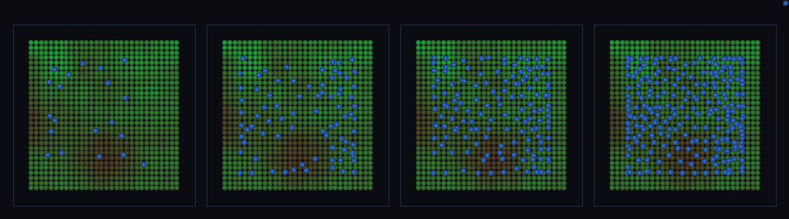

# step_0102 — (조립) 강수 구동 비: 기후 precip 장(0097)이 동적 SPH 빗방울을 낳는다

> [design/environment.md TW](../../design/environment.md)·STATE §3 NEXT 디테일①(동적 SPH 물과 물순환 통합·0101 후속). 조립 step(engine 변경 0·새 법칙 0). 긴 설명은 viewer `note`(scenes/step_0102.js)가 집.

## 논의 (조립 step·정적 강수장 → 동적 SPH 물)

- **세계를 어떻게 변형?** 0091/0096 은 물을 *균일 살포*해 한 번에 바다를 만들었다. 여기선 기후 강수장 `precip`(0097)에 *비례하는 확률*로 셀을 골라(CDF 역추출) 그 위에 빗방울(SPH 입자)을 시간에 걸쳐 떨군다 → 중력+압력(0041)+점성(0046)+경계(0060)로 정착. **기후가 물을 만든다**(정적 장 → 동적 입자).
- **무엇으로 검증?** ① 기후 소스 결합(습한 ⅓ 셀이 받은 비 / 건조한 ⅓ > 1.5) ② 동적 정착(잔류속도 ≪ 낙하속도) ③ 생성 장부 보존 ④ 결정론.
- **무엇이 보존/변하나?** engine 불변. 부품(SPH·precip)은 부품 verify 가 보증. 새로 생긴 건 *precip→동적 물* 다리. 지형(salt TERR)·강수(salt H) 무상관 → 물 편향=순수 소스 결합.

## 구현 — viewer 조립 (engine 변경 0·precip CDF 역추출 + 기존 SPH 법칙)

```js
const u = rnd() * cdf.tot;                       // precip 누적분포에서 역추출 → precip∝확률로 셀 선택
const c = cells[binarySearch(cdf, u)];
water.push({ cx: c.x+jitter, cy: c.y+jitter, cz: AMP+10, mass: 1, ... });   // 그 위에 빗방울(SPH)
// 매 step: 중력 + sphPressureForce + sphViscosity + sphBoundaryForce + stepEntities → 정착
```

## 검증

**(a) 수치 — `node HTJ/steps/step_0102/verify.js` → PASS (4/4)** — 조립 cross-thread 만(부품 보존은 부품 verify).

```
PASS  기후 소스 결합 — 습한 ⅓ 가 받은 비 95 / 건조한 ⅓ 49 = 1.94× (비가 precip 따라 온다·>1.5)
PASS  동적 정착 — 정착 후 잔류 평균속도 1.90 ≪ 낙하속도 ≈9 (비가 실제 물로 쉰다·<3)
PASS  생성 장부 보존 — Σ떨군 비 216 = Σ입자 216(빗방울은 사라지지 않음)
PASS  결정론 — 같은 강수 구동 → 같은 물 = 지문 0xe11e294b
```
- 전 step verify **회귀 0**(engine 변경 0).

**(b) 눈 — `steps/step_0102/capture.png`** (탑다운·배경 강수장[건조 갈색→습 초록]·물 파랑·비 누적 4 프레임)



빗방울(파랑)이 시간에 걸쳐 떨어져 *초록(습한) 띠*에 더 짙게 쌓이고 갈색(건조) 띠는 성기다 — 기후 지도가 물 지도로(verify ①). 위도 온도대(0093·latAmp)로 남북 강수 띠가 또렷.

## 다음

**0101 의 *정적 통합 뷰*를 *동적 SPH 물*로 잇는 첫 디딤돌 — 기후(precip)가 동적 물을 낳는다.** **정직한 한계**: 완만 지형이라 물이 횡류로 수면을 찾아 *공간 구조*는 씻긴다(소스 편향은 *떨어지는 순간* 강함). 그 공간 구조(채널·호수)는 경사가 만든다 → **다음 = 경사 위 흐르는 강(0103·bed friction 으로 골짜기 집중·↔flowAccumulation)·차오르는 호수(0104·↔lakeFill)**.
