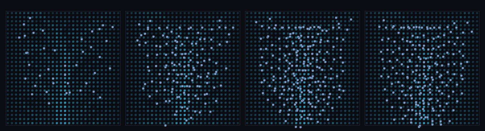

# step_0103 — (조립) 흐르는 강: 비가 경사를 흘러 골짜기에 모인다 ↔ flowAccumulation

> [design/environment.md TW3](../../design/environment.md)·STATE §3 NEXT 디테일①(동적 SPH 물과 물순환 통합·0102 후속). 조립 step(engine 변경 0·새 법칙 0). 긴 설명은 viewer `note`(scenes/step_0103.js)가 집.

## 논의 (조립 step·동적 SPH 흐름 ↔ 정적 흐름 누적)

- **세계를 어떻게 변형?** 0102 는 비를 *떨궜다*(소스). 여기선 그 비가 경사를 *흐른다* — 골짜기(x 중앙 낮음)+경사(y↓ 출구) 위에 상류 살포. 중력 접선 성분 + `sphBedFriction`(0064·종단속도)으로 골짜기 바닥선에 모여 출구로 빠진다 = 강줄기.
- **무엇으로 검증?** ① 골짜기 집중(흐름 경로 가중 평균 flowAcc / 전역 > 1.6) ② 동적↔정적 일치(corr(flowAcc, SPH 흐름 경로) > 0.4) ③ 흐름 보존(떨군 비 = 남은 + 출구) ④ 결정론.
- **무엇이 보존/변하나?** engine 불변. 부품(SPH·bed friction·flowAccumulation)은 부품 verify 가 보증. 새로 생긴 건 *동적 SPH 흐름이 정적 D8 라우팅 예측과 일치*.

## 구현 — viewer 조립 (engine 변경 0·중력 접선 + bed friction + flowAccumulation 비교)

```js
// 같은 elevFn(골짜기+경사)으로 정적 라우팅과 동적 흐름을 동시에
const F = Stream.flowAccumulation({ elevFn, x0:0, y0:0, W:GW, H:GH });   // 정적 예측(어디가 본류냐)
Sph.sphBoundaryForce(water, an, DT, bopt);   // 법선 반발(0060·지형 위에 얹음)
Sph.sphBedFriction (water, an, DT, fopt);    // 접선 항력(0064·종단속도→흐름)
// presence[cell] += 흐르는 동안 물이 지난 셀 → corr(flowAcc, presence)
```

## 검증

**(a) 수치 — `node HTJ/steps/step_0103/verify.js` → PASS (4/4)** — 조립 cross-thread 만(부품은 부품 verify).

```
PASS  골짜기 집중 — 흐름 경로 가중 평균 flowAcc 28.1 / 전역 14.1 = 2.00× (물이 본류로·>1.6)
PASS  동적↔정적 일치 — corr(flowAcc, SPH 흐름 경로) = 0.52 > 0.4 (물이 예측 본류로 흐름)
PASS  흐름 보존 — Σ떨군 비 264 = 남은 124 + 출구 140(장부 닫힘)
PASS  결정론 — 같은 비 → 같은 흐름 = 지문 0x108ad5b
```
- 전 step verify **회귀 0**(engine 변경 0).

**(b) 눈 — `steps/step_0103/capture.png`** (탑다운·배경 흐름 누적 음영[어두움→청록 본류]·물 흰파랑·흐름 4 프레임)



상류 살포된 비(흰파랑)가 경사를 흘러 중앙 골짜기(밝은 청록 본류선)로 모여 아래 출구로 빠진다 — 동적 물이 정적 라우팅 위에 겹친다(verify ②).

## 다음

**0101 의 정적 강(flowAcc 색칠)이 *진짜 흐르는 물*로 — 동적 SPH 흐름이 D8 라우팅 예측을 재현(강줄기 창발).** **정직한 한계**: 유한 비·골짜기 1개(분기 드레인망은 후속)·출구 단순 제거(정상상태 유량 균형은 0105)·SPH 물길이 채널보다 폭이 넓음(가중 평균으로 측정). **다음 = 차오르는 호수(0104·pit 에 모여 유출구까지·↔lakeFill)·정상상태 유량(0105·유입=유출)**.
