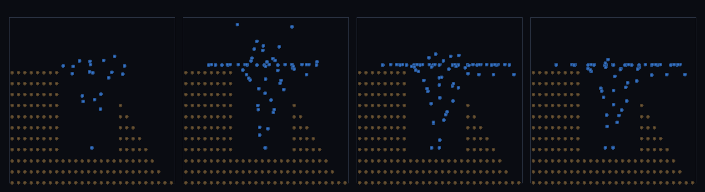

# step_0104 — (조립) 차오르는 호수: 비가 분지에 모여 유출구까지 차올라 평평한 수면 ↔ lakeFill

> [design/environment.md TW2](../../design/environment.md)·STATE §3 NEXT 디테일①(동적 SPH 물과 물순환 통합·0103 후속). 조립 step(engine 변경 0·새 법칙 0). 긴 설명은 viewer `note`(scenes/step_0104.js)가 집.

## 논의 (조립 step·동적 SPH 채움 ↔ 정적 lakeFill)

- **세계를 어떻게 변형?** 0103 은 비가 경사를 *흘러 빠져나갔다*. 여기선 흐름이 *못 빠지는 분지(pit)* 에 갇혀 차오른다 — 고원(8) 속 분지(바닥 2) + 한쪽 유출구 트렌치(spill=6). 비가 모여 수위가 spill 을 넘으면 넘쳐 빠진다(weir) → 정상 수면 ≈ spill·평평한 수면(호수).
- **무엇으로 검증?** ① 유출구까지 차오름(SPH 수면 ≈ lakeFill 예측 spill·입자 반경 오프셋 감안) ② 수평한 수면(최소제곱 평면 기울기 ≈ 0) ③ 차오름 보존(떨군 비 = 남은 + 유출) ④ 결정론.
- **무엇이 보존/변하나?** engine 불변. 부품(SPH·lakeFill)은 부품 verify 가 보증. 새로 생긴 건 *동적 SPH 채움 수면 = 정적 lakeFill 예측*.

## 구현 — viewer 조립 (engine 변경 0·SPH 채움 + lakeFill 예측 비교)

```js
function elevFn(x,y){                                          // 고원 속 분지 + 유출구 트렌치(같은 elev 를 둘이 공유)
  if (y>=11&&y<=14&&x>=17) return max(0, 6-(x-17)*0.75);       // 유출구(spill=6 → 경계 0)
  if (x>=8&&x<=17&&y>=8&&y<=17) return 2;                      // 분지 바닥
  return 8;                                                    // 고원(rim)
}
const Lk = Stream.lakeFill({elevFn, ...});                     // 정적 예측 수면(filled = spill)
// 비 → sphBoundaryForce + sphBedFriction → 차오름·수위>spill 이면 트렌치로 넘쳐 경계서 제거
```

## 검증

**(a) 수치 — `node HTJ/steps/step_0104/verify.js` → PASS (4/4)** — 조립 cross-thread 만(부품은 부품 verify).

```
PASS  유출구까지 차오름 — SPH 수면(중앙값) 7.10 ≈ lakeFill 예측 6.00(spill=6·Δ1.10<2.0·입자반경 오프셋 감안)
PASS  수평한 수면 — 수면 평면 기울기 0.093/셀 ≈ 0 (25컬럼·물이 수면을 찾음·<0.18)
PASS  차오름 보존 — Σ떨군 비 120 = 남은 95 + 유출 25(장부 닫힘)
PASS  결정론 — 같은 비 → 같은 호수 = 지문 0x70f8e3b
```
- 전 step verify **회귀 0**(engine 변경 0).

**(b) 눈 — `steps/step_0104/capture.png`** (측면 단면 x-z·갈색 지형 분지·물 파랑·차오름 4 프레임)



갈색 지형 분지에 파란 물이 바닥부터 차오르며 *수평 수면*이 점점 올라 유출구 높이에서 멈춘다 — 차오르는 호수(verify ①②).

## 다음

**0101 의 정적 호수(lakeFill 색칠)가 *진짜 차오르는 물*로 — 동적 SPH 채움 수면이 정적 lakeFill 예측과 일치(평평·유출구 높이).** **정직한 한계**: 입자 반경(~1)만큼 수면이 높게 읽힘·weir 수두로 spill 보다 약간 높음·분지 1개(다중 호수는 0101 정적)·정상상태 유량 균형(유입=유출→정상 수면) 미포함. **다음 = 정상상태 유량(0105·연속 유입=연속 유출→흔들림 없는 정상 수면·물순환 닫음)**.
