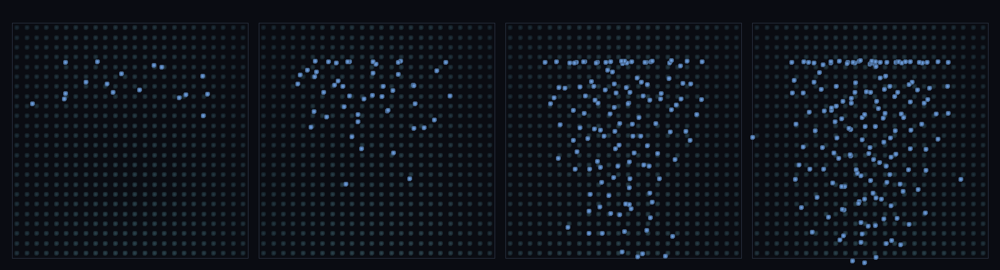

# step_0105 — (조립) 정상상태 유량: 연속 비 유입 = 연속 유출 → 정상 수면(동적 물순환 닫음)

> [design/environment.md TW3](../../design/environment.md)·STATE §3 NEXT 디테일①(동적 SPH 물과 물순환 통합·0104 후속·**디테일① 마무리**). 조립 step(engine 변경 0·새 법칙 0). 긴 설명은 viewer `note`(scenes/step_0105.js)가 집.

## 논의 (조립 step·유한 비 → 정상상태 통과류)

- **세계를 어떻게 변형?** 0102~0104 는 *유한* 비(한 번 와서 정착)였다. 실제 강은 비가 *끊임없이* 와서 *끊임없이* 빠진다 — 그 사이 물량(수면)은 *plateau*(유입=유출). 경사 수로에 비를 끊임없이 떨궈 과도기 후 통과류가 정상상태에 든다.
- **무엇으로 검증?** ① 정상상태 도달(후반 물량 plateau·표류 ≪ 1) ② 유입=유출 균형(유출/step ≈ 유입 BATCH) ③ 전체 보존(떨군 비 = 남은 + 유출) ④ 결정론.
- **무엇이 보존/변하나?** engine 불변. 부품(SPH·bed friction·경계)은 부품 verify 가 보증. 새로 생긴 건 *연속 유입↔유출 균형 = 정상 수면*.

## 구현 — viewer 조립 (engine 변경 0·연속 비 + 기존 SPH 흐름·물량 시계열)

```js
for (step of ∞) {
  rain(BATCH);                                   // *끊임없이* 비(plateau 까지)
  SPH 흐름(중력+압력+점성+경계+bed friction);     // 하류로 흐름
  remove(p.cy < -1);                             // 출구로 빠짐
  hist.push(water.length);                       // 물량 시계열 → plateau·유출/step 측정
}
```

## 검증

**(a) 수치 — `node HTJ/steps/step_0105/verify.js` → PASS (4/4)** — 조립 cross-thread 만(부품은 부품 verify).

```
PASS  정상상태 도달 — 후반 물량 plateau ⟨N⟩=167·표류 14(9%<12%·수면 안정)
PASS  유입=유출 균형 — 유입 5/step ≈ 유출 4.71/step(Δ6%<15%·물순환 닫힘)
PASS  전체 보존 — Σ떨군 비 550 = 남은 173 + 유출 377(장부 닫힘)
PASS  결정론 — 같은 강수 → 같은 정상 흐름 = 지문 0x179eaf86
```
- 전 step verify **회귀 0**(engine 변경 0).

**(b) 눈 — `steps/step_0105/capture.png`** (탑다운·골짜기 음영·물 흰파랑·과도기→정상상태 4 프레임)



처음엔 골짜기가 채워지며 통과류가 자라다가(과도기·프레임 1~3), 곧 일정한 강줄기로 정상상태에 든다(프레임 3≈4·물량 plateau·verify ①②).

## 다음

**0102(비)→0103(흐름)→0104(호수)→0105(정상 유량)으로 *동적 물순환*이 닫혔다 — 0101 의 정적 통합 뷰가 진짜 흐르는·차오르는·정상상태인 물로.** **정직한 한계**: 통과류 저장이 작아 빨리 정상(큰 호수 평형은 느림)·유출 4.71<5 잔여 과도·증발/해수면 결합 미포함. **다음 = 디테일① 마무리 — 다른 디테일(안정 분절 침식·다축 이주 이력·바이옴 3D 표면) 또는 PW 사다리(걸을 수 있는 한 조각 땅)**.
