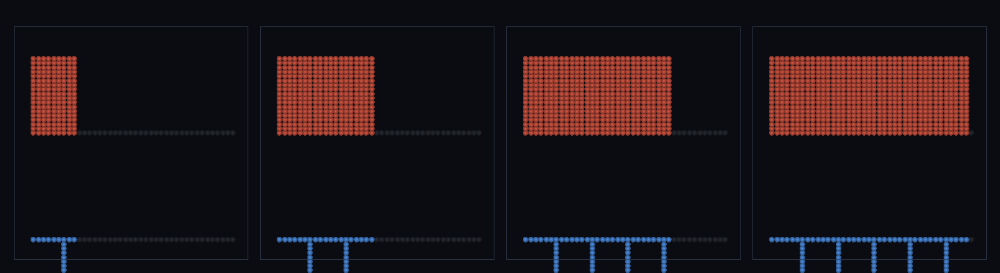

# step_0106 — 이주 이력(hysteresis): minDwell 이 임계 근처 격자↔SPH 깜빡임을 막는다

> [design/sphere-world.md SW5](../../design/sphere-world.md)·STATE §3 NEXT 디테일③(다축 이주 이력·0089 후속). 법칙 step(engine 가법·minDwell=0→회귀 0). 긴 설명은 viewer `note`(scenes/step_0106.js)가 집.

## 논의 (법칙 step·적응 이주에 상태 기억 추가)

- **세계를 어떻게 변형?** 적응 이주(0077·0081·0082·0089)는 밀도·전단·와도·발산 4축으로 디테일을 SPH 로 올린다. 그런데 SPH→격자 *복귀* 는 *밀도(rhoOff)* 만 본다 — 전단/와도/발산 축엔 복귀 임계가 없다. 그래서 *저밀도+고전단* 셀은 격자→SPH(전단 큼)→즉시 SPH→격자(밀도 작음)를 *매 call 깜빡인다*. `minDwell` 이 갓 이주한 입자를 minDwell call 동안 격자 복귀에서 *면제*(p.migDwell)해 그 깜빡임을 끊는다.
- **무엇으로 검증?** ① 깜빡임 방지(격자 복귀 이벤트 ≪ 이력 없음) ② 이력 중 SPH 유지 ③ 항등(minDwell=0→0089 동일) ④ 전역 질량 보존 ⑤ 결정론.
- **무엇이 보존/변하나?** minDwell=0 → 0089 byte 동일(회귀 0). 이주=이동이라 전역 질량 보존(이력은 *복귀 시점만* 늦춤).

## 구현 — engine 가법 (`autoMigrate` 에 dwell 게이트·`engine/htj-sph.js`)

```js
const minDwell = opts.minDwell != null ? opts.minDwell : 0;          // 0 → 면제 0 → 0089 동일
if (minDwell > 0) for (p of particles) if (p.migDwell > 0) p.migDwell--;   // 기존 입자 dwell 감쇠
// 격자→SPH: 갓 이주 입자에 dwell 부여
if (minDwell > 0) for (p of mig.particles) p.migDwell = minDwell;
// SPH→격자: dwell 남으면 복귀 면제(깜빡임 차단)
const eligible = cellMass(p) <= rhoOff && !(minDwell > 0 && p.migDwell > 0);
```

## 검증

**(a) 수치 — `node HTJ/steps/step_0106/verify.js` → PASS (5/5)**

```
PASS  깜빡임 방지 — 격자 복귀 이벤트 12call: 이력없음 6144 → 이력6 512(8%·≪50%)
PASS  이력 중 SPH 유지 — T call 후 SPH 보유 입자: 이력없음 0 < 이력10 512(dwell 동안 복귀 면제)
PASS  항등(노브=0→회귀 0) — minDwell=0 → 0089 동일 = 0x73bef895
PASS  보존 — 전역 질량(격자+입자) = 512 → 512 (rel 0.00e+0 < 1e-9)
PASS  결정론 — 같은 장 → 같은 이력 이주 = 지문 0x618633dc
```
- 전 step verify **회귀 0**(minDwell 미지정 시 모든 호출처 불변).

**(b) 눈 — `steps/step_0106/capture.png`** (격자 복귀 시계열·위=이력 없음[빨강·빽빽]·아래=이력[파랑·드뭄])



위 트랙(이력 없음)은 거의 매 call 격자 복귀 막대가 서고(깜빡임 빽빽한 블록), 아래 트랙(이력)은 막대가 주기 K 로 드문드문(억제) — verify ①(6144→512)이 한 눈에.

## 다음

**적응 이주가 *떨림 없이* 안정 — 디테일 영역이 임계 근처에서 들락날락 안 하고 자리잡는다(비용·결정론 안정).** **정직한 한계**: dwell 후엔 다시 평가(영구 고정 아님·여전히 주기 K 잔여 깜빡임)·셀이 아니라 입자에 dwell·전단 복귀 임계(shearOff) 자체는 후속 선택. **다음(디테일 마무리) = 바이옴 3D 표면 발현·안정 분절 침식 등 또는 PW 사다리**.
