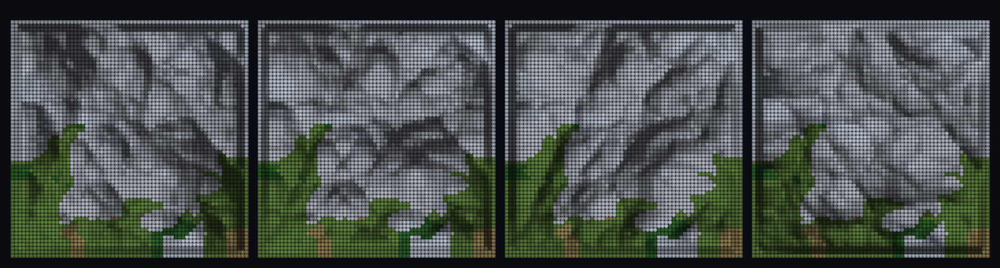

# step_0107 — (조립) 바이옴 지형 3D 음영 표면: 평평 top-down 색 → hillshade 입체 relief

> [design/environment.md TW4](../../design/environment.md)·[design/merge-dna.md §5 T2](../../design/merge-dna.md)·STATE §3 NEXT 디테일④(바이옴 지형 3D 표면 발현·0094/0095 후속). 조립 step(engine 변경 0·새 법칙 0·viewer 표면 유틸 결합). 긴 설명은 viewer `note`(scenes/step_0107.js)가 집.

## 논의 (조립 step·바이옴 + 표면 파이프라인 결합)

- **세계를 어떻게 변형?** 0090~0096 은 바이옴을 *평평한 top-down 색*으로 그렸다. 여기선 같은 바이옴 지형을 *3D 음영 표면*으로 발현 — 같은 높이장을 ⓐ 표면 파이프라인(0068 `pointCloudSurface`·점→면·heights+normals) ⓑ 바이옴(`biomeField`·effTemp=temp−lapse·고도→색)이 공유, 각 정점에 hillshade(n·L) 음영 + 바이옴 팔레트.
- **무엇으로 검증?** ① 표면 재구성 충실(corr(표면 heights, terrain) > 0.9) ② 음영 입체감(경사 셀 밝기 std > 평지·대비 > 0.25) ③ 바이옴 결합(찬 바이옴 평균 고도 > 따뜻·산이 차다) ④ 결정론.
- **무엇이 보존/변하나?** engine 불변·물리 불변(표현일 뿐). 새로 생긴 건 *바이옴 지형의 3D 음영 발현*(평면 색 → 입체 relief).

## 구현 — viewer 조립 (engine 변경 0·pointCloudSurface + biomeField + hillshade)

```js
const surf = Surf.pointCloudSurface(terrainPts, { res: 64 });        // 점→면(heights+normals·0068)
for (정점 k) {
  const n = surf.normals[k];
  const bright = max(0, n·L);                                        // hillshade(법선·빛)
  const biome = bf(wx, wy).biome;                                    // 바이옴 색(effTemp=temp−lapse·고도)
  v = biome + bright;                                                // 색=팔레트[biome]×음영
}
// 프레임마다 빛 방위 회전(새벽→해질녘) → relief 가 산다(진짜 3D 표면)
```

## 검증

**(a) 수치 — `node HTJ/steps/step_0107/verify.js` → PASS (4/4)** — 조립 cross-thread 만.

```
PASS  표면 재구성 충실 — corr(표면 heights, terrain) = 0.983 > 0.9 (점→면 파이프라인)
PASS  음영 입체감 — 밝기 std 경사 0.312 > 평지 0.149×1.5·대비 1.00>0.25 (3D 음영)
PASS  바이옴 결합 — 찬 바이옴 평균 고도 6.5 > 따뜻 4.7(산이 차다·relief 로 보임)
PASS  결정론 — 같은 지형 → 같은 음영 표면 = 지문 0x508eddb1
```
- 전 step verify **회귀 0**(engine·물리 불변·viewer 표현만).

**(b) 눈 — `steps/step_0107/capture.png`** (탑다운 hillshade·바이옴 색·빛 방위 새벽→해질녘 4 프레임)



찬 고지는 흰빛 산(능선·골짜기 음영 또렷)·따뜻 저지는 초록·모래. 빛을 돌리면 같은 표면 음영이 바뀌며 relief 가 *입체*로 산다 — 진짜 3D 표면(verify ②③).

## 다음

**환경(TW)이 평면 기후도 → *입체 지형*으로 — 딛고 다닐 대륙의 *눈*(PW 사다리 "걸을 수 있는 땅"의 시각).** **정직한 한계**: top-down hillshade(오블리크/메시 아님)·바이옴 색=칸 팔레트(연속 아님)·물/바다 미포함(지형 표면만)·0065 deprecated terrainSurface 와 달리 generic pointCloudSurface(타입 0). **다음(디테일 마무리) = 안정 분절 침식(0075 후속·하드) 또는 PW 사다리(걸을 수 있는 한 조각 땅)**.
