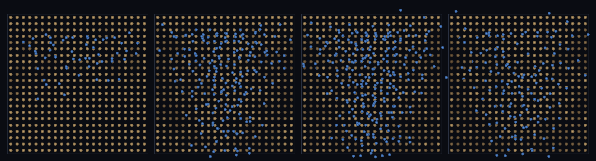

# step_0108 — (조립) 안정 분절 침식: 그리드 베드 위 흐름이 공간 협곡을 깎는다(안정)

> [design/environment.md TW3](../../design/environment.md)·STATE §3 NEXT 디테일②(안정 분절 침식·0075 후속). 조립 step(engine 변경 0·새 법칙 0·0075 침식 법칙 재사용). 긴 설명은 viewer `note`(scenes/step_0108.js)가 집.

## 논의 (조립 step·베드 표현 고침으로 0075 침식 안정화)

- **세계를 어떻게 변형?** 0075 침식(`sphSedimentErosion`)은 *겹친 sphere 앵커* 카펫 위에선 경계력이 폭발해 불안정(단일 램프 *균일* 하강만·STATE §3 디테일② 난점). 핵심 고침은 *새 물리가 아니라 베드 표현* — 셀당 앵커 하나(비겹침·0103/0104 그리드)면 erosion 이 각 셀 `A.bed/A.radius` 만 안정하게 바꾼다. 그러면 경사 가파른(빠른 흐름·stream power) 셀이 더 깎여 *공간 협곡*이 집중 창발.
- **무엇으로 검증?** ① 공간 비균일 협곡(corr(경사,침식) > 0·상위 30% 셀이 침식 과반 집중) ② 안정성(베드 유한·max 속도 < 60·minBed 위반 0) ③ 침식 보존(Σbed+운반중+유출운반 = 초기) ④ 결정론.
- **무엇이 보존/변하나?** engine 불변. 0075 침식 법칙은 부품 verify 가 보증. 새로 생긴 건 *비겹침 그리드 베드 위 안정 공간 침식*(균일 램프 → 집중 협곡).

## 구현 — viewer 조립 (engine 변경 0·그리드 베드 + 0075 침식 + 0103 흐름)

```js
// 셀당 앵커 하나(비겹침) — 0075 의 겹친 카펫 폭발 회피
for (cell) an.push({ cx, cy, cz: elev-AR, radius: AR, bed: AR });
Sph.sphBedFriction(water, an, DT, fopt);                 // 흐름(0064)
Sph.sphSedimentErosion(water, an, DT, eopt);             // 0075 침식 — A.bed/radius 안정 변경 → 협곡
```

## 검증

**(a) 수치 — `node HTJ/steps/step_0108/verify.js` → PASS (4/4)** — 조립 cross-thread 만(0075 법칙은 부품 verify).

```
PASS  공간 비균일 협곡 — corr(경사,침식) 0.49>0.2·상위 30% 셀이 침식 76%>55% 집중(균일 램프 아닌 협곡)
PASS  안정성 — 베드 유한·minBed 위반 0·max속도 11.0<60(겹친 앵커 폭발 없음·그리드 베드 안정)
PASS  보존 — 침식 장부(Σbed + 운반중 + 유출운반) = 3736 → 3736 (rel 0.00e+0 < 1e-9)
PASS  결정론 — 같은 비 → 같은 협곡 = 지문 0x8c3f30d2
```
- 전 step verify **회귀 0**(engine 변경 0).

**(b) 눈 — `steps/step_0108/capture.png`** (탑다운·배경=침식 깊이[모래색→어두운 적갈 협곡]·물 파랑·시간 4 프레임)



모래색 평지에 비(파랑)가 흐르며 *어두운 협곡 줄기*가 골짜기 경사를 따라 점점 또렷이 깎인다(마지막 프레임=비 그친 뒤 맨 협곡·균일 아닌 집중·verify ①).

## 다음

**0075 침식이 *공간 지형*을 빚는다 — 흐름이 땅을 조각(협곡)하는 환경(TW3)·핵심은 베드 격자화로 겹침 폭발 제거.** **정직한 한계**: 그리드 베드(연속 높이장 아님·셀 해상도)·유한 비·minBed 바닥(다 깎이면 멈춤)·메타볼 경계는 후속. **디테일 작업 4종 모두 완료**(①동적 물 0102~0105·③이주 이력 0106·④바이옴 3D 표면 0107·②분절 침식 0108). **다음 = PW 사다리(걸을 수 있는 한 조각 땅)**.
