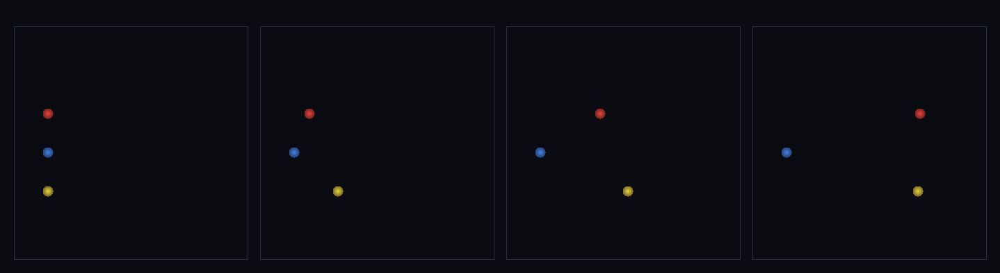

# step_0109 — (법칙) 제어 힘 applyControl: 행위성이 지정 개체에 명령 힘을 주입한다

> [design/playable-world.md](../../design/playable-world.md) PW 마일스톤 A·STATE §3 NEXT(PW 사다리 진입). 새 engine 법칙(`engine/htj-control.js`). 긴 설명은 viewer `note`(scenes/step_0109.js)가 집.

## 논의 (법칙 step·행위성 주입 통로)

- **세계를 어떻게 변형?** 세계 물리는 *창발*(법칙만 author)이지만 **캐릭터의 의지=행위성은 최상층 author**(CLAUDE.md §4). 세계가 스스로 만들 수 없는 *입력*이 들어오는 유일한 통로를 연다 — `applyControl` 이 호출자가 명령한 개체에 generic 외력을 더한다. ⛔ 절대 원칙 준수: "캐릭터"·"플레이어" 타입을 아는 분기가 **없다**(누가·왜·어디로는 호출자=author 몫·engine 은 벡터만 적용).
- **무엇으로 검증?** ① 연속 힘 → Δp=F·dt 정확·등가속(뉴턴2) ② 명령 없는 개체 불변(early-return·회귀 0) ③ 임펄스 1회 → 이후 등속 직진(뉴턴1) ④ 결정론.
- **무엇이 보존/변하나?** **운동량은 *주입*된다(외력·보존 안 됨이 핵심)** — 행위성이 세계에 운동량·일을 *넣는다*. 그 일은 KE 로(KEcm·energy 재계산·internalE 불변). 명령 없으면 세계 불변.

## 구현 — `engine/htj-control.js` (새 법칙)

```js
// 각 명령을 대상 개체 운동량에 더한다 — 연속(Δp=F·dt)/임펄스(Δp=F). 운동량 주입(외력).
function applyControl(entities, dt, opts) {
  const cmds = opts.commands; if (!cmds || !cmds.length) return entities;  // 없음 → 회귀 0
  for (const cmd of cmds) { const e = entities[cmd.i]; const s = cmd.impulse ? 1 : dt;
    e.px += (cmd.fx||0)*s; e.py += (cmd.fy||0)*s; e.pz += (cmd.fz||0)*s; }
  // 명령 받은 개체만 KEcm·energy 재계산(energy=KEcm+internalE·internalE 불변)
}
function groundContact(entity, anchors, pad) { /* 겹친 앵커 인덱스(접지 게이트·점프용) */ }
```

## 검증

**(a) 수치 — `node HTJ/steps/step_0109/verify.js` → PASS (5/5)**

```
PASS  연속 힘=뉴턴2 — px 12.0000=F·dt·K 12.0000·매 step Δp=F·dt(등가속)·energy 자기일관
PASS  항등(노브=0→회귀 0) — 명령 없는 개체 불변(i=1) = 0xcde8db85
PASS  빈 commands → early-return(전체 불변·회귀 0)
PASS  임펄스=뉴턴1 — Δp=F 9.000(×dt 아님)·이후 등속 Δx=v·dt(자유 드리프트)
PASS  결정론 — 같은 명령 → 같은 궤적 = 지문 0x6f4c8d35
```
- 전 step verify **회귀 0**(새 파일 htj-control.js·기존 호출처 0).

**(b) 눈 — `steps/step_0109/capture.png`** (탑다운·A=빨강 연속 힘·B=파랑 명령 없음·C=노랑 임펄스·시간 4 프레임)



빨강(연속 힘)은 점점 빨라지며 오른쪽으로(가속)·파랑(명령 없음)은 그 자리·노랑(1회 임펄스)은 한 번 차이고 등속으로 흐른다(초반 노랑이 앞서다 후반 빨강이 추월=가속 vs 등속 시그니처·verify ①③).

## 다음

**행위성이 세계에 들어오는 유일한 통로(외력 1개)를 열었다 — 다음은 이 위에 지면·중력·접촉을 얹어 "선 캐릭터"(0110)·"걷기"(0111)·"점프"(0112)로 PW-A 에 닿는다.** **정직한 한계**: 아직 지면 없는 빈 공간 데모·입력은 스크립트(인터랙티브 viewer 는 마일스톤 도달 시 큐레이트).
