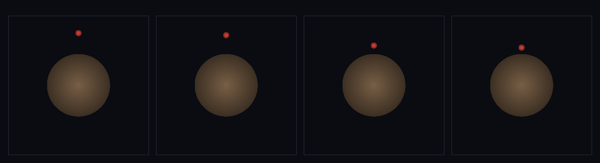

# step_0110 — (조립) 선 캐릭터: 큰 구체(행성) 위에 방사 중력으로 선다

> [design/playable-world.md](../../design/playable-world.md) PW-A·CLAUDE.md §4 게임 최소 단위. 조립 step(engine 변경 0·applyEntityGravity 0028 + applyEntityContact 0037 재사용). 긴 설명은 viewer `note`(scenes/step_0110.js)가 집.

## 논의 (조립 step·게임 최소 단위 발현)

- **세계를 어떻게 변형?** CLAUDE §4 "선 캐릭터 = 중력↓ + 접촉 반발↑ 균형, 지면 = 아주 큰 구체"를 *새 물리 없이* 발현. 무거운 행성(M≫m)을 큰 구체로 두고, 가벼운 캐릭터를 방사 중력(0028)으로 끌어 접촉(0037)이 표면서 떠받쳐 평형 overlap*=F_grav/k 에 정착시킨다.
- **무엇으로 검증?** ① 정착(최종 속도≈0) ② 균형(F_contact=F_grav·ratio 1.0) ③ 안 가라앉음(overlap 유계·d>R) ④ 어디든 선다(꼭대기/옆/대각 같은 분리거리·아래=방사) ⑤ 계 운동량 보존 ⑥ 결정론.
- **무엇이 보존/변하나?** engine 불변. 중력·접촉 법칙은 부품 verify 가 보증. 새로 생긴 건 *큰 구체 표면의 정착 균형*(선 캐릭터)·행성은 무게가 곧 부동성(author-anchor 아님).

## 구현 — viewer 조립 (engine 변경 0)

```js
// 무거운 행성(M=4000) + 가벼운 캐릭터(m=1) — 두 기존 법칙만 함께 굴림
En.applyEntityGravity([planet, ch], DT, { G: 0.04, soft: 1 });   // 방사 중력(0028)·아래=중심 방향
En.applyEntityContact([planet, ch], DT, { k: 20, cDamp: 6 });    // 반발+감쇠(0037)·표면서 떠받침
En.stepEntities([planet, ch], DT);                               // → overlap*=F_grav/k 에 정착
```

## 검증

**(a) 수치 — `node HTJ/steps/step_0110/verify.js` → PASS (6/6)** — 조립 cross-thread 만(중력·접촉 법칙은 부품 verify).

```
PASS  정착 — 캐릭터 최종 속도 3.47e-14 ≈ 0(감쇠로 멈춤·튕김 없이 선다)
PASS  균형 — 접촉력 F_c 0.9452 = 중력 F_g 0.9452(ratio 1.000000·떠받침=무게)
PASS  안 가라앉음 — overlap 0.0473∈(0,0.5)·d 12.953>R 12(표면 위·터널링 0)
PASS  어디든 선다 — 꼭대기/옆/대각/아래 정착 분리거리 12.953=12.953=12.953=12.953·산포 1.78e-14<1e-6(아래=방사)
PASS  보존 — 계 총 운동량(planet+char) = 0 → 0 (rel 0.00e+0 < 1e-9)
PASS  결정론 — 같은 낙하 → 같은 정착 = 지문 0x1a81d4a1
```
- 전 step verify **회귀 0**(engine 변경 0).

**(b) 눈 — `steps/step_0110/capture.png`** (탑다운·행성=흙빛 큰 원·캐릭터=빨강·시간 4 프레임)



빨간 캐릭터가 흙빛 행성 위로 떨어져 표면에 닿고 — 튕김 없이 *얹혀 선다*(중력↓+접촉↑ 균형·verify ①②).

## 다음

**"선 캐릭터"(PW-A 토대)가 섰다 — 다음은 여기에 제어 힘(0109)을 얹어 표면을 *걷는다*(0111).** **정직한 한계**: 행성 M 유한(미세 반작용 드리프트 0.001)·접촉 단일 점(표면 곡률 무시)·아직 정지(걷기는 0111).
