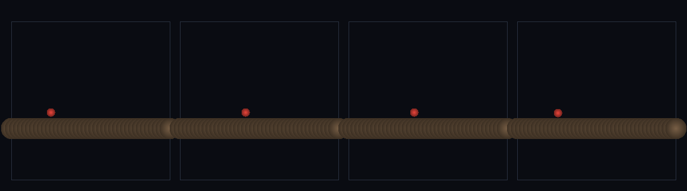

# step_0111 — (조립) 걷기: 제어 힘 + 접지 마찰로 캐릭터가 지면을 걷는다

> [design/playable-world.md](../../design/playable-world.md) PW-A 핵심. 조립 step(engine 변경 0·0109 제어 + 0037 접촉 + 0057 마찰 + 0058 구름 저항 재사용). 긴 설명은 viewer `note`(scenes/step_0111.js)가 집.

## 논의 (조립 step·행위성을 선 캐릭터에 얹음)

- **세계를 어떻게 변형?** 0110(선 캐릭터)에 0109(행위성 제어 힘)를 얹어 *걷는다*. 평평한 한 조각 땅 위 선 캐릭터에 수평 제어 힘 → 접촉 마찰(0057)+구름 저항(0058)이 접지를 잡아 발판으로 — 누르면 종단속도로 나아가고, 놓으면 멈춘다. **걷기 = 외력(행위성) ↔ 접지 마찰의 균형**.
- **무엇으로 검증?** ① 걷기(cx 전진) ② 종단속도(속도 유계·자유 가속의 1/수십·후반 일정) ③ 멈춤(놓으면 |v|→0·얼음 아님) ④ 접지 유지(cy 표면 근처 유계) ⑤ 결정론.
- **무엇이 보존/변하나?** engine 불변. 제어·마찰 법칙은 부품 verify 가 보증. 새로 생긴 건 *제어+마찰 균형이 낳는 걷기*(종단속도·멈춤·접지 locomotion).

## 구현 — viewer 조립 (engine 변경 0)

```js
ch.py -= ch.mass * G * DT;                                       // 균일 중력(아래=−y)
En.applyEntityContact(es, DT, { k:60, cDamp:8 });               // 떠받침(0037)
if (f) Ctl.applyControl(es, DT, { commands:[{ i:0, fx:f }] });  // 방향키=제어 힘(0109)
En.applyEntityFriction(es, DT, { k:60, mu:8, cTan:14 });        // 접지 마찰(0057)=발판
En.applyEntityRollingResistance(es, DT, { k:60, muRoll:4, cRoll:8 });  // 구름 저항(0058)=자유 굴림 방지
// 지면 앵커 운동량 0(부동) → stepEntity(ch)
```

## 검증

**(a) 수치 — `node HTJ/steps/step_0111/verify.js` → PASS (5/5)** — 조립 cross-thread 만(제어·마찰 법칙은 부품 verify).

```
PASS  걷기 — cx 10.00→17.44(Δ7.44>4·전진)
PASS  종단속도 — v_end 0.954<1.5·자유가속 64의 1/67·중후반 Δv 0.003<0.6(유계)
PASS  멈춤 — 놓으면 v 0.0083→0·cx 정지(Δ0.18<1.0·얼음 아님)
PASS  접지 유지 — cy∈[0.927,0.956]⊂(0.5,1.4)(안 날아가고 안 가라앉음)
PASS  결정론 — 같은 입력 → 같은 걸음 = 지문 0x531d7211
```
- 전 step verify **회귀 0**(engine 변경 0).

**(b) 눈 — `steps/step_0111/capture.png`** (탑다운·지면=흙빛 띠·캐릭터=빨강·시간 4 프레임: 서다→오른쪽→멈춤→왼쪽)



빨간 캐릭터가 흙빛 땅을 오른쪽으로 걸어가 멈추고, 다시 왼쪽으로 걸어와 멈춘다(제어에 반응·접지 유지·verify ①③④).

## 다음

**PW-A "걸을 수 있는 한 조각 땅" 거의 달성 — 다음은 점프(0112·접지 게이트+상향 임펄스)·절차 지형 위 걷기(0113).** **정직한 한계**: 평평한 패치(곡면 행성 걷기는 종단속도≪궤도속도 필요)·접촉 단일 점·입력은 스크립트.
