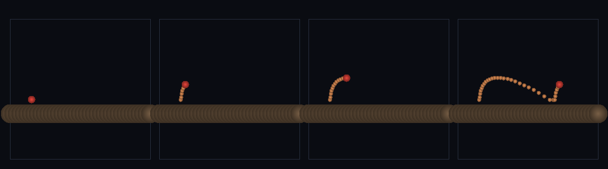

# step_0112 — (조립) 점프: 접지 게이트 + 상향 임펄스로 캐릭터가 뛴다

> [design/playable-world.md](../../design/playable-world.md) PW-A 마무리. 조립 step(engine 변경 0·0109 제어/접지 + 0037/0057/0058 재사용). 긴 설명은 viewer `note`(scenes/step_0112.js)가 집.

## 논의 (조립 step·행위성에 도약 추가)

- **세계를 어떻게 변형?** 0111(걷기)에 점프를 더한다. 점프 = *접지일 때만* 내보내는 상향 임펄스(0109 `applyControl impulse`). `groundContact`(generic·겹친 앵커 있나)로 발이 땅에 닿았는지 보고, 닿았을 때만 위로 임펄스 → 솟구쳐 중력에 끌려 탄도로 착지. 공중 점프는 무시(게이트).
- **무엇으로 검증?** ① 도약(정점≫선 높이) ② 탄도 복귀(제자리 착지·재접지) ③ 접지 게이트(공중 연타 무시·단발과 같은 정점) ④ 재무장(착지 후 다시 점프) ⑤ 결정론.
- **무엇이 보존/변하나?** engine 불변. 제어·접지·중력 법칙은 부품 verify 가 보증. 새로 생긴 건 *접지 게이트 점프*(무한 비행 방지·탄도 hop).

## 구현 — viewer 조립 (engine 변경 0)

```js
const grounded = Ctl.groundContact(ch, an, 0.05) >= 0;          // 발이 땅에 닿았나(generic)
if (jumpPress && grounded)                                      // 접지일 때만 도약
  Ctl.applyControl(es, DT, { commands:[{ i:0, fy:JY, impulse:true }] });  // 상향 임펄스(0109)
// + 걷기(fx)와 합치면 달리며 도약하는 포물선 hop
```

## 검증

**(a) 수치 — `node HTJ/steps/step_0112/verify.js` → PASS (5/5)** — 조립 cross-thread 만(제어·접지·중력은 부품 verify).

```
PASS  도약 — 정점 cy 7.23 − 선 높이 0.93 = 6.30>4(솟구침)
PASS  탄도 복귀 — 착지 cy 0.933≈선 0.933·착지 접지 true·정점 공중 true
PASS  접지 게이트 — 공중 연타해도 정점 7.23≈단발 7.23(공중 점프 무시)·도약은 접지 후에만(1회·각각 착지 뒤)
PASS  재무장 — 착지 후 접지 true→2차 점프 정점 7.39≈1차 7.23(게이트 재무장)
PASS  결정론 — 같은 점프 → 같은 궤적 = 지문 0xed0ad36c
```
- 전 step verify **회귀 0**(engine 변경 0).

**(b) 눈 — `steps/step_0112/capture.png`** (탑다운·주황=궤적 잔상·시간 4 프레임: 접지→상승→정점→착지 후 달림)



빨간 캐릭터가 달리다 땅을 차고 솟아(주황 궤적) 정점을 찍고 *포물선*으로 내려와 착지해 계속 달린다(탄도 hop·verify ①②).

## 다음

**PW-A 행위성(서다·걷다·뛰다) 완성 — 다음은 *절차 지형* 위를 걷기(0113)로 PW-B(끝없이 걷는 땅)에 다가간다.** **정직한 한계**: 평평한 패치·접촉 단일 점·점프 타이밍은 스크립트.
