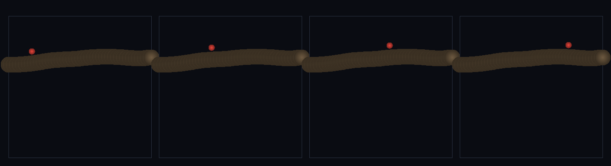

# step_0113 — (조립) 절차 지형 위를 걷기: 캐릭터가 fBm 높이장을 오르내린다

> [design/playable-world.md](../../design/playable-world.md) PW-A→B 다리. 조립 step(engine 변경 0·0111 걷기 + 0074 fBm 재사용). 긴 설명은 viewer `note`(scenes/step_0113.js)가 집.

## 논의 (조립 step·창발↔절차 잇기)

- **세계를 어떻게 변형?** 0111(평지 걷기)을 *절차 지형*(fBm 높이장·0074)으로 옮긴다. 지면 앵커를 elev(x)=fBm 높이로 깔면 — *새 걷기 법칙 없이* 0111 의 제어+마찰+중력 그대로가 캐릭터를 *언덕을 따라* 오르내리게 한다. 두 트랙(창발 걷기 ↔ 절차 지형)을 잇는다.
- **무엇으로 검증?** ① 지형 추종(corr(cy,elev)≈1·offset 좁은 띠) ② 오르내림(고도 변화>1.5) ③ 접지 유지(터널링 0·안 날아감) ④ traversal(언덕에 안 갇힘) ⑤ 결정론.
- **무엇이 보존/변하나?** engine 불변. 걷기·fBm 부품은 부품 verify 가 보증. 새로 생긴 건 *절차 지형 표면 추종 보행*. 지형은 author 안 함(fBm 발현·타입 0).

## 구현 — viewer 조립 (engine 변경 0)

```js
const elev = (x) => 9 + 6 * Stream.fbm(x*0.03, 0.5, { salt:'RIDGE', octaves:3, gain:0.5 });  // 절차 높이장(author 아님)
for (x) an.push({ cx:x, cy: elev(x)-3, radius:3, ... });        // 지면 앵커 = fBm 표면
// 0111 의 걷기(제어+접촉+마찰+구름저항) 그대로 → 캐릭터가 언덕 따라 오르내림
```

## 검증

**(a) 수치 — `node HTJ/steps/step_0113/verify.js` → PASS (5/5)** — 조립 cross-thread 만(걷기·fBm 은 부품 verify).

```
PASS  지형 추종 — corr(cy,elev) 1.000>0.95·offset∈[0.96,1.02]⊂(0.6,1.5)(표면 위를 탐)
PASS  오르내림 — 캐릭터 고도 변화 2.20>1.5(언덕 오르내림·평지 아님)
PASS  접지 유지 — 모든 샘플 cy 가 elev+[0.6,1.5] 안(터널링 0·안 날아감)
PASS  traversal — cx 7.9→40.9(Δ33.1>25·언덕 횡단·안 갇힘)
PASS  결정론 — 같은 입력 → 같은 보행 = 지문 0xc7575ea3
```
- 전 step verify **회귀 0**(engine 변경 0).

**(b) 눈 — `steps/step_0113/capture.png`** (탑다운·지형=흙빛 fBm 능선·캐릭터=빨강·시간 4 프레임)



빨간 캐릭터가 흙빛 fBm 언덕을 따라 오르막을 오르고 능선을 넘는다(고도 변화·표면 추종·verify ①②).

## 다음

**PW-A→B 다리 — 보행이 *절차 세계*와 만났다. 다음은 경사 한계(0114·못 오르는 절벽)·끝없이 펼쳐지는 지형(0115 streamChunks).** **정직한 한계**: 1D 단면 높이장·앵커 그리드 해상도·유한 패치(무한 스트리밍은 0115).
